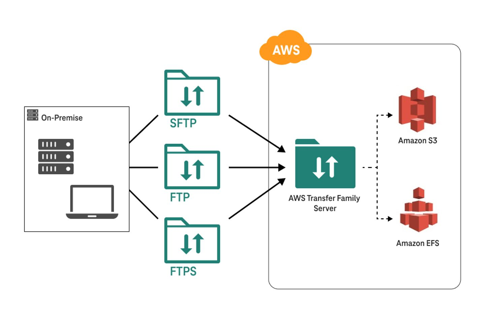

# 🚚 **How AWS Transfer Family Works (with Example)**

The **AWS Transfer Family** provides **SFTP, FTPS, and FTP access** directly to your **Amazon S3** or **Amazon EFS** storage. It’s fully managed, supports custom domains and identity providers, and integrates with IAM, CloudWatch, VPC, and more.

---

<div style="text-align: center;">
  
</div>

---

## 🧠 **Use Case: Secure File Upload via SFTP to S3**

Let’s say you're building a system where **external partners (vendors)** need to **upload CSV files** via SFTP to your backend.

Your app needs:

- 🔐 Secure access (via SFTP)
- 📦 File storage in S3
- 📢 Triggering a Lambda when a file is uploaded

---

## 🛠️ **Step-by-Step Setup (SFTP to S3)**

### 🔧 1. Create an S3 Bucket

You’ll store uploaded files here (e.g., `my-vendor-data-bucket`).

---

### 🚀 2. Create a Transfer Family Server

Go to the **Transfer Family console**, and:

- Click **Create server**
- Choose **SFTP**
- Select **Amazon S3** as the storage backend
- Enable **VPC hosting** (optional, for private endpoints)
- Choose **service-managed users** or **custom identity provider (like IAM or Cognito)**

---

### 👤 3. Add a User

- Add a user like `vendor1`
- Set their **home directory** (e.g., `/my-vendor-data-bucket/uploads`)
- Attach an **IAM role** that gives `s3:PutObject` permission to that prefix
- Upload their **SSH public key** (for SFTP login)

---

### 🧪 4. Connect via SFTP

From any SFTP client (like FileZilla or command line), your vendor can now upload files:

```bash
sftp -i my-private-key.pem vendor1@s-12345678.server.transfer.us-east-1.amazonaws.com
```

Once connected, they upload the CSV file:

```bash
put sales-report.csv
```

✅ The file is now in your S3 bucket.

---

### ⚙️ 5. Add Automation with Event Notifications

- Set up **S3 Event Notifications** to trigger:
  - An **SNS alert**
  - An **SQS message**
  - Or a **Lambda function** for real-time processing

Example: Process the file using Lambda and move it to another folder.

---

## 💡 Real-World Benefits

| Feature                 | Benefit                                         |
| ----------------------- | ----------------------------------------------- |
| ✅ SFTP Access          | Vendors use familiar tools to upload files      |
| 🔒 IAM Integration      | Fine-grained control over file access           |
| 📦 Direct to S3/EFS     | No need to manage storage yourself              |
| ⚡ Trigger AWS Services | Serverless file processing                      |
| 🧘 Fully Managed        | No maintenance for SFTP/FTP/FTPS infrastructure |

---

## 📌 Example IAM Policy for Uploading to a Prefix

```json
{
  "Version": "2012-10-17",
  "Statement": [
    {
      "Sid": "UploadOnly",
      "Effect": "Allow",
      "Action": ["s3:PutObject"],
      "Resource": "arn:aws:s3:::my-vendor-data-bucket/uploads/*"
    }
  ]
}
```

---

## 🧪 Example Scenario

- 🔐 **Partner logs in via FileZilla using SSH key**
- 📤 Uploads `sales-jan.csv` → goes directly to S3
- 🚀 **S3 Event triggers Lambda**
- 🧠 Lambda parses CSV, writes to DynamoDB
- 📨 Notification sent via SNS to the internal team

---

## 🤝 Final Thoughts

**AWS Transfer Family** bridges the old (FTP) and the new (S3) — giving your partners a **secure, familiar interface** while keeping your infrastructure modern, scalable, and serverless.
