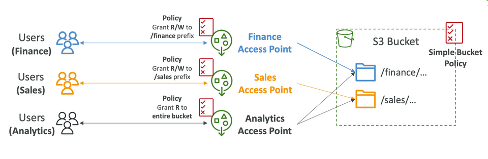
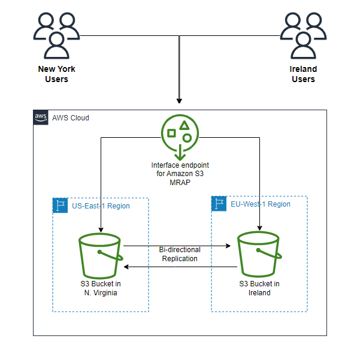

# 🛣️ **Amazon S3 Access Points**

> _Simplifying and securing shared data access in S3 at scale._

---

<div align="center">
  
</div>

---

## 🔍 **What Are S3 Access Points?**

**Amazon S3 Access Points** are **dedicated endpoints** that allow you to define **fine-grained access policies** for specific use cases—like user groups, applications, or services—without changing your **main S3 bucket policy**.

Think of them as **custom front doors** to your S3 bucket. You can create **multiple access points**, each with:

- A unique name and URL
- Its own **IAM-style policy**
- Optionally, VPC restriction for private access

---

## 🎯 **Why Use Access Points?**

| 🚀 Traditional Way                        | 🧠 Access Points Advantage                     |
| ----------------------------------------- | ---------------------------------------------- |
| A single bucket policy governs all access | Create multiple isolated entry points          |
| Complex conditions for many users/apps    | Simple, readable, per-app or per-team policies |
| No easy way to restrict access to a VPC   | Can restrict access to a specific VPC/subnet   |

They’re especially helpful when:

- You manage **multi-tenant applications**
- You want to **enforce VPC-only access**
- You need to **delegate** access to different teams

> Each access point enforces its **own policy**, and all requests eventually land on the **same S3 bucket** — but with different levels of access.

---

## 📦 **S3 Access Point Components**

| Component                  | Description                                            |
| -------------------------- | ------------------------------------------------------ |
| 🏷️ **Access Point Name**   | Used to construct the endpoint URL                     |
| 🧾 **Access Point Policy** | IAM-style resource policy specific to the access point |
| 🌍 **Network Origin**      | Public internet OR restricted to a **VPC**             |
| 🗃️ **Bucket Association**  | Each access point is linked to a **single S3 bucket**  |

---

## 🧪 **Real Example: Analytics App with VPC Access**

Let’s say you have:

- A bucket `logs-archive`
- An analytics app inside a **VPC**
- You want **read-only access** to a certain prefix (`/2024/`)

### ✅ Solution

Create an access point:

- Name: `analytics-read`
- VPC-only access
- Policy allows `s3:GetObject` on prefix `logs-archive/2024/*`

### 🧾 Sample Policy

```json
{
  "Version": "2012-10-17",
  "Statement": [
    {
      "Effect": "Allow",
      "Principal": "*",
      "Action": "s3:GetObject",
      "Resource": "arn:aws:s3:us-east-1:123456789012:accesspoint/analytics-read/object/2024/*"
    }
  ]
}
```

---

## 🌐 **Access Point URL Format**

When you use an access point, your S3 URL looks different:

```ini
https://<access-point-name>-<account-id>.s3-accesspoint.<region>.amazonaws.com
```

🔐 **Secure by design**:

- Can restrict to VPC access
- No need to modify the bucket’s master policy
- IAM and resource policies combine to enforce security

---

## 🔒 **VPC-Only Access (Private Data)**

To enforce access **only within a VPC**, you can:

- Create a **VPC endpoint** for S3
- Attach a **VPC policy** to your access point

🚫 That means external users **can’t access S3**, even if they have credentials.

---

## 🧰 **When to Use S3 Access Points**

| Use Case                        | Access Points Help By...                                 |
| ------------------------------- | -------------------------------------------------------- |
| Multi-tenant data lake          | Creating per-team or per-user endpoints                  |
| Private app in VPC              | Enforcing VPC-only access through network origin control |
| Decentralized app permissions   | Delegating access without touching global bucket policy  |
| Simplifying complex permissions | Using clean, scoped IAM-style policies per access point  |

---

## 🧠 **Access Point vs Bucket Policy: Key Differences**

| Feature            | Bucket Policy           | Access Point Policy                  |
| ------------------ | ----------------------- | ------------------------------------ |
| Scope              | Applies to whole bucket | Applies to access point only         |
| Granularity        | More complex to manage  | Easier to isolate by app/team/prefix |
| VPC Restriction    | Requires extra config   | Built-in option for VPC-only access  |
| Multi-user support | One policy shared       | Multiple policies, isolated per app  |

---

## 📝 **Best Practices**

✅ **Use Access Points** when:

- You have **different teams or apps** using the same bucket
- You need **VPC-only access** or **custom IAM isolation**
- You want to **delegate access** without making global changes

🚫 Avoid using access points for:

- Public websites or **S3 static hosting**
- Applications that **don’t support access point-style URLs** yet

---

## 💡 AWS S3 Multi-Region Access Points

AWS S3 Multi-Region Access Points allow you to create access points in multiple AWS Regions, which can be useful for cross-region replication or global access.

<div align="center">
  
</div>

---

## 🚀 Final Thoughts

S3 Access Points = **clean, secure, and scalable** access to your shared buckets.  
They help you follow **least privilege** access and make **multi-app workflows easier** to manage.
