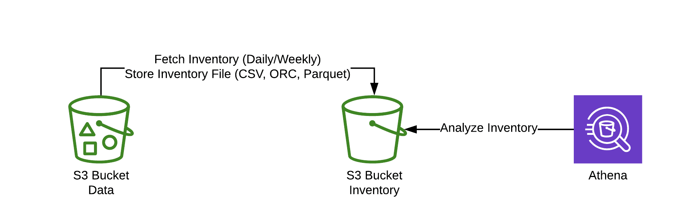
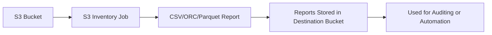

# 📋 **Amazon S3 Inventory**

> _A powerful reporting tool to track, audit, and manage your S3 objects._

---

<div align="center">
  
</div>

---

## 🔍 **What is S3 Inventory?**

**Amazon S3 Inventory** is a built-in feature that **generates reports** about the **objects and metadata** in your S3 buckets. It helps you **audit access**, **track encryption**, **monitor replication status**, and **optimize storage** across millions (or billions!) of objects.

Instead of scanning a massive bucket manually (which can be costly and time-consuming), you can let S3 Inventory **generate a file listing all your objects** and **export it regularly** in an efficient format.

---

## 🧰 **Why Use S3 Inventory?**

| ✅ Use Case                       | 💡 Benefit                                                  |
| --------------------------------- | ----------------------------------------------------------- |
| 🔐 Check if objects are encrypted | Ensure compliance with security policies                    |
| 📦 Audit storage usage            | Know how many objects you have and how large they are       |
| 🔁 Monitor replication status     | Confirm if replication is working properly                  |
| 💵 Control costs                  | Identify old or infrequently accessed objects for archiving |
| 📤 Feed into batch operations     | Use as input for S3 Batch jobs (e.g., tag or delete files)  |

---

## 🧪 **How S3 Inventory Works (Simplified)**



---

## 🧾 **What’s Inside an Inventory Report?**

Each report contains **object-level metadata**, which may include:

| Field              | Description                                    |
| ------------------ | ---------------------------------------------- |
| Object Key         | The object's name (full path)                  |
| Last Modified Date | When the object was last updated               |
| Size               | Object size in bytes                           |
| Storage Class      | e.g., STANDARD, INTELLIGENT_TIERING, GLACIER   |
| ETag               | Object hash (for tracking changes)             |
| Encryption Status  | Whether SSE-S3 or SSE-KMS is used              |
| Replication Status | Whether the object was successfully replicated |
| Object Lock Status | Whether retention/lock is enabled              |
| Checksum           | If enabled, includes SHA-256/CRC32 checksum    |

---

## 🛠️ **How to Enable S3 Inventory**

### ✅ Step-by-Step

1. **Open the S3 Console**
2. Select your **source bucket**
3. Go to **Management → Inventory**
4. Click **Create Inventory Configuration**

### 🧾 Provide These Settings

| Setting            | Description                                                   |
| ------------------ | ------------------------------------------------------------- |
| Destination Bucket | Where to store the report (can be the same or another bucket) |
| Format             | Choose **CSV**, **ORC**, or **Parquet**                       |
| Frequency          | **Daily** or **Weekly** reports                               |
| Scope              | Whole bucket or filtered by **prefix**                        |
| Optional Metadata  | Choose whether to include fields like encryption, checksum    |

### 🔐 Permissions

Ensure your **destination bucket policy** allows `s3:PutObject` from the source bucket’s inventory service.

---

## 🧪 **Real-World Example: Compliance Audit**

🎯 **Goal:** Check if all objects in your bucket are encrypted.

1. Enable **S3 Inventory** with the **Encryption Status** field included.
2. After the report is generated, open the CSV or load it into **Athena**.
3. Run this query:

```sql
SELECT *
FROM inventory_report
WHERE encryption_status = 'NOT-SSE'
```

🛑 Now you know which objects are _not encrypted_ and can take action (e.g., apply encryption or delete sensitive files).

---

## 📂 **Output Formats Explained**

| Format      | Use Case                                          |
| ----------- | ------------------------------------------------- |
| **CSV**     | Easy to read and analyze in Excel or Athena       |
| **ORC**     | Best for high-performance analytics (Athena, EMR) |
| **Parquet** | Compressed and optimized for columnar queries     |

---

## 💬 **S3 Inventory vs. ListObjects API**

| Feature            | S3 Inventory                          | `ListObjectsV2` API             |
| ------------------ | ------------------------------------- | ------------------------------- |
| 📈 Scale           | Designed for **billions** of objects  | Slower for large datasets       |
| ⏱️ Performance     | Batch export, runs asynchronously     | Real-time but slower            |
| 📊 Metadata        | Includes encryption, class, lock info | Basic only                      |
| 🧾 Format Support  | CSV, ORC, Parquet                     | JSON via API                    |
| 💰 Cost Efficiency | Cheaper for regular audits            | Can be expensive at large scale |

---

## 🌟 **Best Practices**

- 🧹 **Use lifecycle policies** to **delete old reports** and save costs.
- 🎯 **Use prefix filtering** to audit only part of a bucket (e.g., `/logs/2024/`)
- 🛡️ Store reports in a **separate bucket** with strict **access control**
- ⚙️ Feed reports into **S3 Batch Operations** for tagging, moving, or deleting objects

---

## 🚀 Final Thoughts

Amazon S3 Inventory is your go-to tool when you need:

- Better visibility into your S3 data
- Easier compliance audits
- Inputs for automated bulk operations
