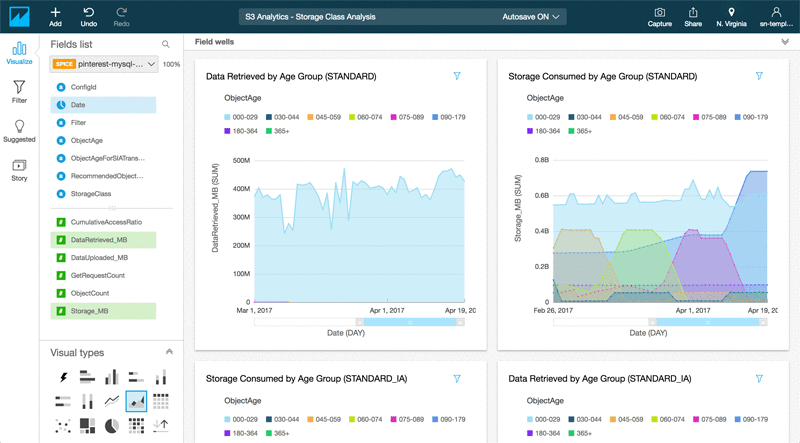
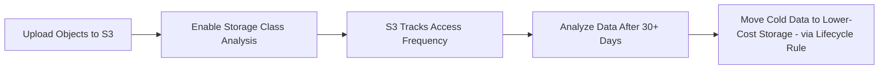
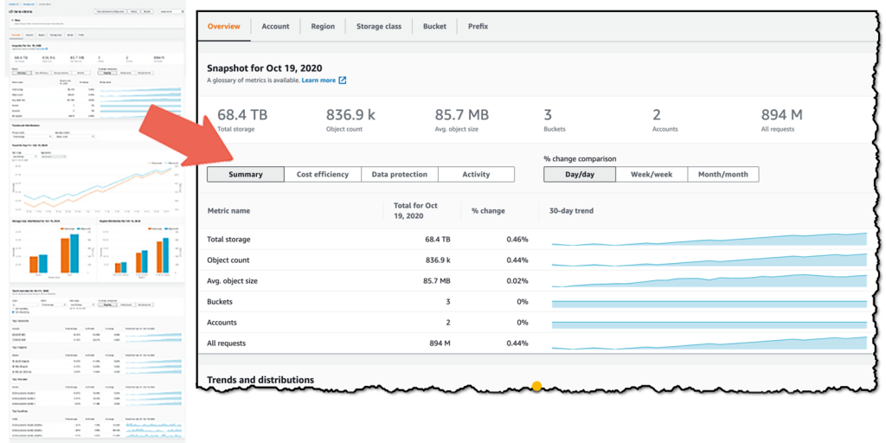
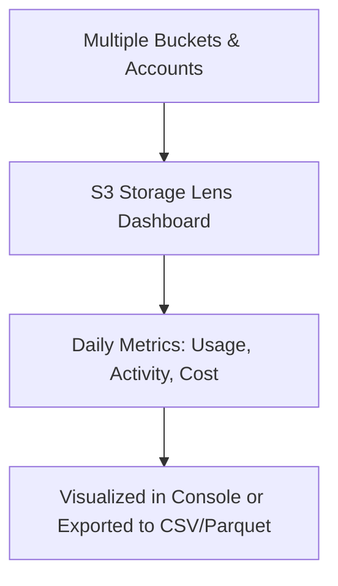

# 📊 **Amazon S3 Analytics & Insights**

> _Smart storage begins with smart insights!_

Amazon S3 offers **powerful tools** to help you analyze your storage patterns, optimize costs, and make informed data management decisions. Two key services that bring visibility to your storage usage are:

- **S3 Storage Class Analysis**
- **S3 Storage Lens**

Let’s break down each tool and explore how they work.

---

## 📦 **1. S3 Storage Class Analysis**

  

---

### 🔍 What is it?

**S3 Storage Class Analysis** helps you understand **how frequently your objects are accessed** so you can automatically transition them to **lower-cost storage classes** (like S3 Standard-IA or Glacier).

This feature is perfect for **data lifecycle optimization**, especially when you're unsure about access patterns.

---

### 🧠 How It Works

---

### 🔧 How to Enable **S3 Storage Class Analysis**

**📍 Steps via AWS Console:**

1. **Open your S3 bucket** → Go to the **"Management"** tab.
2. Under **Storage Class Analysis**, click **Create storage class analysis**.
3. Fill in the details:
   - **Name**: `my-cold-object-analysis`
   - **Scope**: Choose entire bucket, prefix (like `images/`), or use tags.
   - **Export destination**: Choose a bucket to store analysis results.
4. Click **Create**. ✅

**📁 Where to See Results:**

- Results will appear in your **destination bucket** in `.csv` format.
- You can query this data using **Amazon Athena** or download it manually.
- You can Display it using **AWS Quicksight**

---

### 🧰 Key Features

| Feature               | Description                                                      |
| --------------------- | ---------------------------------------------------------------- |
| 🎯 Purpose            | Analyze object access frequency                                  |
| ⏱️ Analysis Delay     | Minimum of **30 days** to gather meaningful access patterns      |
| 📁 Scope Options      | Analyze entire bucket, specific prefix, or tags                  |
| 🔁 Automation         | Integrates with **S3 Lifecycle Rules** for automatic transitions |
| 📤 Output Destination | Results are viewable via **console**, **CSV**, or Athena         |

---

### ✅ Use Case Example

You store product images for an e-commerce site. Some are viewed daily, others rarely.

1. Enable **Storage Class Analysis** on your image bucket.
2. After 30 days, view the report.
3. Transition rarely accessed images to **S3 Standard-IA** or **S3 Glacier**.
4. Save money. 💰

---

## 📡 **2. Amazon S3 Storage Lens**

  

---

### 🔍 What is it?

**S3 Storage Lens** provides **organization-wide visibility** into storage usage and activity across **ALL** your buckets, accounts, and regions.

It's like a **central dashboard** for everything related to your S3 storage footprint.

---

### 🧠 How It Works

---

### 🔧 How to Enable **S3 Storage Lens**

**📍 Steps via Console:**

1. Open S3 service → Navigate to **“Storage Lens”** tab.
2. Click **Create dashboard**.
3. Fill the config:
   - **Name**: `global-storage-insights`
   - **Region**: Where the dashboard resides (e.g. `us-east-1`)
   - **Include buckets**: All or filtered by account/region.
   - Optional: Enable **metrics export** to S3.
   - Optional: Enable **Advanced metrics** (paid tier).
4. Click **Create**.

**📊 Where to View Dashboard:**

- Go to **S3 → Storage Lens → Your Dashboard**.
- Use filters to sort by account, tag, region, etc.

---

### 🧰 Key Features

| Feature              | Description                                                    |
| -------------------- | -------------------------------------------------------------- |
| 🧠 Metrics           | Object count, size, request counts, failed requests, etc.      |
| 🧭 Scope             | Account, Org, or Region-wide views                             |
| 📈 Historical Data   | Up to **15 months** of trend data for long-term insights       |
| 📊 Dashboards        | Visual graphs + tables inside the AWS Console                  |
| 🔐 Free & Paid Tiers | Free tier + optional **Advanced Metrics** with deeper insights |

---

### 📦 Storage Lens Dashboard Snapshot

| Metric              | Description                            |
| ------------------- | -------------------------------------- |
| Total Storage       | Total GB stored across all buckets     |
| Object Count        | Number of objects                      |
| Average Object Size | Calculated per bucket                  |
| % Encrypted Objects | Tracks SSE-S3, SSE-KMS usage           |
| Replication Status  | Tracks cross-region replicated objects |
| Access Activity     | Read/write requests per bucket         |

---

## 🤔 **S3 Analytics vs Inventory vs Storage Lens**

| Feature        | S3 Analytics            | S3 Inventory          | S3 Storage Lens                |
| -------------- | ----------------------- | --------------------- | ------------------------------ |
| 🔍 Focus       | Object access frequency | Object metadata list  | Org-wide usage & activity      |
| 📁 Scope       | Bucket, prefix, tags    | Object-level          | All buckets/accounts/regions   |
| 📤 Output      | CSV report              | CSV, ORC, Parquet     | Dashboard + CSV                |
| 🧠 Primary Use | Lifecycle optimization  | Audit, bulk ops input | Monitoring & cost optimization |

---

## 📝 Best Practices

- ✅ **Enable Storage Class Analysis** on buckets with mixed-use objects to automate cost saving.
- ✅ **Use Storage Lens** to detect underused buckets and high-cost patterns across your org.
- ✅ **Export reports to Athena or QuickSight** for advanced analytics and visual dashboards.
- ✅ **Combine analytics with lifecycle rules** to optimize automatically.

---

## 🧠 Summary

| Feature                   | Use it to…                                    |
| ------------------------- | --------------------------------------------- |
| 📦 Storage Class Analysis | Find cold data & move it to cheaper storage   |
| 📡 Storage Lens           | Monitor usage & access across your entire org |
| 📋 Inventory              | List all objects and metadata in a report     |

---

## 🛠️ Want to Automate the Magic?

You can automate all of this using:

- **AWS CLI or SDKs**
- **S3 Lifecycle Policies**
- **Athena for querying reports**
- **QuickSight for reporting dashboards**

Let me know if you'd like help building an automated pipeline! 😎
