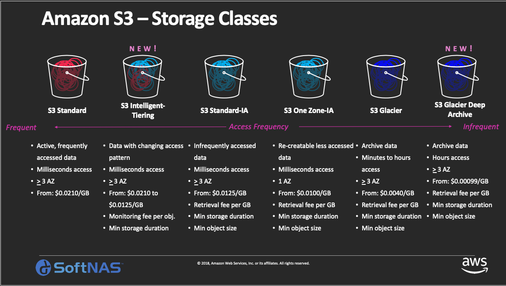
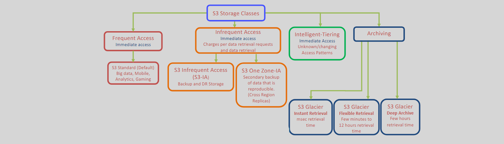

# 📦 **Amazon S3 Tiered Storage Classes**

Amazon S3 provides multiple storage classes, each tailored to specific use cases and access patterns. These classes enable you to balance cost and performance by storing data in the most appropriate tier based on its usage.

---

  
  
  ---

  

---

## **1️⃣ Frequent Access**

### 🟢 **S3 Standard**

#### **Description:**

S3 Standard is designed for frequently accessed data, offering high durability, availability, and performance.

#### **Features:**

- **🔒 Durability:** 99.999999999% (11 9's) durability.
- **⚡ Availability:** 99.99% availability.
- **🚀 Performance:** Low latency and high throughput.
- **📂 Use Cases:**
  - Dynamic websites
  - Content distribution
  - Big data analytics
  - Mobile and gaming applications

---

## **2️⃣ Infrequent Access**

### 🔵 **S3 Standard-Infrequent Access (Standard-IA)**

#### **Description:**

S3 Standard-IA is optimized for data that is accessed less frequently but requires rapid access when needed.

#### **Features:**

- **🔒 Durability:** 99.999999999% durability.
- **⚡ Availability:** 99.9% availability within a multi AZ.
- **💲 Lower Storage Costs:** Reduced cost compared to S3 Standard for infrequently accessed data.
- **💾 Retrieval Fee:** Charges apply for data retrieval (per GB).
- **📅 Minimum Storage Duration:** 30 days.
- **📂 Use Cases:**
  - Backup and disaster recovery
  - Long-term data storage
  - Archival data that needs occasional access

#### **Notes:**

- **Real-Time Access:** Provides real-time instant access to data.
- **Durability and Availability:** S3 Standard-IA offers the same durability as S3 One Zone-IA.
- **Minimum Storage Duration:** Objects deleted before 30 days incur a 30-day charge.
- **Cost Considerations:** AWS charges for requests and data retrievals.

---

### 🟡 **S3 One Zone-Infrequent Access (One Zone-IA)**

#### **Description:**

S3 One Zone-IA stores data in a single Availability Zone (AZ), offering lower costs for infrequently accessed data that does not require multi-AZ resilience.

#### **Features:**

- **🔒 Durability:** 99.999999999% durability within a single AZ.
- **⚡ Availability:** 99.5% availability.
- **💲 Cost Savings:** Lower storage costs compared to S3 Standard-IA.
- **💾 Retrieval Fee:** Charges apply for data retrieval (per GB).
- **📅 Minimum Storage Duration:** 30 days.
- **📂 Use Cases:**
  - Secondary backups
  - Data easily reproducible
  - Storing non-critical, infrequently accessed data

#### **Notes:**

- **Same Durability:** One Zone-IA maintains the same durability as S3 Standard-IA but within a single AZ.
- **Availability and Resilience:** Offers less availability and resilience compared to S3 Standard-IA due to single AZ storage.
- **Minimum Storage Duration:** Similar to S3 Standard-IA, objects deleted before 30 days incur a 30-day charge.

---

## **3️⃣ Intelligent-Access**

### 🟣 **Intelligent-Tiering**

#### **Description:**

S3 Intelligent-Tiering automatically moves data between access tiers based on changing access patterns, optimizing costs without performance impact.

#### **Features:**

- **🔄 Automatic Tiering:** Seamlessly transitions objects between frequent and infrequent access tiers.
- **📊 Monitoring and Automation:** Continuously monitors access patterns and adjusts storage class accordingly.
- **💲 Cost-Effective:** Reduces costs for data with unpredictable or changing access patterns.
- **💸 No Retrieval Fees:** Eliminates additional costs for data retrieval.
- **📂 Use Cases:**
  - Data lakes
  - Data analytics
  - New applications with unknown or changing access patterns

#### **Consideration**

- **Monitoring Fee:** AWS charges a small monthly fee for monitoring and automation.
- **re-access behavior:** If the data is accessed again, it gets moved back to the Frequent Access Tier.
- **Archive Access Tiers:**
  - **Archive Access Tier:** Bypasses the Archive Instant Access Tier, similar to the S3 Glacier Flexible Retrieval storage class.
  - **Deep Archive Access Tier:** Moves objects not accessed for a configurable period (default 180 days) to the S3 Glacier Deep Archive class.
  - **Retrieval Time:** Both Archive and Deep Archive Access Tiers require retrieval time when accessing data.

#### **How it Works**

- If Archive Tiering not Enabled

  

  
- If Archive Tiering Enabled

  

---

## **4️⃣ Archiving**

### 🧊 **S3 Glacier - Instant Retrieval**

#### **Description:**

S3 Glacier Instant Retrieval is designed for rarely accessed data that requires millisecond retrieval times.

#### **Features:**

- **🔒 Durability:** 99.999999999% durability.
- **⚡ Retrieval Options:** `Expedited` retrievals with millisecond access.
- **💲 Cost-Effective:** Lower storage costs compared to S3-IA class.
- **💸 Retrieval Fees:** Higher data access charges compared to S3-IA class.
- **📂 Use Cases:**
  - Digital preservation
  - Compliance archives
  - Media archives

---

### ❄️ **S3 Glacier - Flexible Retrieval**

#### **Description:**

S3 Glacier Flexible Retrieval is suitable for archives where data may need to be retrieved in minutes.

#### **Features:**

- **🔒 Durability:** 99.999999999% durability.
- **⚡ Retrieval Options:** `Expedited`, `Standard`, and `Bulk` retrievals`.
- **💲 Cost-Effective:** Significantly lower storage costs compared to other classes.
- **📅 Minimum Storage Duration:** 90 days minimum storage charge.
- **📂 Use Cases:**
  - Long-term archival storage
  - Regulatory compliance archives

---

### ⚫ **S3 Glacier Deep Archive**

#### **Description:**

S3 Glacier Deep Archive offers the lowest cost storage option for data that is rarely accessed and requires long-term retention.

#### **Features:**

- **🔒 Durability:** 99.999999999% durability.
- **⚡ Retrieval Options:** `Standard`, and `Bulk` retrievals`.
- **⏳ Retrieval Time:** Typically 12 hours for standard retrieval.
- **💰 Ultra-Low Cost:** The most cost-effective storage class for long-term data retention.
- **📅 Minimum Storage Duration:** 180 days.
- **📂 Use Cases:**
  - Regulatory archives
  - Digital preservation
  - Long-term backup storage

### **⚠️ Notes**

#### **🔖 Retrieval Options:**

Retrieval Options For: Glacier Flexible Retrieval and Glacier Deep Archive

| **Storage Class**                 | **Expedited**    | **Standard**    | **Bulk**        |
| --------------------------------- | ---------------- | --------------- | --------------- |
| **S3 Glacier Flexible Retrieval** | 1-5 minutes (\$) | 3-5 hours       | 5-12 hours      |
| **S3 Glacier Deep Archive**       | N/A              | Within 12 hours | Within 48 hours |

#### **🔖 Archive Tier:**

- **🔒 Data Loss Resilience:** Designed to sustain data loss in two facilities by replicating data across 3+ AZs.
- **👁️ Visibility:** Glacier archives are visible and available only through the AWS S3 dashboard.
- **🛒 Provisioned Retrieval Capacity:** Customers can purchase provisioned retrieval capacity to guarantee access for expedited retrievals.
- **💸 Deep Archive & Bulk Retrieval:** Offers the cheapest retrieval options among all S3 classes.

#### **🔖 Glacier Deep Archive – Archives and Vaults:**

- **📦 Archive:**

  - **🧾 Definition:** The base storage unit in Glacier, with a maximum size of `40 TB`.
  - **📦 Content:** Can be any data such as files, photos, or documents.

- **🏰 Vault:**
  - **🧾 Definition:** A container to store archives.
  - **📍 Regional Scope:** Confined to an AWS region.
  - **📦 Capacity:** Can store an unlimited number of archives.
  - **⚠️ Limitations:** Maximum of `1,000` vaults `per AWS region`.
  - **🔧 Access:** Archives can be uploaded to vaults `using CLI or SDKs` (not via the AWS Management Console).

---

## 🤔 **Choosing the Right Storage Class Consideration**

1️⃣ **📈 Access Frequency:**

- **High Access:** S3 Standard, S3 Intelligent-Tiering.
- **Low Access:** S3 Standard-IA, S3 One Zone-IA.
- **Rare Access:** S3 Glacier, S3 Glacier Deep Archive.

2️⃣ **⏱️ Data Retrieval Time:**

- **Immediate Access Needed:** S3 Standard, S3 Intelligent-Tiering.
- **Flexible Access Times:** S3 Standard-IA, S3 One Zone-IA.
- **Long Retrieval Times Acceptable:** S3 Glacier, S3 Glacier Deep Archive.

3️⃣ **💲 Cost Considerations:**

- **Minimize Storage Costs:** S3 Glacier Deep Archive.
- **Balance Storage and Retrieval Costs:** S3 Intelligent-Tiering, S3 Standard-IA.

4️⃣ **🔒 Durability and Availability Requirements:**

- **High Availability:** S3 Standard.
- **Single AZ Storage for Cost Savings:** S3 One Zone-IA.
