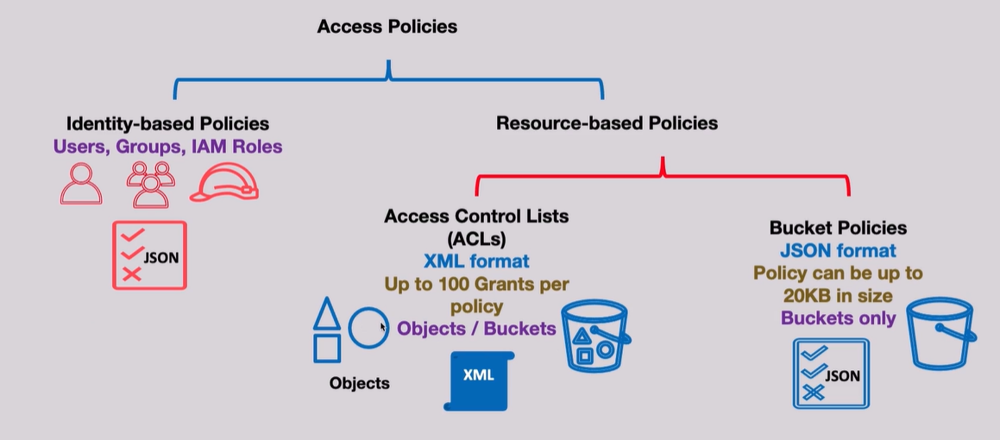

# 🔒 **Amazon S3 Access Policies**

Amazon S3 **Access Policies** are essential for controlling who can access your S3 buckets and objects, ensuring data security and compliance. Understanding how to effectively implement and manage these policies is crucial for solution architects to design secure and efficient storage solutions. This guide explores the different types of access policies available in S3, their features, and best practices for implementation.

---

## 🔐 **Access Policies Overview**

Access policies in Amazon S3 can be categorized into two primary types:

- **🔖 Identity-Based Policies:** Policies attached to IAM users, groups, or roles that define their permissions.
- **🔖 Resource-Based Policies:** Policies attached directly to S3 resources (buckets or objects) that define who can access them.

> 💡 Bonus: Amazon Glacier (S3’s cold storage cousin) uses a special version called **Vault Access Policies**.

---

<div align="center" style="padding: 0 20px;">
    
</div>

---

### **🤹‍♀️ S3 Resource-Based Policy Types:**

1️⃣ **Access Control Lists (ACLs):**

- **Format:** XML
- **Grants:** Up to 100 grants per policy
- **Scope:** Can be applied at the bucket or object level

2️⃣ **Bucket Policies:**

- **Format:** JSON
- **Size Limit:** Up to 20KB per policy
- **Scope:** Applied only at the bucket level

---

## 🧾 **Object Ownership in Amazon S3** 🔐

In S3, every object (file) is **owned by the AWS account that uploads it** — unless you configure otherwise.

**Object Ownership** determines which AWS account owns the objects within an S3 bucket. Properly configuring object ownership is vital for managing access and ensuring security.

<div style="text-align:center;">
    
</div>

---

This is important because:

- **The object owner controls permissions** on the object (like who can read/write/delete).
- Even if _you own the bucket_, someone else who uploads an object may own it — which can cause access headaches!

---

### 🧠 Why This Matters

If **another AWS account uploads** an object to your bucket, by default:

- ❌ _You (the bucket owner) won’t have full access to that object._
- You’d need the uploader to explicitly grant you permission via ACLs.

➡️ That’s messy, especially in **cross-account uploads**.

---

### ✅ Solution: Configure **Object Ownership**

S3 gives you control over who owns uploaded objects with **3 modes**:

| Mode                          | Who Owns the Object?                            | Recommended? |
| ----------------------------- | ----------------------------------------------- | ------------ |
| ❌ **Object Writer**          | Uploader (default legacy)                       | ❌ No        |
| ✅ **Bucket Owner Preferred** | Bucket owner (even if uploaded by someone else) | ✅ Yes       |
| 🔒 **ACLs Disabled**          | Bucket owner by default, ACLs ignored           | ✅ Strongest |

---

## 🛡️ **Using Access Control Lists (ACLs)**

Access Control Lists (ACLs) are the **legacy way** to grant permissions to S3 buckets and objects — like public read/write access or sharing with another AWS account. While they once played a vital role, **ACLs are now discouraged** in favor of more powerful and manageable **IAM and bucket policies**.

| Feature                     | With ACLs ✅              | Without ACLs (Recommended) ✅   |
| --------------------------- | ------------------------- | ------------------------------- |
| Per-object permissions      | ✅ Yes                    | ❌ No                           |
| Complex ownership scenarios | 😵 Possible               | 😊 Simplified (bucket owns all) |
| Condition-based rules       | ❌ Not supported          | ✅ Fully supported              |
| Public access via ACL       | ✅ Possible (but risky)   | ❌ Disabled                     |
| Clean access control        | ❌ Scattered (per-object) | ✅ Centralized (via policies)   |
| AWS recommendation          | ❌ Legacy feature         | ✅ Use IAM + Bucket policies    |

### ⚙️ When You Might Still Use Them

- Public access for individual objects
- Legacy apps

### ❌ Downsides

- Hard to scale
- Can’t use advanced conditions (like IP filters)
- XML format 🤢

### ✅ Best Practice

- **Disable ACLs** to simplify ownership and access control.
- Use **“Bucket Owner Preferred”** mode for cross-account uploads.
- Control access exclusively with **IAM and bucket policies**.
- Only use ACLs if you're supporting a legacy app or edge case.

💡 **ACLs = Old-school; Policies = Cloud-native.** Stick with policies for better security and clarity! 🔐

## 🔑 **Using Resource Policies**

Resource policies provide a powerful and flexible way to manage access to your S3 buckets and objects. They allow you to define permissions that apply to all or specific objects within a bucket.

### 🪣 **Bucket Policies**

- Written in **JSON**
- Applied at the **bucket level**
- Super handy for cross-account sharing, encryption enforcement, or public access

### 📦 **Vault Policies (Glacier)**

- Same concept, just for Amazon Glacier

### Why They Rock

| Advantage          | Why It Matters                                                 |
| ------------------ | -------------------------------------------------------------- |
| 🎯 Precise Control | Use `Action`, `Condition`, and `Principal` to fine-tune access |
| 🌍 Cross-Account   | Let another account upload, download, or list objects          |
| 🔐 Centralized     | Define access rules in one place instead of on each object     |

### ✍🏻 **Examples**

#### 1️⃣ **Granting Public Read Access**

This example grants **public read access** to all objects in the S3 bucket `hw-bucket-01`.

```json
{
  "Version": "2012-10-17",
  "Statement": [
    {
      "Sid": "PublicRead",
      "Effect": "Allow",
      "Principal": "*",
      "Action": "s3:GetObject",
      "Resource": ["arn:aws:s3:::hw-bucket-01/*"]
    }
  ]
}
```

---

#### 2️⃣ **Cross-Account Uploads**

Allows another AWS account to upload objects to your bucket but restricts them to a specific storage class.

```json
{
  "Version": "2012-10-17",
  "Statement": [
    {
      "Sid": "statement1",
      "Effect": "Allow",
      "Principal": {
        "AWS": "arn:aws:iam::AccountB-ID:user/Ahmed"
      },
      "Action": "s3:PutObject",
      "Resource": ["arn:aws:s3:::hw-bucket-01/*"],
      "Condition": {
        "StringEquals": {
          "s3:x-amz-storage-class": ["STANDARD_IA"]
        }
      }
    }
  ]
}
```

---

#### 3️⃣ **Cross-Account Object Uploads - Public Read Access**

Allows specified AWS accounts to upload objects with public read access.

```json
{
  "Version": "2012-10-17",
  "Statement": [
    {
      "Sid": "AddCannedAcl",
      "Effect": "Allow",
      "Principal": {
        "AWS": ["arn:aws:iam::accountA-ID:root", "arn:aws:iam::accountB-ID:root"]
      },
      "Action": "s3:PutObject",
      "Resource": "arn:aws:s3:::hw-bucket-01/*",
      "Condition": {
        "StringEquals": {
          "s3:x-amz-acl": "public-read"
        }
      }
    }
  ]
}
```

---

#### 4️⃣ **Object Uploads - Enforcing Encryption**

Enforces that all object uploads use AWS KMS-managed encryption.

```json
{
  "Version": "2012-10-17",
  "Id": "PutObjectPolicy",
  "Statement": [
    {
      "Sid": "DenyUnEncryptedObjectUploads",
      "Effect": "Deny",
      "Principal": "*",
      "Action": "s3:PutObject",
      "Resource": "arn:aws:s3:::hw-bucket-01/*",
      "Condition": {
        "StringNotEquals": {
          "s3:x-amz-server-side-encryption": "aws:kms"
        }
      }
    }
  ]
}
```

**Explanation:**

- **Condition:** Denies any `PutObject` request that does not include `s3:x-amz-server-side-encryption` set to `aws:kms`.
- **Effect:** Ensures that all objects uploaded to the bucket are encrypted using AWS KMS-managed keys.

---

## **🚫 Block Public Access (BPA)**

**AWS S3 has an extra security layer** called the **"Block Public Access" (BPA)** feature — and it overrides your public policy unless you explicitly turn it off.

Think of it as an **"are-you-sure-you-want-this-to-be-public" master switch**.

It exists to **protect you from accidental exposure**. Even if you write a perfectly valid policy like this:

```json
{
  "Effect": "Allow",
  "Principal": "*",
  "Action": "s3:GetObject",
  "Resource": "arn:aws:s3:::your-bucket-name/*"
}
```

…S3 will **still block access** unless you disable the Block Public Access setting.

---

### 🤔 How to Make a Bucket Truly Public

Here’s the full checklist:

| ✅ Step                             | 🔍 Why It Matters                              |
| ----------------------------------- | ---------------------------------------------- |
| Write the public-read bucket policy | Grants access to anonymous users               |
| Go to S3 → Bucket → Permissions     | Where the security settings live               |
| Click “Block public access”         | Default setting blocks **ALL public policies** |
| Uncheck `Block all public access`   | This is the **master override switch**         |
| Confirm changes                     | AWS asks you to acknowledge the risk ✅        |

---

### ⚠️ Pro Tip

Don’t make your entire bucket public unless absolutely necessary (e.g., hosting static website assets). For safer options:

- Use **signed URLs** for controlled access
- Enable **CloudFront** with **Origin Access Control (OAC)** for secure distribution

---

## 🧠 Final Best Practices (So You Don’t Lose Sleep 😅)

- ✅ **Use Bucket Policies + IAM** instead of ACLs
- ✅ **Choose "Bucket Owner Preferred"** to control all objects
- ✅ **Log All Access** with S3 access logs or CloudTrail
- ✅ **Add Conditions** like IP filtering or VPC access
- ✅ **Avoid wildcards (`*`) in permissions** unless strictly necessary

---

## 🧾 Summary Table: Your Access Policy Cheat Sheet

| Feature              | IAM Policy ✅ | Bucket Policy ✅ | ACL ❌   |
| -------------------- | ------------- | ---------------- | -------- |
| Scope                | Identity      | Resource         | Object   |
| JSON Format          | ✅            | ✅               | ❌ XML   |
| Conditional Access   | ✅            | ✅               | ❌       |
| Cross-Account Access | ✅            | ✅               | ✅       |
| Granular Permissions | ✅            | ✅               | ❌       |
| Recommended?         | ✅ Always     | ✅ Always        | ❌ Avoid |

🎯 **S3 access policies are your line of defense. Use them smartly, clearly, and consistently.**
