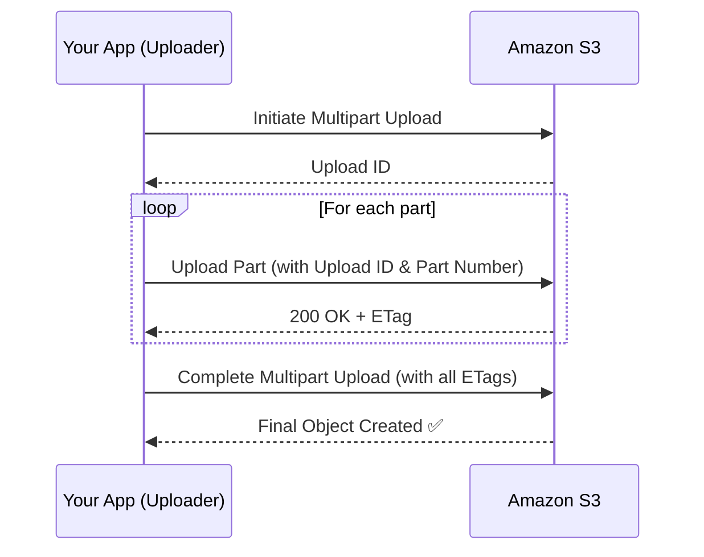

# 📤 **Amazon S3 Multipart Uploads**

Amazon S3 **Multipart Uploads** allow you to upload large objects in **discrete parts**, independently and in **parallel** — improving reliability, speed, and flexibility.

<div align="center" style="padding: 0 20px;">
  
</div>

---

## 🔍 **What Is Multipart Upload?**

Instead of uploading a massive file in one go (which can fail midway), Multipart Upload breaks it into **smaller chunks** (parts), uploads them independently, then assembles them into a single object.

---

## 📏 **Multipart Upload Limits**

| Requirement        | Value                                |
| ------------------ | ------------------------------------ |
| 📦 Minimum size    | 5 MB per part (except the last part) |
| ⚠ Required for     | Objects **larger than 5 GB**         |
| 💡 Recommended for | Objects **larger than 100 MB**       |
| 🛑 Max object size | 5 TB (combined size of all parts)    |
| 🧩 Max parts       | 10,000 parts per upload              |

---

## 🚀 **Why Use Multipart Uploads?**

### ✅ **Faster Uploads**

- Upload parts **in parallel** to maximize network throughput.

### 🔁 **Retry Only What Fails**

- If part 7 fails, retry **only part 7**, not the whole object.

### ⏸️ **Pause and Resume Support**

- You can **pause** uploads and **resume** them later using the upload ID.

### 💾 **Efficient for Spotty Connections**

- Great for unreliable networks, especially for mobile or remote uploads.

---

## 🛠️ **How It Works: Step-by-Step**



---

## 🧪 **Code Example: Multipart Upload (Boto3 Python)**

```python
import boto3
from boto3.s3.transfer import TransferConfig

s3 = boto3.client('s3')

# Optional: Fine-tune transfer config
config = TransferConfig(
    multipart_threshold=1024 * 25,  # 25MB threshold
    multipart_chunksize=1024 * 25, # 25MB chunks
    use_threads=True
)

# Upload file with multipart
s3.upload_file(
    Filename='large_file.zip',
    Bucket='my-bucket-name',
    Key='uploads/large_file.zip',
    Config=config
)
```

---

## 💡 **Best Practices**

- 📁 **Use multipart upload for files >100MB** to improve speed and reliability.
- 🧵 **Enable multithreading** for parallel part uploads.
- 🧠 **Track Upload IDs** if you plan to pause/resume later.
- 🧹 **Abort incomplete uploads** to avoid storage waste (you can set lifecycle rules for this).

---

## 📌 Summary Table

| Benefit                      | Description                            |
| ---------------------------- | -------------------------------------- |
| ⚡ Faster uploads            | Upload parts in parallel               |
| 💪 Resilient uploads         | Retry individual failed parts          |
| 🧠 Intelligent storage usage | Pause/resume and control uploads       |
| 🧹 Easy cleanup              | Abort unfinished uploads to free space |
| ✅ Required for >5GB uploads | Multipart required for any object >5GB |
