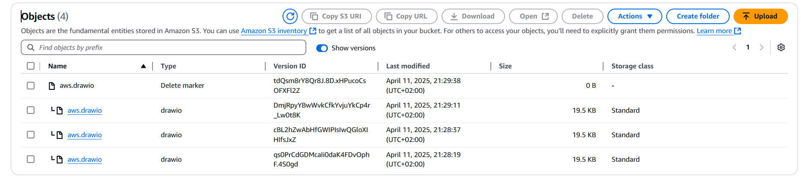

# 📦 **Amazon S3 Bucket Versioning**

Amazon S3 **Bucket Versioning** is a powerful feature that protects your data from accidental **deletions** and **overwrites** by maintaining **multiple versions** of every object in a bucket.

---

<div align="center" style="padding: 0 20px;">
  
</div>

---

<div align="center" style="padding: 0 20px;">
  
</div>

---

## 🔐 **What Is Bucket Versioning?**

When enabled, versioning ensures that **every object update** results in a **new version**, preserving the older ones. You can retrieve, restore, or delete specific versions at any time.

### ✨ **Key Highlights**

| Feature                 | Description                                             |
| ----------------------- | ------------------------------------------------------- |
| 🌍 Universal Protection | Applies to **all objects** in the bucket                |
| 🔄 Version History      | Saves **every version** of each object                  |
| 🧼 Soft Deletes         | Deletions only mark the object with a **DELETE marker** |
| ♻️ Lifecycle Support    | Use policies to transition/delete old versions          |

---

## 🔄 **How Versioning Works (Step-by-Step)**

### 1️⃣ **Uploading Objects**

- 📥 **New Object**: Assigned a **unique version ID**.
- 🔄 **Update Existing**: Creates a **new version**, retaining the old one as **non-current**.

### 2️⃣ **Deleting Objects**

- 🗑️ S3 places a **DELETE marker** instead of deleting the data.
- ⚠️ The object appears deleted unless you **specify a version ID** to retrieve it.

### 3️⃣ **Recovering Deleted Objects**

- ✅ **Delete the DELETE marker** to bring the most recent version back.
- 📂 All previous versions remain retrievable unless explicitly deleted.

### 4️⃣ **Managing Versions with Lifecycle Rules**

- 🧊 **Transition to Glacier** after N days.
- ⌛ **Expire non-current versions** after 365 days.

Example:

```json
{
  "Rules": [
    {
      "Status": "Enabled",
      "NoncurrentVersionTransition": {
        "NoncurrentDays": 30,
        "StorageClass": "GLACIER"
      },
      "NoncurrentVersionExpiration": {
        "NoncurrentDays": 365
      }
    }
  ]
}
```

---

## 🔐 **MFA Delete (Optional Security Layer)**

Add an extra protection layer by requiring **MFA (Multi-Factor Authentication)** to:

- 🚫 Delete versions of objects
- 🔄 Change versioning configuration

### 🔑 Important Notes

- Only the **root account** can enable MFA Delete
- Must use **AWS CLI**, **SDK**, or **API** (not Console)

---

## 🌟 **Benefits Recap**

| Benefit            | Description                                                   |
| ------------------ | ------------------------------------------------------------- |
| 🛡️ Data Protection | Prevents permanent loss from accidental deletes/overwrites    |
| 📜 Audit Readiness | Tracks full history of object changes                         |
| 🔄 Easy Rollbacks  | Restore to any previous version with a few clicks or commands |
| 💰 Cost Control    | Use lifecycle rules to archive or expire non-current versions |

---

Enable versioning on buckets where **data durability, integrity, and audit history** are mission-critical. It’s your **undo button** for S3! 💾

## References

[Bucket Versioning](https://docs.aws.amazon.com/AmazonS3/latest/userguide/versioning-workflows.html)
