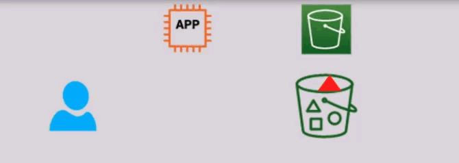
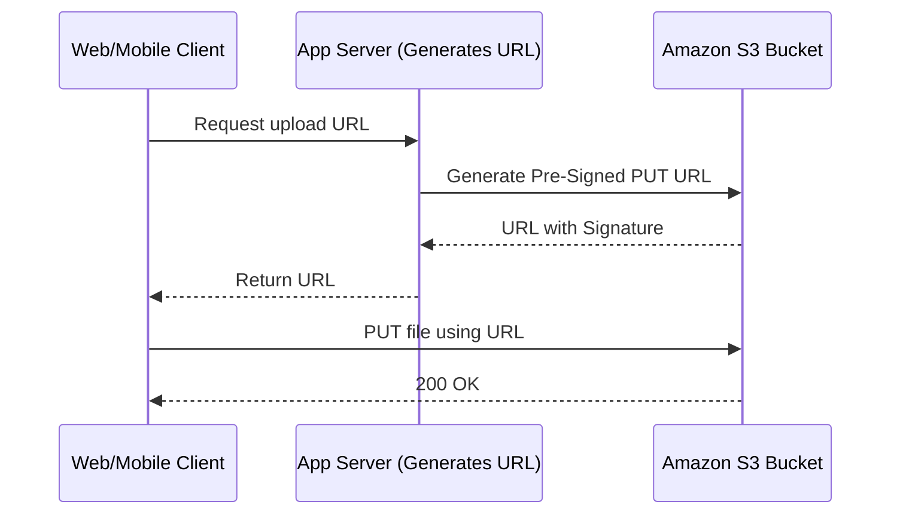

# 🔗 **Amazon S3 Pre-Signed URLs**

Amazon S3 **Pre-Signed URLs** let you share **temporary, secure access** to your private S3 objects — without making them public or exposing your AWS credentials. Whether you're sharing a PDF download or allowing a user to upload a file directly to S3, this tool is a go-to for seamless and secure file access in your apps.

---

<div align="center">
  
</div>

---

## 📌 **What Is a Pre-Signed URL?**

A **Pre-Signed URL** is a **time-limited, signed request** generated using your AWS credentials that allows another party to perform a specific S3 operation (like GET or PUT) on a specific object — without needing their own AWS credentials.

### ✅ Key Benefits

| Feature                  | Description                                                          |
| ------------------------ | -------------------------------------------------------------------- |
| 🔐 **Secure**            | Auth includes signature, so only the URL owner can access the object |
| ⏳ **Temporary**         | URL expires after the set time limit (from seconds to 7 days)        |
| 🙌 **Credential-Free**   | The recipient doesn't need AWS credentials or roles                  |
| 🔁 **Upload & Download** | Can be used for both `PUT` (upload) and `GET` (download) operations  |

---

## 🔒 **How It Works**

<div align="center">



</div>

---

1. You (the object owner) generate a **pre-signed URL** using AWS CLI, SDK, or Console.
2. The URL includes:
   - Your **Access Key ID**
   - An **expiry timestamp**
   - A **cryptographic signature**
3. You share that URL.
4. Anyone with the URL can now **upload/download** the object **until the expiration time**.

### 🧠 Behind the Scenes

S3 verifies:

- That the signature was created by someone with access
- That the URL hasn’t expired
- That the operation (GET/PUT/etc.) is valid

If anything fails → access is **denied**.

---

## 🛠️ **Generating Pre-Signed URLs**

### 🧑‍💻 AWS Management Console

- 1️⃣ **Navigate to the S3 Console:**
  - Log in to the [AWS Management Console](https://console.aws.amazon.com/s3/) and open the **S3** service.
- 2️⃣ **Select the Object:**
  - Browse to your bucket and select the object you want to share.
- 3️⃣ **Generate Pre-Signed URL:**

  - Click on the **"Share"** button or **"Actions"** dropdown.
  - Select **"Create Pre-Signed URL"**.
  - Set the **expiration time** for the URL.
  - Click **"Generate URL"**.

- 4️⃣ **Share the URL:**
  - Copy the generated URL and share it with the intended recipients.

### 🔧 AWS CLI

- 1️⃣ Generate a Download Link (GET)

  ```bash
  aws s3 presign s3://my-bucket/file.txt --expires-in 3600
  ```

- 2️⃣ Generate an Upload Link (PUT)

  ```bash
  aws s3 presign s3://my-bucket/file.txt --http-method PUT --expires-in 3600
  ```

  > 📝 `--expires-in` is in **seconds**. Max is **7 days**.

---

### 🐍 Python (Boto3) – SDK Example

- 1️⃣ Upload (PUT)

  ```python
  import boto3

  client = boto3.client('s3')

  upload_url = client.generate_presigned_url(
      'put_object',
      Params={'Bucket': 'my-bucket', 'Key': 'my-folder/upload.txt'},
      ExpiresIn=3600
  )

  print(upload_url)
  ```

  > 💡 Use `curl` or a frontend app to upload:

  ```bash
  curl -X PUT -T file.txt "<upload_url_here>"
  ```

- 2️⃣ Download (GET)

  ```python
  download_url = client.generate_presigned_url(
      'get_object',
      Params={'Bucket': 'my-bucket', 'Key': 'my-folder/upload.txt'},
      ExpiresIn=900
  )

  print(download_url)
  ```

  > 💬 “Anyone with this link can download the file within 15 minutes.”

---

## 🧰 **Use Cases for Pre-Signed URLs**

| Scenario             | Description                                                                 |
| -------------------- | --------------------------------------------------------------------------- |
| 🔽 User Download     | Share private file links for limited time (e.g., invoices, reports)         |
| 🔼 User Upload       | Let users upload files (profile images, CVs) without direct AWS access      |
| ⚙️ API File Transfer | Let Lambda or EC2 securely upload/download to S3 without static credentials |
| 🌍 Static Sites      | Securely provide downloadable assets in a JAMstack workflow                 |

---

## 🚨 **Important Notes & Gotchas**

| Detail                     | Explanation                                                                |
| -------------------------- | -------------------------------------------------------------------------- |
| ⏰ Max Expiration          | AWS CLI/SDK supports up to **7 days** expiration                           |
| 🔐 Signature Type          | V4 signing process — uses credentials & secret to sign                     |
| 📦 Object-Specific         | URL only works for **one object** and **one method** (GET or PUT)          |
| 🧾 Tied to Permissions     | The generator must have `s3:GetObject` or `s3:PutObject` on the target key |
| ❌ Not for Listing Buckets | Can’t use pre-signed URLs to list files                                    |

---

## 💡 **Best Practices**

- ✅ Keep URLs **short-lived** for security (usually 15 mins – 1 hour)
- ✅ Never expose AWS credentials in frontend apps — use pre-signed URLs instead
- ✅ Use **CloudFront Signed URLs** if you need CDN + fine-grained control + HTTPS
- ✅ Monitor access with S3 **access logs** or **CloudTrail**

---

## 🆚 S3 Pre-Signed URL vs CloudFront Signed URL

| Feature                 | S3 Pre-Signed URL                         | CloudFront Signed URL                         |
| ----------------------- | ----------------------------------------- | --------------------------------------------- |
| 🔐 Security Scope       | Specific S3 object                        | CloudFront distribution (any origin)          |
| 🌍 HTTPS Support        | Only for public buckets or via CloudFront | Native HTTPS via CloudFront                   |
| 🌎 Global Caching       | ❌ No CDN                                 | ✅ Yes – CDN support                          |
| ⚙️ Fine-Grained Control | ❌ Limited                                | ✅ Expiry, IP range, geo, user-agent, cookies |
| 💡 Use Case             | Temporary file upload/download            | Protect streaming, large files, global access |

---

## 🧠 TL;DR – Why Pre-Signed URLs Rock

- You get **secure, temporary access** to a file in S3.
- You don’t need to expose credentials or change bucket policies.
- It’s **fast**, **cheap**, and **easy to integrate**.

> ✨ Perfect for sharing private files — without ever making your S3 bucket public.
