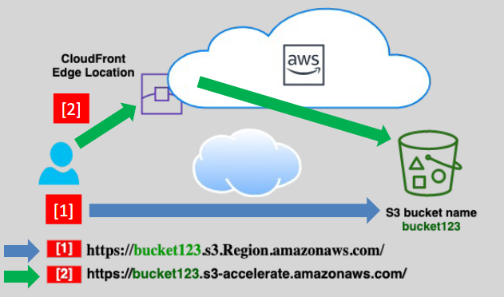
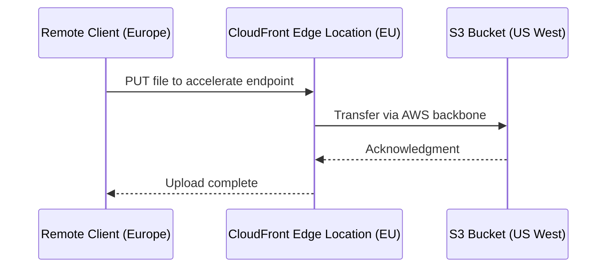

# ⚡ **Amazon S3 Transfer Acceleration (TA)**

> _Speed up uploads and downloads to Amazon S3, especially from around the world._

Amazon S3 **Transfer Acceleration** is a premium feature that uses **Amazon CloudFront’s global edge network** to dramatically **reduce latency** and **speed up data transfers** to and from your S3 bucket — especially when users or applications are far from the S3 bucket’s region.

---

<div align="center">
  
</div>

---

## 🚀 **What Is Transfer Acceleration?**

### ✅ **Official Definition**

**S3 Transfer Acceleration** uses Amazon CloudFront edge locations to accelerate uploads and downloads by routing requests through the nearest edge location and forwarding them over Amazon’s optimized backbone network to your S3 bucket.

### 💡 In Simple Terms

You **upload or download** files via a **special S3 Accelerate endpoint**, and AWS ensures the data travels **the fastest path across the globe**, using CloudFront's network.

---

## 🌐 **How It Works**



### 🌎 Behind the Scenes

- Your file is first uploaded to the **nearest edge location** (via HTTPS).
- AWS routes that file through its **high-speed internal network** to the **S3 bucket’s region**.
- The transfer is often **faster and more reliable** than using the public internet directly to S3.

---

## 🛠️ **How to Enable Transfer Acceleration**

### 🔧 Using the AWS Console

1. Go to the **S3 bucket** in the AWS Management Console.
2. Choose **Properties** → scroll to **Transfer Acceleration**.
3. Click **Edit** → Enable **Transfer Acceleration**.
4. Save changes ✅

You can now access your bucket via the accelerated endpoint:

```ini
https://<bucket-name>.s3-accelerate.amazonaws.com
```

---

## 🔗 **Accelerated vs. Regular Endpoint**

| Access Type | URL Format                                                |
| ----------- | --------------------------------------------------------- |
| Standard    | `https://my-bucket.s3.us-east-1.amazonaws.com/my-object`  |
| Accelerated | `https://my-bucket.s3-accelerate.amazonaws.com/my-object` |

> ✨ No region prefix required with accelerate endpoints — AWS handles it behind the scenes.

---

## 📊 **When Should You Use Transfer Acceleration?**

### ✅ Best for

- 🧍‍♂️ **End-users far from your bucket's region** (e.g., uploading from India to us-east-1)
- 📥 **Uploading large files over long distances**
- 🌍 **Mobile apps or global applications** needing consistent, high-speed S3 access

### ❌ Not ideal when

- 🌐 Your users are in the **same region** as the bucket
- 💸 You’re sensitive to additional **per-GB transfer costs**

---

## 💰 **Transfer Acceleration Pricing**

- You are charged **per GB transferred** through the accelerated endpoint.
- Pricing is **in addition to standard S3 charges**.
- 🧮 Compare costs using [AWS Pricing Calculator](https://calculator.aws.amazon.com/).

> 🔗 [See Transfer Acceleration pricing](https://aws.amazon.com/s3/pricing/)

---

## 📈 **Try It Yourself – Speed Comparison Tool**

Use the official [S3 Transfer Acceleration Speed Test Tool](https://s3-accelerate-speedtest.s3-accelerate.amazonaws.com/en/accelerate-speed-comparsion.html) to:

- 🚀 Upload a test file from your browser
- 📊 Measure performance **with and without** acceleration
- 🧭 Compare transfer speeds from different regions

---

## ✅ **Real-World Use Case**

> **Scenario**: A video editing team in Europe uploads 10 GB raw footage daily to a shared bucket in `us-west-1`.  
> **Without TA**: Uploads are slow and often fail.  
> **With TA**: Transfer time cut by 60%, with stable upload success via edge nodes.

---

## 🔐 **Security & Compatibility**

- Fully supports **HTTPS** encryption.
- Works with **pre-signed URLs** and **multipart uploads**.
- You don’t need to modify existing IAM policies — just use the **accelerated endpoint**.

---

## 🧠 Summary: Why Use S3 Transfer Acceleration?

| Benefit               | Description                                                        |
| --------------------- | ------------------------------------------------------------------ |
| 🌍 Global Performance | Uses edge locations to improve speed worldwide                     |
| ⚡ Faster Uploads     | Greatly reduces latency for large/remote uploads                   |
| 🔁 Multipart Uploads  | Compatible with parallel/multipart uploads                         |
| 🔒 Secure             | Data transfers happen over secure HTTPS and AWS backbone           |
| 💬 Easy to Use        | Just enable the setting and switch to the `s3-accelerate` endpoint |
