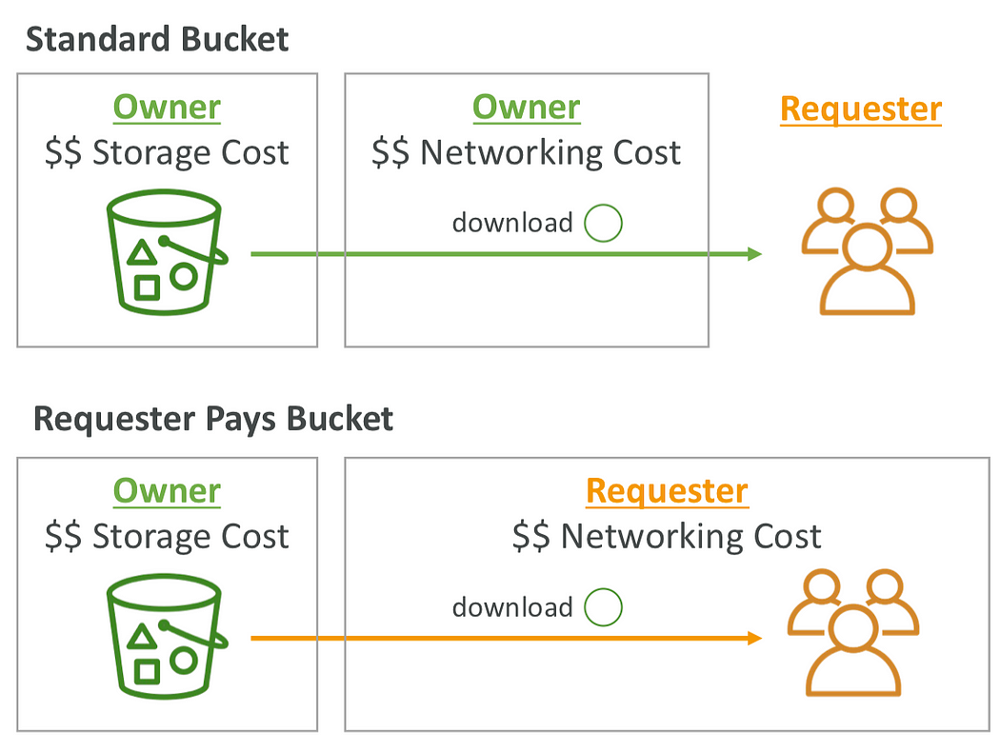
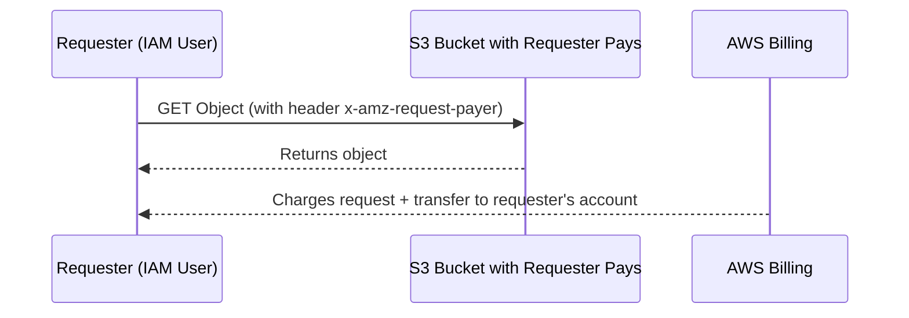

# 💸 **Amazon S3 Requester Pays**

> _Shift the cost of accessing S3 data to the people who request it._

---

## 📦 **What is Requester Pays?**

Amazon S3 **Requester Pays** is a **cost allocation feature** that allows the **bucket owner** to **delegate data access charges** (like download costs) to the **person accessing the data**.

> ✅ Great for **public datasets**, research archives, and multi-user environments where the **owner stores**, but **others retrieve**.

---

<div align="center">
  
</div>

---

## 🧠 **How It Works**

<div align="center">



</div>

---

## 🔍 **Key Concepts**

| Feature                    | Description                                                              |
| -------------------------- | ------------------------------------------------------------------------ |
| 📊 **Cost Shift**          | Requester pays for **data retrieval and requests**.                      |
| 🛠 **Storage Ownership**    | Bucket owner pays only for **storage**.                                  |
| 🔒 **Secure Access**       | Only **authenticated** AWS users (IAM roles or access keys) can request. |
| ⛔ **No Anonymous Access** | You **cannot use** public anonymous access with requester pays.          |
| 🔑 **Header Required**     | All requests **must include** the `x-amz-request-payer` header.          |

---

## 🛠️ **How to Enable Requester Pays**

### ✅ Enable via AWS Console

1. Go to your **S3 bucket** in the AWS Console.
2. Open the **Permissions** tab.
3. Scroll to **Requester Pays** and click **Edit**.
4. ✅ Enable the checkbox and save.

---

### ✅ Enable via AWS CLI

```bash
aws s3api put-bucket-request-payment \
  --bucket my-bucket-name \
  --request-payment-configuration '{"Payer":"Requester"}'
```

---

## 📥 **How to Access Requester Pays Buckets**

All requests (GET, HEAD, LIST, etc.) must **explicitly state** they’re willing to pay:

### ✅ AWS CLI Example

```bash
aws s3api get-object \
  --bucket my-bucket-name \
  --key data/report.csv \
  --request-payer requester \
  report.csv
```

### ✅ Boto3 Example (Python)

```python
import boto3

s3 = boto3.client('s3')
response = s3.get_object(
    Bucket='my-bucket-name',
    Key='data/report.csv',
    RequestPayer='requester'
)
```

---

## 🧾 **Billing Breakdown**

| Who Pays?          | Cost Type                  |
| ------------------ | -------------------------- |
| 🧍‍♂️ Requester       | ❗ GET, PUT, LIST requests |
| 🧍‍♂️ Requester       | ❗ Data transfer OUT       |
| 🧑‍💼 Bucket Owner | ✅ Storage only            |

💡 **Use case**: You're a university hosting a **3 TB research dataset**. Instead of footing the bill for every download, **each student/researcher pays their own way**.

---

## 📌 **Best Practices**

### 🔐 Access Control

- Use **IAM policies** to restrict who can request data.
- Prevent abuse by requiring **specific roles or conditions**.

### 📋 Documentation

- Inform your users that:
  - They **must be authenticated**
  - They **must include `x-amz-request-payer`** header

### 🔍 Monitor Usage

- Track usage by enabling **S3 Access Logs**
- Use **AWS Billing reports** to break down charges by user/account

---

## 📈 **Real-World Use Cases**

| Use Case                       | Why Requester Pays Works                                                 |
| ------------------------------ | ------------------------------------------------------------------------ |
| 📚 Academic Research Datasets  | Universities distribute large open datasets without paying for downloads |
| 🛰️ Satellite Imagery Providers | Government-funded S3 datasets shift transfer costs to users              |
| 🎮 Game Patch Mirrors          | Gaming companies host static files; players pay to download              |
| 📦 Public Archives / Open Data | NGOs or public sector institutions offload download traffic cost         |

---

## 🧠 Summary

| Feature                 | Benefit                                         |
| ----------------------- | ----------------------------------------------- |
| 💵 Cost Delegation      | Requesters pay for access, not the bucket owner |
| 🔐 Controlled Sharing   | Only authenticated AWS users can access         |
| 🧩 Simple Integration   | Add a header → you're good to go!               |
| 📈 Scales for Open Data | Great for public-but-controlled file sharing    |
