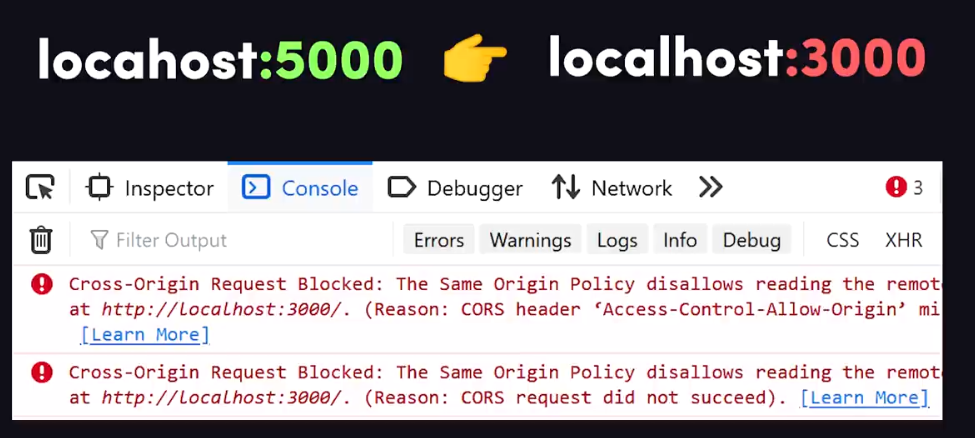
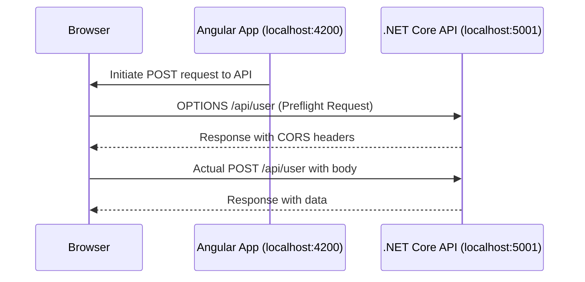
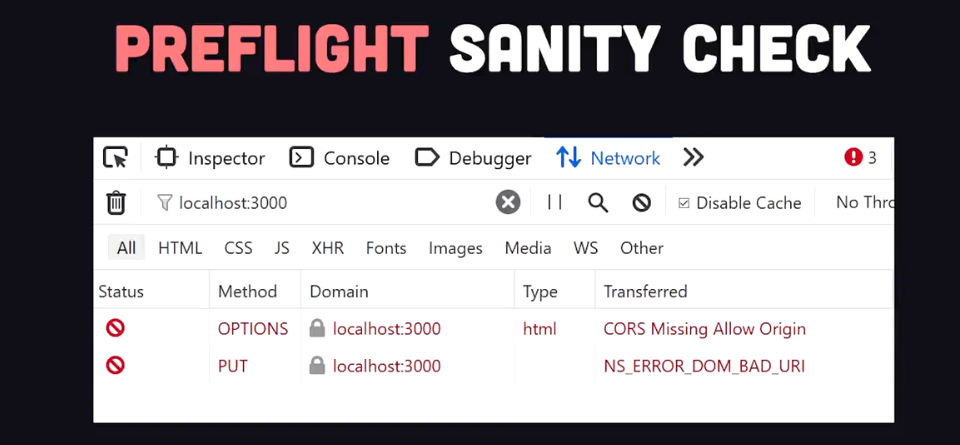
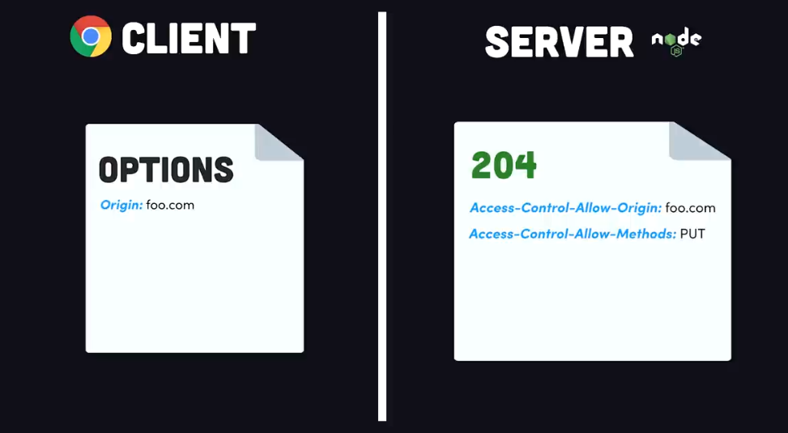

# 🧭 **CORS Explained for Devs (Angular + .NET Core)**

<div style="text-align: center;">
    
</div>

---

## 📌 What’s the Problem?

Imagine this:

- You’re developing a Single Page App (SPA) with **Angular** running on `http://localhost:4200`.
- Your backend API is built with **ASP.NET Core**, running on `http://localhost:5001`.
- You open your Angular app in the browser → It tries to call the API → **Boom! CORS error**.

Why? Because browsers are **strict** about cross-origin requests.

---

## 🌍 **What is CORS (Cross-Origin Resource Sharing)?**

> 📖 **Official Definition:** CORS is a security feature implemented by browsers that blocks web pages from making requests to a different **origin** unless that origin explicitly allows it.

### 💡 **What’s an “origin”?**

An **origin** is a combination of:

- `Scheme` + `Host` + `Port`

So:

- `http://localhost:4200`  
  different origin from
- `https://localhost:5001`

---

## 🔥 Real-World Example: Angular to ASP.NET Core

Let’s say your Angular app tries to call:

```ts
this.http.post("http://localhost:5001/api/user", { name: "Ahmed" });
```

### 🛑 You’ll see

```http
Access to fetch at 'http://localhost:5001/api/user' from origin 'http://localhost:4200' has been blocked by CORS policy.
```

Why? Because the browser says:

> "Wait a second. You’re trying to reach another origin. I’m gonna send a **preflight request** first to make sure it’s allowed."

---

<div style="text-align: center;">



</div>

---

## ✈️ **Preflight Request: The Sneaky Check**

<div style="text-align: center;">
    
</div>

---

### 🧐 What Is It?

A **preflight request** is an HTTP `OPTIONS` request the browser sends **before** the actual request — to **ask for permission**.

#### 🔁 When does a preflight happen?

A preflight is triggered when:

- You use **HTTP methods** like `PUT`, `DELETE`, or `POST` (if it has a custom `Content-Type`)
- You use **custom headers** (like `Authorization`, `X-Custom-Header`)
- You set `Content-Type` to anything **other than**:
  - `application/x-www-form-urlencoded`
  - `multipart/form-data`
  - `text/plain`

#### 🔍 Example Preflight Request

```http
OPTIONS /api/user HTTP/1.1
Origin: http://localhost:4200
Access-Control-Request-Method: POST
Access-Control-Request-Headers: content-type
```

#### 🔐 Expected Server Response

```http
HTTP/1.1 204 No Content
Access-Control-Allow-Origin: http://localhost:4200
Access-Control-Allow-Methods: POST, GET, OPTIONS
Access-Control-Allow-Headers: content-type
Access-Control-Max-Age: 600
```

<div style="text-align: center;">
    
</div>

---

### 🧠 What Do These Headers Mean?

| Header                         | Meaning                                                        |
| ------------------------------ | -------------------------------------------------------------- |
| `Access-Control-Allow-Origin`  | Allows requests from this origin                               |
| `Access-Control-Allow-Methods` | Lists allowed methods (GET, POST, etc.)                        |
| `Access-Control-Allow-Headers` | Lists allowed headers                                          |
| `Access-Control-Max-Age`       | (🌟 Important) Caches the **preflight response** for X seconds |

---

### ⏳ **Preflight Caching Explained**

The browser **remembers the CORS permissions** for a certain route (like `/api/user`) for a specific amount of time using:

```http
Access-Control-Max-Age: 600
```

This tells the browser:

> “Hey, you don’t need to ask me again for 10 minutes (600 seconds). Just go ahead.”

---

<div style="text-align: center;">
    
</div>

---

## 🛠️ CORS Fix in ASP.NET Core

Add this to your backend:

```csharp
builder.Services.AddCors(options =>
{
    options.AddPolicy("AllowAngularDev", policy =>
    {
        policy
            .WithOrigins("http://localhost:4200")
            .AllowAnyHeader()
            .AllowAnyMethod()
            .SetPreflightMaxAge(TimeSpan.FromMinutes(10)); // cache preflight
    });
});

app.UseCors("AllowAngularDev");
```

---

## 🌟 Summary: CORS with Preflight for Devs

| Concept         | Explanation                                                                      |
| --------------- | -------------------------------------------------------------------------------- |
| CORS            | Browser block policy for security                                                |
| Origin          | Combination of scheme, host, and port                                            |
| Preflight       | OPTIONS request to ask the server for permission                                 |
| Trigger         | Custom methods, headers, or content types                                        |
| Fix on API      | Add correct CORS headers in the response                                         |
| Cache Preflight | `Access-Control-Max-Age` avoids repeated preflight requests                      |
| Dev Tip         | Avoid preflight by using only safe headers/methods (if performance is a concern) |
