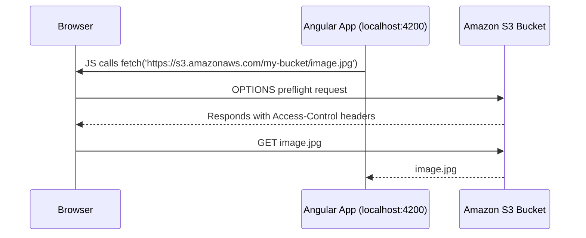

# 🌐 Amazon S3 CORS (Cross-Origin Resource Sharing)

Ever run your **SPA on `localhost:4200`** and got blocked when trying to fetch an image or file from **S3**?  
That’s **CORS** stepping in — the browser’s built-in security guard. Let’s break it all down in a way that makes total sense to a software developer.

---

<div align="center" style="padding: 0 0;">
  
</div>

---

## 🧠 What is CORS, Really?

> **CORS** (Cross-Origin Resource Sharing) is a security feature enforced by browsers that **prevents JavaScript from making requests to a different origin unless explicitly allowed**.

| Request Origin   | Allowed?                                   |
| ---------------- | ------------------------------------------ |
| Same origin      | ✅ Yes                                     |
| Different origin | ⚠️ Blocked unless allowed via CORS headers |

### 🔥 Real Example

Your Angular frontend is served from:

```ini
http://localhost:4200
```

Your backend API or S3 bucket is hosted on:

```ini
http://localhost:5001
or
https://mybucket.s3.amazonaws.com
```

Without CORS? ❌ The browser blocks the request.
With CORS? ✅ The browser checks the S3 bucket's CORS config → allows access.

---

## 🧩 Why CORS is Needed in S3

Amazon S3 is a **RESTful object store** and doesn’t care about browsers — but **browsers do** care about origins.  
That’s where **CORS rules** come in to tell the browser:

> “Yes, requests from origin `X` are allowed to access me.”

---

## 🗂️ S3 CORS Use Cases

- 🖼️ Hosting images on S3 and showing them on your frontend
- 📄 Downloading PDFs directly from S3
- ☁️ Uploading files to S3 directly from the browser using JavaScript
- 🔄 Accessing S3 via `fetch()` or `axios` in frontend apps

---

## 🧪 How CORS Works in Amazon S3



---

## 📜 Sample CORS Configuration for S3 Bucket

```json
[
  {
    "AllowedHeaders": ["*"],
    "AllowedMethods": ["GET", "POST", "PUT"],
    "AllowedOrigins": ["http://localhost:4200", "https://example.com"],
    "ExposeHeaders": ["ETag"],
    "MaxAgeSeconds": 3000
  }
]
```

### 🔍 What These Fields Mean

| Field            | Meaning                                                              |
| ---------------- | -------------------------------------------------------------------- |
| `AllowedOrigins` | List of origins that can make requests to this bucket                |
| `AllowedMethods` | What kind of HTTP methods are permitted (`GET`, `POST`, `PUT`, etc.) |
| `AllowedHeaders` | What request headers are allowed from the client                     |
| `ExposeHeaders`  | What headers can be seen by the browser (like `ETag`)                |
| `MaxAgeSeconds`  | How long the **preflight response** should be cached                 |

---

## ⚙️ How to Apply CORS in S3

### 📌 Via AWS Console

1. Open the **S3 Console**
2. Choose your **bucket**
3. Go to **Permissions** → **CORS Configuration**
4. Paste the CORS JSON
5. ✅ Save

---

## 🧠 Understanding the Preflight Request

When your frontend sends certain types of requests (e.g., `PUT`, custom headers), **the browser first sends a `OPTIONS` request** to ask:

> “Hey, is this allowed?”

If S3 replies with valid headers → request proceeds.  
Otherwise → ❌ blocked by the browser.

### 💡 Preflight Caching

The `MaxAgeSeconds` field tells the browser **how long to cache** the preflight result.

```json
"MaxAgeSeconds": 3000
```

Means: for 3000 seconds (~50 minutes), don’t re-ask S3 — just use the cached CORS permission. 🚀

---

## 🔐 Common Gotchas

| Mistake                                               | Fix It By...                                              |
| ----------------------------------------------------- | --------------------------------------------------------- |
| Using `*` in `AllowedOrigins` and sending credentials | ❌ Not allowed — remove credentials or be explicit        |
| No CORS config at all                                 | Add proper JSON under Permissions → CORS Configuration    |
| Wrong HTTP method                                     | Ensure `AllowedMethods` includes `PUT`, `POST`, etc.      |
| Preflight always failing                              | Check request headers, enable them under `AllowedHeaders` |

---

## ✅ When Should You Use CORS in S3?

- Hosting a static frontend elsewhere that pulls resources from S3
- Uploading files directly from browser to S3
- Integrating S3 images or fonts into a website

---

## 🧪 Bonus Test Tool

Use the **[S3 Preflight Tester](https://apitester.org/)** or open **DevTools → Network tab → OPTIONS** to debug your CORS flow live.

---

## 🧼 Final Words

> 🧠 CORS is not an S3 feature — it’s a **browser protection layer**.  
> S3 just helps you **respond properly** to the browser's questions.  
> Get your JSON config right — and your frontend will thank you!
