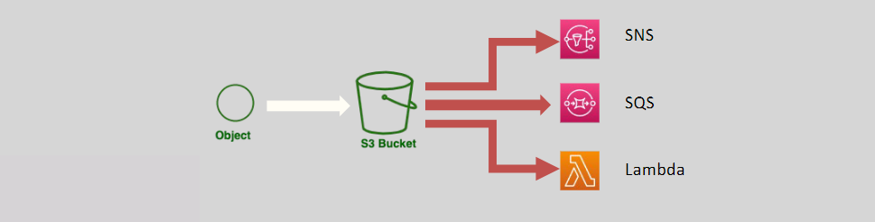
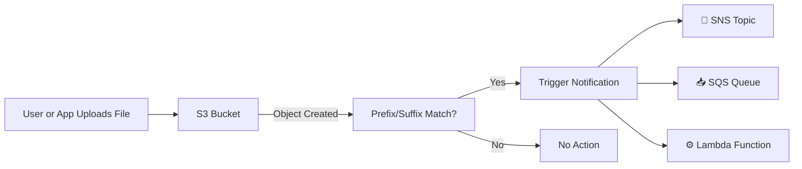

# 📢 **Amazon S3 Event Notifications**

Amazon S3 **Event Notifications** let your apps automatically respond when something happens in your bucket — like a file upload, deletion, or restore. Think of it like giving your bucket ears 👂 so it can say: “Hey, something just happened!” and take action. ⚡

<div align="center" style="padding: 0 0;">
  
</div>

---

## 🔍 **What Are S3 Event Notifications?**

S3 Event Notifications are configurations that detect specific events (like new uploads or deletions) and trigger actions via:

- 📨 Amazon SNS (email/text broadcast)
- 📬 Amazon SQS (queue for async processing)
- 🧠 AWS Lambda (run custom code instantly)

---

## ⚙️ **How S3 Event Notifications Work**



---

## 🛠️ **How to Set Up S3 Event Notifications**

### 1️⃣ Open Your S3 Bucket

- Go to **S3 Console → Buckets**
- Choose your bucket

### 2️⃣ Go to **Properties → Event Notifications**

- Scroll to **“Event notifications”**
- Click **“Create Event Notification”**

### 3️⃣ Define Event Trigger

- **Name:** e.g., `ImageUploadHandler`
- **Event Types:** `PUT`, `DELETE`, `RESTORE`, etc.
- **Prefix/Suffix Filters:** e.g., `images/`, `.jpg`

### 4️⃣ Choose the Destination

- 🧠 **Lambda Function** (serverless trigger)
- 📧 **SNS Topic** (notify many subscribers)
- 📥 **SQS Queue** (queue the job)

### 5️⃣ Review & Save

Make sure your bucket and destination have the correct IAM permissions to communicate.

---

## ✨ **Popular Use Cases**

| Use Case              | What Happens                                              |
| --------------------- | --------------------------------------------------------- |
| 📸 Image Resizing     | Upload a photo → Lambda resizes it automatically          |
| 🧠 AI Training        | Drop data in → triggers SageMaker model training          |
| 🧾 Audit Logging      | Log every delete/upload to DynamoDB for security/auditing |
| 📤 Email Notification | Upload a file → notify admin via SNS email or SMS         |
| 🔄 Cross-Region Sync  | Auto-replicate new uploads to another bucket              |

---

## 🧠 **Best Practices**

- 🔒 **Permissions:**

  - S3 must be allowed to call SNS, SQS, or Lambda (IAM policies matter).

- 📉 **Cost Control:**

  - High-volume buckets can rack up charges. Only trigger events you really need.

- 📊 **Monitor It:**
  - Use CloudWatch Logs & Metrics to track invocations and failures.

---

## 📌 Example Event JSON

Here’s a sample event payload you’ll receive:

```json
{
  "Records": [
    {
      "eventName": "ObjectCreated:Put",
      "s3": {
        "bucket": { "name": "my-bucket" },
        "object": { "key": "uploads/file.jpg" }
      }
    }
  ]
}
```

---

## 🚀 Why It’s Awesome

| 🔥 Feature             | ✅ Benefit                                      |
| ---------------------- | ----------------------------------------------- |
| Event-driven workflow  | No polling or manual checks                     |
| Instant responsiveness | React to uploads/deletes in real-time           |
| Fully serverless       | Combine with Lambda to run code without servers |
| Scalable & decoupled   | Use SQS for large-scale, async pipelines        |
