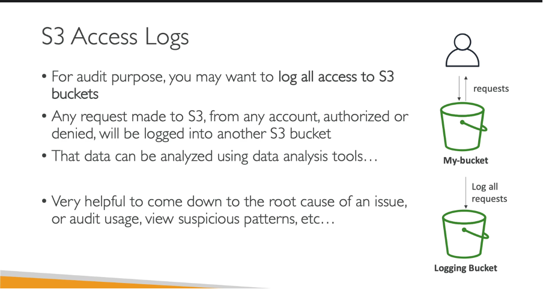

# 📜 **Amazon S3 Server Access Logging**

> _Audit who did what, when, and how in your S3 bucket — without breaking a sweat._

Amazon S3 **Server Access Logging** records **detailed logs of every access request** made to your S3 buckets. It's a great way to **monitor usage**, **track security incidents**, and **analyze patterns** — all stored directly in S3.

---

<div align="center">
  
</div>

---

## 🔍 **What Is S3 Server Access Logging?**

S3 **Server Access Logs** are like CCTV footage for your bucket — capturing every access attempt and storing it in a designated S3 bucket.

Each log record contains:

| Field            | Description                               |
| ---------------- | ----------------------------------------- |
| 👤 Requester     | Who made the request (IAM/User ID)        |
| 🗂️ Bucket/Object | Which bucket and object was accessed      |
| 🕒 Timestamp     | When the request occurred                 |
| 🛠️ Action        | What kind of operation (GET, PUT, DELETE) |
| ✅ Response      | Whether it succeeded or failed            |
| ❗ Error Code    | Any error returned (e.g., 403, 404)       |

---

## 🛠️ **How to Enable Server Access Logging**

Here’s how to switch on logging in 6 easy steps:

### 🧩 1. Choose the Source Bucket

Go to **S3 Console → Buckets** and select the bucket you want to monitor.

### ⚙️ 2. Enable Logging

Navigate to **Properties → Server Access Logging** → Click **Edit** → Check **Enable**.

### 📦 3. Choose the Destination Bucket

Pick a **destination bucket** (must be in the same AWS region). This is where your logs will be saved.

### 🛂 4. Set Permissions

You **must** grant `logging.s3.amazonaws.com` permission to write logs.

Add this bucket policy to your **destination bucket**:

```json
{
  "Version": "2012-10-17",
  "Statement": [
    {
      "Effect": "Allow",
      "Principal": { "Service": "logging.s3.amazonaws.com" },
      "Action": "s3:PutObject",
      "Resource": "arn:aws:s3:::your-log-bucket-name/*",
      "Condition": {
        "StringEquals": {
          "aws:SourceAccount": "123456789012"
        }
      }
    }
  ]
}
```

### 💾 5. Save Configuration

Click **Save changes**. Logs will start flowing in shortly.

---

## 📂 **Sample Log Entry**

```text
79a5f9f3b2d5 MyBucket [12/Apr/2025:17:05:23 +0000] 192.168.1.1 arn:aws:iam::123456789012:user/Admin ...
REST.GET.OBJECT images/logo.png 200 -
```

You can parse this using Athena, AWS Glue, or a Python script.

---

## 📊 **S3 Logs vs. AWS CloudTrail**

Not sure when to use what? Here's a quick cheat sheet:

| Feature     | **S3 Server Access Logs**           | **AWS CloudTrail**                            |
| ----------- | ----------------------------------- | --------------------------------------------- |
| 🔍 Focus    | Only S3 object-level access         | Full AWS API-level tracking                   |
| 📁 Storage  | S3-only (writes to your bucket)     | S3, CloudTrail Lake, or CloudWatch            |
| 🕒 Delivery | Best-effort (may delay under load)  | Near real-time                                |
| 💰 Cost     | Free (you pay only for storage)     | Extra charges may apply                       |
| 📜 Format   | Text log files                      | Structured JSON logs                          |
| 🎯 Use Case | Access monitoring, billing analysis | Compliance, IAM activity, root-level auditing |

---

## 🌟 **Benefits of Server Access Logging**

| Benefit                 | What It Helps With                                              |
| ----------------------- | --------------------------------------------------------------- |
| 🔐 Security Auditing    | Detect suspicious activities (like unauthorized access or 403s) |
| 📈 Usage Analytics      | See which files are most accessed and by whom                   |
| 💰 Cost Transparency    | Monitor API usage patterns and map them to billing              |
| ⚙️ Operational Insights | Troubleshoot failed uploads, deletes, or slow responses         |

---

## 📝 **Best Practices**

### ✅ Use a Separate Log Bucket

Avoid writing logs into the same bucket you're logging — it could become recursive and expensive.

### 🔒 Lock It Down

Restrict access to the log bucket to only specific IAM users or logging services.

### 📆 Apply Lifecycle Rules

Use **S3 Lifecycle Policies** to:

- Transition old logs to **Glacier**
- Delete logs older than X days

### 📊 Analyze with Athena

Enable partitioned querying using AWS Glue Crawlers + Amazon Athena for querying logs with SQL.

---

## 📌 Need-to-Know Facts

| Key Point                         | Description                                              |
| --------------------------------- | -------------------------------------------------------- |
| 🚫 Disabled by default            | Must be manually enabled per bucket                      |
| 🪂 No delivery SLA                | Best-effort delivery — not guaranteed in real time       |
| 🗂️ Stores raw logs in plain text  | Logs can get large over time — plan your lifecycle rules |
| 🧩 Integrates with other services | Combine with Lambda, CloudWatch, QuickSight              |

---

## 🎯 Summary

✅ Use **Server Access Logs** when:

- You want detailed access logs for your S3 buckets.
- You're tracking individual object access patterns.
- You're running a security audit or compliance check.

Use **CloudTrail** when:

- You need **global-level AWS API logging**.
- You’re tracking actions by users or roles across services.
