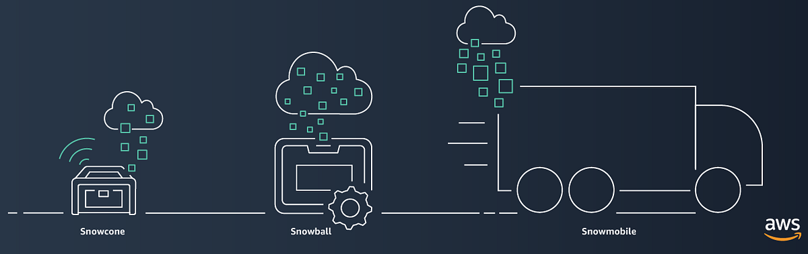

# 🚚 **Amazon Snow Family**

The **Amazon Snow Family** is a suite of physical devices and services designed to help organizations **migrate large volumes of data** `offline` to and from AWS, and to **perform edge computing** in environments with limited or unreliable internet connectivity.

  

---

## 🔑 **Key Capabilities**

1. **Data Transfer at Scale:** Move or migrate vast amounts of data offline between on-premises data centers and AWS.
2. **Edge Computing:** Execute compute operations in remote or disconnected environments where consistent internet access is unavailable.

---

## 🌟 **Why Choose the Snow Family?**

- **Local Access:** Provides local storage and compute capabilities, ensuring data and applications remain accessible even without internet connectivity.
- **Secure & Rugged:** Devices are built to withstand harsh environments and include robust security features to protect data in transit.
- **Scalable Solutions:** From terabytes to exabytes, the Snow Family offers solutions tailored to various data migration and edge computing needs.

---

## 🛠️ **Snow Family Services Overview**

The Snow Family includes several services, each tailored to specific data transfer and edge computing needs:

### 🍦 **1. Snowcone**

- **Specifications:**
  - **Compute:** 2 vCPUs
  - **Storage:**
    - **Standard:** 8 TB HDD
    - **Snowcone SSD:** 14 TB SSD
  - **Memory:** 4 GB RAM
  - **Design:** Rugged and portable, suitable for extreme environments
- **Compute Capabilities:** Supports EC2 compute instances
- **Interfaces:**
  - **NFS Interface:** File gateway for data collection from Windows, Linux, MacOS servers and applications
  - **Network/WiFi Interface:** Depending on the region
- **Use Cases:** Edge computing, data collection, processing, and transfer in remote locations with limited connectivity
- **Deployment:** Ideal for highly mobile or rugged environments where portability is key

---

### 🎱 **2. Snowball Edge**

- **Storage Capacity:**
  - **Storage Optimized:** 80 TB usable storage
  - **Compute Optimized:** 42 TB (HDD) or 80 TB (with SSD options)
  - **Compute Optimized with GPU:** Enhanced for GPU workloads
- **Compute Capabilities:**
  - **Compute Instances:** Supports EC2 instances
  - **Serverless Computing:** Integrates with AWS Lambda
- **Variants:**
  - **Storage Optimized – Data Transfer:** 80 TB usable storage
  - **Storage Optimized (EC2 Compute):** 80 TB storage, 40 vCPUs, 80 GiB RAM, 1 TB SSD for EC2 AMI
  - **Compute Optimized:** 52 vCPUs, 208 GiB RAM, 42 TB HDD
  - **Compute Optimized with GPU:** Similar to Compute Optimized with added GPU support
- **Use Cases:** Data migration, edge computing, temporary storage solutions, and scenarios requiring local compute power
- **Deployment:** Shipped directly to the client by AWS; multiple devices can be deployed simultaneously for larger data sets

### 🚚 **3. Snowmobile**

- **Scale:** Designed for exabyte-scale data transfers (up to 1000 petabytes)
- **Form Factor:** A 45-foot long rugged shipping container trailer mounted on a truck
- **Use Cases:** Massive data migrations, such as data center decommissioning or large-scale archival
- **Deployment:** A physical Snowmobile is delivered to the customer’s site, loaded with data, and then transported back to AWS

## 🌐 **Edge Computing and Storage**

- **Extended AWS Capabilities:** Snowcone and Snowball Edge devices extend the power of AWS Storage and Compute (EC2 and Lambda) to locations with no or unstable internet services.
- **Deployment Environments:** Suitable for areas without data centers, such as factories, natural disaster sites, mines, and forests.
- **Functionalities:**
  - **Data Collection & Processing:** Collect and process data locally before transferring it to AWS.
  - **Local Insights:** Gain insights at the edge without relying on constant internet connectivity.
  - **Content Distribution:** Distribute content to partners and customers efficiently.

---

## 💾 **Device Features and Benefits**

### 🔒 **Secure Data Transport**

- **Encryption:** Data is encrypted on-premises before being loaded onto Snow devices using AWS Key Management Service (KMS).
- **Protection:** Devices are built to safeguard data during transit with tamper-resistant hardware and encryption.

### 🚀 **Efficient Data Migration**

- **Massive Transfers:** Capable of moving large datasets (typically 8 TB or more) where network transfers would be time-consuming or cost-prohibitive.
- **Use Cases:** Disaster Recovery (DR), data migration to AWS, or large-scale data archiving.

### 🔗 **Seamless Integration with AWS**

- **Storage:** Data is uploaded to Amazon S3 Standard and can be automatically transitioned to S3 Glacier using lifecycle policies for cost-effective long-term storage.
- **Compute:** Devices like Snowball Edge support running AWS compute instances locally, enabling processing close to the data source.

### 🛡️ **Durability and Reliability**

- **Rugged Design:** Built to withstand physical shocks, temperature variations, and other environmental challenges.
- **Redundancy:** Features such as error-correcting codes (ECC) and redundant storage paths ensure data integrity.

---

## ❄️ **Snowcone vs. Snowball Edge**

| **Feature / Use Case**                     | **Snowball Edge** | **AWS Snowcone** |
| ------------------------------------------ | ----------------- | ---------------- |
| **Import Data into Amazon S3**             | ✅                | ✅               |
| **Export Data from Amazon S3**             | ✅                | ❌               |
| **Durable Local Storage**                  | ✅                | ❌               |
| **Local Compute with AWS Lambda**          | ✅                | ❌               |
| **Local Compute Instances (EC2)**          | ✅                | ✅               |
| **Durable Amazon S3 Storage in a Cluster** | ✅                | ❌               |
| **Integration with AWS IoT Greengrass**    | ✅                | ❌               |
| **Transfer Files through NFS with a GUI**  | ✅                | ✅               |
| **GPU Workloads Support**                  | ✅                | ❌               |

### 🛠️ **When to Use Each Device**

- **🎱 Snowball Edge:**

  - Best for larger data transfers and scenarios requiring local compute capabilities.
  - Suitable for environments needing durable storage and the ability to run compute instances or Lambda functions.
  - **Variants:** Choose based on storage optimization or compute needs (including GPU support).

- **🍦 Snowcone:**
  - Ideal for smaller-scale data transfers and highly mobile or rugged environments where portability is key.
  - Suitable for basic data collection and transfer tasks without the need for extensive compute resources.
  - **Variants:** Standard (8 TB HDD) or SSD (14 TB SSD) based on storage requirements.

---

## 📏 **How to Determine If You Need the Snow Family**

Understanding your data transfer and edge computing needs is crucial in deciding whether to use Snow Family services or rely on network-based transfers. Here’s a quick reference guide:

### 📊 **Data Transfer Metrics**

- **1 Exabyte (EB) = 1,000 Petabytes (PB)**
- **1 Petabyte (PB) = 1,000 Terabytes (TB)**
- **1 Terabyte (TB) = 1,000 Gigabytes (GB)**
- **1 Gigabyte (GB) = 1,000 Megabytes (MB)**
- **1 Byte = 8 Bits**

### ⚡ **Transfer Speed Estimates**

- **100 Mbps (Megabits per second) Link:**

  - **Per Hour:** 45 GB
  - **Per Day:** 1.08 TB

- **1 Gbps (Gigabit per second) Link:**
  - **Per Hour:** 450 GB
  - **Per Day:** 10.8 TB

### 🧠 **Rule of Thumb**

- **If your data transfer needs exceed what your available network can handle within your desired timeframe, consider using Snow Family services.**

### 📘 **Examples**

#### **Example 1: Large-Scale Data Migration**

- **Scenario:**

  - **Data Volume:** 250 TB
  - **Network Link:** 100 Mbps
  - **Timeframe:** 30 days

- **Calculation:**

  - **Daily Transfer Capability:** 1.08 TB/day
  - **Total Time Needed:** 250 TB / 1.08 TB/day ≈ 232 days

- **Conclusion:**
  - **Network Transfer is Infeasible**
  - **Solution:** Utilize multiple Snowball Edge devices to meet the migration requirement within 30 days

#### **Example 2: Moderate Data Transfer**

- **Scenario:**

  - **Data Volume:** 50 TB
  - **Network Link:** 1 Gbps
  - **Timeframe:** 10 days

- **Calculation:**

  - **Daily Transfer Capability:** 10.8 TB/day
  - **Total Time Needed:** 50 TB / 10.8 TB/day ≈ 5 days

- **Conclusion:**
  - **Network Transfer is Feasible**
  - **Solution:** Use the existing 1 Gbps link to transfer data within the desired timeframe

---

## 🖥️ **Monitoring and Management**

### 🛠️ **Tools Available**

1. **OpsHub:**

   - **Functionality:** Comprehensive management and monitoring of Snow devices.
   - **Capabilities:** Track device status, manage data transfers, and oversee compute operations.

2. **Snowball Client:**
   - **Functionality:** Command-line interface for managing Snow devices.
   - **Capabilities:** Monitor device status, initiate data transfers, and perform device operations remotely.

### 📈 **Key Monitoring Features**

- **Device Status:** Real-time visibility into device health and operational status.
- **Remote Management:** Unlock, reboot, and manage compute instances on Snow devices from the cloud.
- **Compute Operations:** Launch and monitor AWS compute instances directly on Snow devices for edge processing.

---

## 💰 **Pricing Overview**

AWS Snow Family pricing varies based on usage duration and scale. Understanding the pricing model helps in optimizing costs based on your specific needs.

### 💳 **Pricing Tiers**

1. **On-Demand Pricing:**

   - **Description:** Highest cost option, suitable for short-term or urgent data transfers.
   - **Use Case:** Temporary projects or when immediate data migration is required without long-term commitment.

2. **1-Year Pricing:**

   - **Description:** Discounted rate compared to on-demand, ideal for projects with a defined timeframe.
   - **Use Case:** Medium-term data migrations or consistent data transfer needs over a year.

3. **3-Year Pricing:**
   - **Description:** Highest discount available, best for long-term or large-scale data transfer commitments.
   - **Use Case:** Ongoing data migration projects, large enterprises with continuous data transfer requirements.

### 💡 **Cost Considerations**

- **Device Rental Fees:** Based on the duration of use (daily, yearly, or multi-year).
- **Data Transfer Fees:** Costs associated with uploading data to AWS S3 from the device.
- **Compute Usage:** Additional charges for running compute instances on Snow devices.

**Tip:** Choose the pricing tier that aligns with your project duration and scale to maximize cost efficiency.

---

## 🏁 **Conclusion**

The **AWS Snow Family** offers versatile solutions for data transfer and edge computing, catering to a wide range of needs from small-scale data migrations to massive exabyte transfers. By understanding the specific capabilities and use cases of each Snow device, you can effectively choose the right tool to optimize your data operations, ensuring efficiency, security, and cost-effectiveness.
