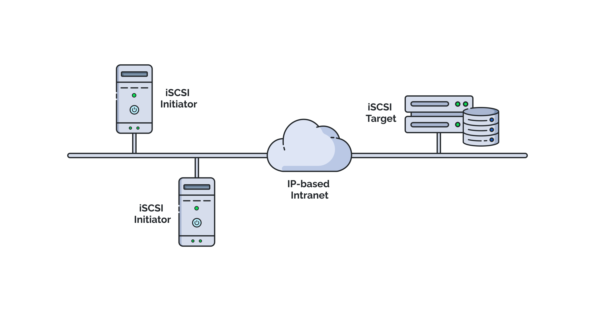

# ☁️ AWS Storage Gateway (iSCSI-Backed) – Volume Gateway Explained

    

---

## 💡 What’s the Connection?

To use **AWS Storage Gateway** effectively—especially **Volume Gateway**—you need to understand how **iSCSI** works, because AWS exposes cloud-backed volumes to your local systems via the **iSCSI protocol**.  
Your **on-premises server** acts as the **initiator**, and AWS Storage Gateway (running as a VM or hardware appliance) acts as the **target**.

---

## 💾 What is iSCSI?

**iSCSI (Internet Small Computer Systems Interface)** is a protocol that enables clients (initiators) to send **SCSI commands** over **IP networks** to storage devices (targets).

> 📦 It allows local servers to treat **remote cloud storage** as if it’s a **directly attached block device**.

---

## 🔄 Lifecycle of an iSCSI Transaction (in AWS Storage Gateway context)

Let’s map the standard iSCSI lifecycle to how it works with AWS Volume Gateway:

| 🔁 **Step**                  | 📘 **Description**                                                                                                                           |
| ---------------------------- | -------------------------------------------------------------------------------------------------------------------------------------------- |
| **1. Initiator Setup** 🧑‍💻 | You configure your **on-premises application server** (e.g., Windows/Linux) to connect to the **Storage Gateway** via iSCSI initiator.       |
| **2. Target Setup** 🎯       | On AWS, you create volumes via the **Volume Gateway**, and the gateway exposes them as **iSCSI targets**.                                    |
| **3. Initiation** 🚀         | The server sends a read/write SCSI command over TCP/IP to the gateway.                                                                       |
| **4. Transmission** 📡       | The SCSI command is encapsulated in IP packets and routed to the **local Storage Gateway appliance**.                                        |
| **5. Receiving** 📥          | The Storage Gateway receives the request and either serves it from local cache or forwards it to **Amazon S3 (cached)** or **EBS (stored)**. |
| **6. Response** 📤           | The Storage Gateway responds with the required data block.                                                                                   |
| **7. Completion** ✅         | The client unpacks the data and continues its local operations—just like reading from a local disk.                                          |

---

## 🧪 Example: Volume Gateway in Cached Mode

Imagine you have an on-premises application writing logs to a mounted volume:

1. You set up **Volume Gateway** in **cached mode**.
2. You create a 2 TB volume from the AWS Console.
3. Your app server connects to the volume over iSCSI.
4. The server starts writing data. It gets cached locally and asynchronously uploaded to **Amazon S3**.
5. Later reads are served from local cache (if available) or pulled from the cloud.

---

## 🧩 Key Components (Mapped to iSCSI)

| 🔧 **AWS Component**   | 🎯 **iSCSI Role**                                  |
| ---------------------- | -------------------------------------------------- |
| **AWS Volume Gateway** | iSCSI **Target**                                   |
| **Application Server** | iSCSI **Initiator**                                |
| **Amazon S3 or EBS**   | **Cloud-backed storage**                           |
| **Local Disk Cache**   | **Performance layer** for frequently accessed data |
| **iSCSI Connection**   | **Data transport** between server and gateway      |

---

## 🌍 Storage Gateway Modes & iSCSI

| 🔄 **Mode**                 | 📚 **How iSCSI Is Used**                                                              |
| --------------------------- | ------------------------------------------------------------------------------------- |
| **Volume Gateway – Cached** | Stores full dataset in S3, frequently accessed data cached locally. Exposed as iSCSI. |
| **Volume Gateway – Stored** | Stores full dataset on-prem, backs up snapshots to AWS. Exposed as iSCSI.             |
| **Tape Gateway**            | Uses iSCSI to present virtual tapes (VTL) to backup apps like Veeam.                  |
| **File Gateway** ❌         | Does **not** use iSCSI. It presents storage via **NFS/SMB** protocols instead.        |

---

## ✅ Benefits of iSCSI with AWS Gateway

- 🔗 **Seamless Hybrid Integration**  
  Use cloud storage with local workloads as if it’s on-prem.

- 🚀 **Performance Boost with Caching**  
  Frequently accessed data is cached locally for faster access.

- 💾 **Block Storage Simplicity**  
  Acts like a local disk — ideal for apps that need block-level storage.

- 🔐 **Secure Transfers**  
  iSCSI traffic can be secured via VPN or AWS Direct Connect.

- 💸 **Cost Optimization**  
  Cached mode minimizes local storage usage; stored mode offers fast local writes.

---

## 📌 When Should You Use Volume Gateway with iSCSI?

- 🧯 Backup legacy on-prem apps to the cloud (e.g., SQL backups)
- 🗄️ Use block storage for file servers, databases, or ERP systems
- 🔁 Migrate workloads gradually from on-prem to cloud
- 🧪 Develop hybrid cloud testing environments
