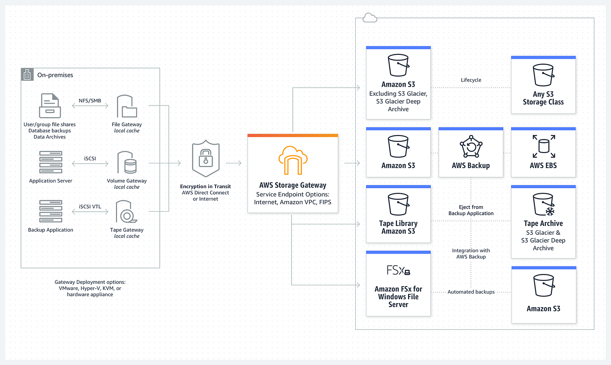
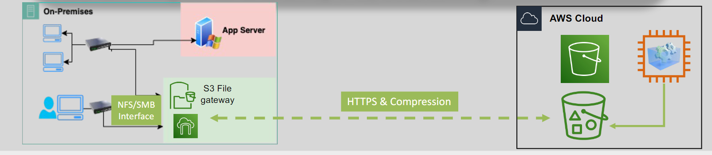
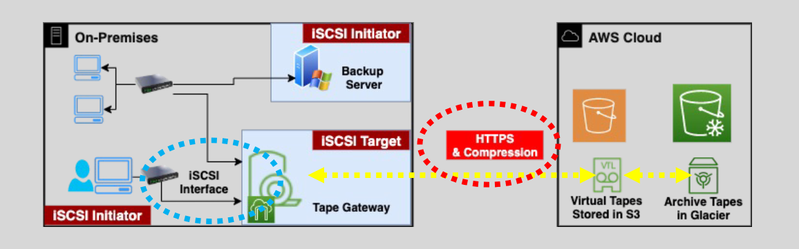
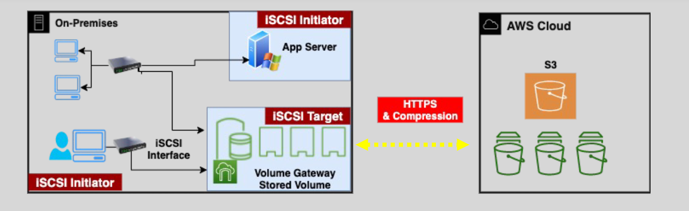
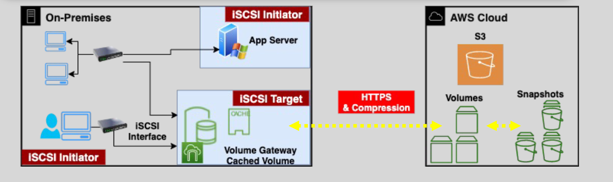
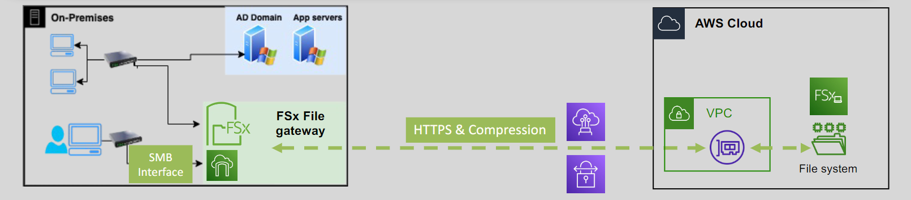

# 🗄️ **Amazon Storage Gateway**

**Amazon Storage Gateway** is a **hybrid cloud storage service** that connects your **on-premises environments** to **AWS cloud storage**, enabling secure and seamless integration for `backups`, `disaster recovery`, `archiving`, and `hybrid access to cloud data`.

---

    

---

## **🔗 What is Amazon Storage Gateway?**

Amazon Storage Gateway provides your **on-premises applications** access to cloud-backed storage services like:

- 🪣 **Amazon S3** and **Amazon S3 Glacier** for object storage
- 💾 **Amazon EBS** for block storage
- 🗂️ **Amazon FSx** for managed Windows file systems

This is achieved via familiar interfaces like **NFS**, **SMB**, or **iSCSI**.

---

## **🚀 Deployment Options**

### 1. 💻 **Virtual Machine (VM)**

- ✅ Downloadable image from AWS
- 💡 Deployable on VMware ESXi, Microsoft Hyper-V, or KVM

### 2. 📦 **Hardware Appliance**

- 🚚 Pre-installed by AWS
- 🛡️ Supports SMB, NFS, and iSCSI depending on gateway type
- 🔒 Secures data with HTTPS in transit and SSE-S3 at rest
- ⚙️ Efficient data transfer via compression and change-only sync

---

## **🛠️ Storage Gateway Configurations**

Amazon Storage Gateway offers several configurations, each tailored to specific use cases and storage needs:

### **1️⃣ S3 File Gateway 🗄️**

    

---

The **S3 File Gateway** lets your on-premises systems store and access files in Amazon S3 using **NFS or SMB protocols**. It feels like a traditional file server to your apps — but everything is backed by object storage in S3.

#### **🔑 Key Features:**

- **File Shares:** Acts as a file share (file system) mount to store files directly to Amazon S3.
- **Client Compatibility:** Accessible by both in-AWS and on-premises Windows and Linux clients.
- **S3 Integration:** Supports S3 Lifecycle policies, versioning, and Cross-Region Replication (CRR) for efficient object management.
- **Low Latency Access:** Utilizes local caching of frequently accessed files to ensure quick access.
- **Security:** Data is encrypted in transit and compressed to optimize storage.
- **API Access:** Files stored in S3 can be accessed by AWS applications through the S3 API.

#### **🏃🏻‍♂️‍➡️ Use Cases:**

- **Data Migration:** Easily migrate file data to Amazon S3.
- **Backup Solutions:** Utilize S3 as a robust backup destination.
- **Cloud Bursting:** Extend your on-premises storage to the cloud for scalability.

---

### **2️⃣ Tape Gateway 🎞️**

    

---

**Tape Gateway** provides a cloud-backed virtual tape library (VTL) for backup and archival applications.

#### **🔑 Key Features:**

- **Virtual Tape Storage:** Uses Amazon S3 as the primary storage for virtual tapes.
- **Archival Storage:** Archives are stored in Amazon S3 Glacier as Virtual Tape Shelves (VTS) for long-term retention.
- **iSCSI Interface:** Presents an iSCSI interface to your backup servers, mimicking traditional tape libraries.
- **Deployment:** Can be installed on an Amazon EC2 instance to provide a tape gateway within AWS.
- **Security:** Utilizes HTTPS and data compression to securely transfer data to S3.

#### **🏃🏻‍♂️‍➡️ Use Cases:**

- **Backup Solutions:** Replace traditional tape-based backup systems with a scalable cloud solution.
- **Archival Storage:** Store long-term archives securely in Amazon S3 Glacier.

---

### **3️⃣ Volume Gateway 💾**

The **Volume Gateway** presents block storage volumes to your on-premises apps using the iSCSI protocol. It acts like a local disk but the underlying data can be either stored locally or in the cloud, depending on the configuration.

Volume Gateway supports two configurations:

#### **📌 1. Stored Volume** _"Store First, Backup to Cloud"_

    

**Stored Volume** configuration stores primary data on-premises block storage volumes while asynchronously backing up point-in-time snapshots to Amazon S3.

##### **🔑 Key Features:**

- Data is stored locally and accessed with low latency
- Uses iSCSI to expose block volumes to applications
- Takes point-in-time snapshots and stores them in Amazon S3
- Can be deployed on-premises or in EC2 for edge scenarios

##### **🏷️ Ideal When:**

- You need fast access to data locally
- You want to keep using your current storage, but add cloud backup
- You're preparing for disaster recovery or compliance snapshots

#### **📌 2. Cached Volume** _"Cloud First, Cache Locally"_

    

**Cached Volume** configuration uses Amazon S3 as the primary storage for your block volumes while retaining frequently accessed data on-premises for low-latency access.

##### **🔑 Key Features:**

- Uses **S3 as a block storage** with **virtual volumes in S3**.
- Frequently accessed data is **cached locally on-premises**.
- Exposed as iSCSI volumes to local applications
- Supports snapshots for backups or restore

##### **🏷️ Ideal When:**

- You want to minimize local storage hardware
- You’re slowly migrating to the cloud
- You want scalable block storage but with fast access to hot data

---

#### 📊 Comparison: Stored vs. Cached Volumes

| Feature                      | Stored Volumes          | Cached Volumes                |
| ---------------------------- | ----------------------- | ----------------------------- |
| 📍 Primary Data Location     | On-premises             | Amazon S3                     |
| ⚡ Latency                   | Very low (local access) | Low (cached blocks on-prem)   |
| 💾 Local Storage Requirement | High                    | Minimal                       |
| ☁️ Cloud Storage Role        | For backup snapshots    | Main data store               |
| 🧠 Best For                  | DR + local performance  | Cloud-first with hybrid speed |

---

### **4️⃣ FSx File Gateway 🖥️**

    

**FSx File Gateway** provides low-latency, efficient access to Amazon FSx file systems from your on-premises clients.

#### **🔑 Key Features:**

- **Low Latency Access:** Ensures quick access to FSx for Windows File Server shares by caching frequently accessed data locally.
- **SMB Interface:** Exposes an SMB interface to on-premises clients, enabling seamless integration with Windows environments.
- **Network Requirements:** Requires a Direct Connect (DX) or VPN connection to facilitate communication with the file server and allow the file server to join the on-premises Active Directory (AD) domain.
- **Deployment Options:** Can be deployed on a Storage Gateway VM appliance or as a hardware appliance.

#### **🏃🏻‍♂️‍➡️ Use Cases:**

- **Enterprise File Sharing:** Provide efficient file sharing capabilities for Windows-based environments.
- **Hybrid Workloads:** Enable seamless integration between on-premises and AWS-based file storage.

---

## **⚖️ Gateway Comparisons**

### 🔄 FSx File Gateway vs FSx for Windows

| Feature     | FSx File Gateway         | FSx for Windows (Direct)     |
| ----------- | ------------------------ | ---------------------------- |
| 🧠 Caching  | ✅ Yes                   | ❌ No                        |
| ⚡ Latency  | ✅ Optimized for on-prem | 🔁 Depends on network        |
| 🔌 Network  | Requires DX/VPN          | Requires DX/VPN              |
| 🛡️ Use Case | On-prem access with DR   | Directly mounted file system |

---

### 🚚 Storage Gateway vs AWS DataSync

| Feature      | Storage Gateway              | AWS DataSync                      |
| ------------ | ---------------------------- | --------------------------------- |
| 🧩 Type      | Hybrid storage               | Bulk data transfer                |
| 🔁 Direction | Ongoing 2-way                | One-time or scheduled             |
| 🔗 Protocols | SMB, NFS, iSCSI              | SMB, NFS, HDFS                    |
| 📁 Access    | Persistent (NFS, iSCSI, SMB) | Temporary                         |
| ⚡ Speed     | Moderate                     | Up to 10x faster than traditional |
| 🔄 Best For  | Backups, DR, hybrid          | Migrations, sync jobs             |

🧠 **Tip**: Use **Storage Gateway** for long-term hybrid access and **DataSync** for fast, large data moves.

---

## **🤔 How Storage Gateway Works**

Understanding the workflow of **Amazon Storage Gateway** helps in effectively leveraging its capabilities for your storage needs.

### **1️⃣ Deployment**

- **Virtual Appliance:**

  - **Download:** Obtain the Storage Gateway VM from AWS.
  - **Install:** Deploy it in your virtualized environment (e.g., VMware ESXi, Microsoft Hyper-V, or KVM).

- **Physical Appliance:**
  - **Setup:** Receive the preinstalled Storage Gateway appliance from AWS.
  - **Connect:** Integrate it into your on-premises network.

### **2️⃣ Configuration**

- **Select Gateway Type:**

  - Choose between **File Gateway**, **Volume Gateway**, or **Tape Gateway** based on your requirements.

- **Set Up Interfaces:**

  - Configure SMB, NFS, or iSCSI interfaces as needed.

- **Network Integration:**
  - Ensure connectivity via existing network infrastructure or establish connections using AWS Direct Connect or VPN.

### **3️⃣ Data Integration**

- **Connect Applications:**

  - Mount the Storage Gateway as a file system or block storage on your applications.

- **Data Transfer:**

  - Data written to the gateway is either cached locally or directly transferred to AWS storage services.

- **Security Measures:**
  - Data is encrypted in transit using HTTPS and at rest using AWS encryption mechanisms.

### **4️⃣ Management and Monitoring**

- **AWS Management Console:**

  - Use the console to monitor gateway status, manage configurations, and oversee data transfers.

- **AWS CloudWatch:**
  - Integrate with CloudWatch for detailed monitoring and alerting on gateway performance and health.

---

## **✅ Benefits of Using Amazon Storage Gateway**

| 💡 Benefit            | Description                                       |
| --------------------- | ------------------------------------------------- |
| 🔒 Secure             | HTTPS in transit, encrypted at rest using SSE-S3  |
| ⚡ Fast Access        | Caches hot data locally to reduce latency         |
| 💰 Cost-Efficient     | Store infrequently accessed data in S3 or Glacier |
| 🔄 Hybrid Flexibility | Extend local infrastructure into the cloud        |
| 📈 Scalable           | Grow storage without provisioning hardware        |

---

## **🏁 Final Thoughts**

**Amazon Storage Gateway** is your go-to solution when you want to connect your existing storage workflows to the cloud **without overhauling everything**. It gives you cloud-scale, cloud-durability, and cost savings — all while keeping your apps and users happy with local-like access.

If you’re running backups, archives, shared file systems, or need low-latency hybrid access to the cloud — you’ll love how simple and powerful this tool is.
