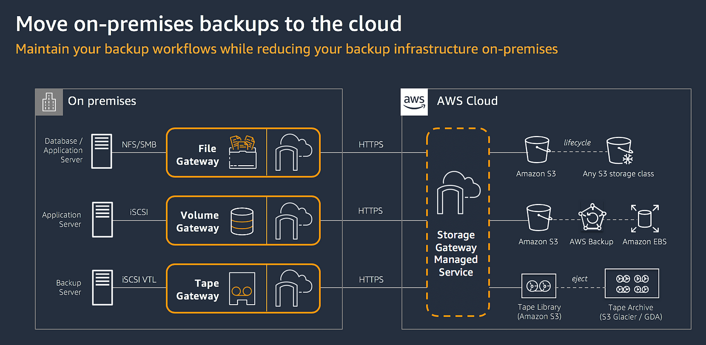

# 🗄️ **Amazon Storage Gateway**

**Amazon Storage Gateway** is a **hybrid cloud storage service** that connects your **on-premises environments** to **AWS cloud storage**, enabling secure and seamless integration for backups, disaster recovery, archiving, and hybrid access to cloud data.

    

---

    

---

## 🔗 What is Amazon Storage Gateway?

Amazon Storage Gateway provides your **on-premises applications** access to cloud-backed storage services like:

- 🪣 **Amazon S3** and **Amazon S3 Glacier** for object storage
- 💾 **Amazon EBS** for block storage
- 🗂️ **Amazon FSx** for managed Windows file systems

This is achieved via familiar interfaces like **NFS**, **SMB**, or **iSCSI**.

---

## 🚀 Deployment Options

### 1. 💻 **Virtual Machine (VM)**

- ✅ Downloadable image from AWS
- 💡 Deployable on VMware ESXi, Microsoft Hyper-V, or KVM

### 2. 📦 **Hardware Appliance**

- 🚚 Pre-installed by AWS
- 🛡️ Supports SMB, NFS, and iSCSI depending on gateway type
- 🔒 Secures data with HTTPS in transit and SSE-S3 at rest
- ⚙️ Efficient data transfer via compression and change-only sync

---

## ⚙️ Gateway Configurations

---

### 📂 **S3 File Gateway**

**Use Case**: Bridge local file shares to **Amazon S3**

| Feature           | Description                                                       |
| ----------------- | ----------------------------------------------------------------- |
| 🧩 Interface      | Exposes **NFS/SMB** file shares                                   |
| 📁 Access         | For Windows/Linux apps and AWS services                           |
| 🔄 Local Cache    | Speeds up frequently accessed files                               |
| 🌍 S3 Integration | Supports lifecycle rules, CRR, versioning                         |
| 🔐 Security       | Data is encrypted and compressed                                  |
| 🧪 Access Mode    | Local apps write/read via SMB/NFS; AWS apps access via **S3 API** |

**Common Scenarios**:

- 📤 File migration to S3
- 🧯 On-prem backup to cloud
- ☁️ Cloud bursting of on-prem workloads

---

### 💾 **Volume Gateway**

**Use Case**: Provide **block-level storage** over iSCSI

#### 🗃️ Stored Volumes

- 🖥️ Data resides **on-premises**
- 🔁 Snapshots sent asynchronously to Amazon S3
- 🔐 For backup, DR, and hybrid block access

#### ☁️ Cached Volumes

- 💡 Primary storage is **Amazon S3**
- 🚀 Frequently used data cached locally
- ✅ Useful for cost savings + fast access

| Feature            | Stored Volumes          | Cached Volumes                    |
| ------------------ | ----------------------- | --------------------------------- |
| 🧠 Primary Storage | Local                   | Cloud (S3)                        |
| 🧩 Interface       | iSCSI                   | iSCSI                             |
| 🔐 Snapshots       | Yes, to S3              | Yes, to S3                        |
| ⚡ Performance     | High local access speed | Cost-effective, cache-accelerated |

---

### 🎞️ **Tape Gateway**

**Use Case**: Modernize traditional tape backup systems

| Feature                 | Description                                              |
| ----------------------- | -------------------------------------------------------- |
| 📼 Virtual Tape Library | iSCSI-based VTL                                          |
| 🗃️ Tape Storage         | Stored in Amazon S3                                      |
| ❄️ Archival             | Moved to **Amazon S3 Glacier** (as Virtual Tape Shelves) |
| 🔒 Security             | HTTPS + data compression                                 |
| 📦 Deployment           | On-prem or in EC2 for cloud-native backups               |

**Common Scenarios**:

- 🧯 Replace on-prem physical tape libraries
- 📚 Long-term archive storage in Glacier

---

### 🖥️ **FSx File Gateway**

**Use Case**: Accelerate access to **Amazon FSx for Windows**

| Feature        | Description                               |
| -------------- | ----------------------------------------- |
| 💨 Local Cache | Caches frequently used FSx files locally  |
| 📁 Protocol    | SMB                                       |
| 🔐 Integration | Requires Direct Connect or VPN to join AD |
| 🛠️ Deployment  | VM-based or hardware                      |

**Common Scenarios**:

- 🏢 Windows file share for offices
- 💻 Hybrid workloads with low-latency access

---

## ⚖️ Gateway Comparisons

---

### 🔄 FSx File Gateway vs FSx for Windows

| Feature     | FSx File Gateway         | FSx for Windows (Direct)     |
| ----------- | ------------------------ | ---------------------------- |
| 🧠 Caching  | ✅ Yes                   | ❌ No                        |
| ⚡ Latency  | ✅ Optimized for on-prem | 🔁 Depends on network        |
| 🔌 Network  | Requires DX/VPN          | Requires DX/VPN              |
| 🛡️ Use Case | On-prem access with DR   | Directly mounted file system |

---

### 🚚 Storage Gateway vs AWS DataSync

| Feature      | Storage Gateway              | AWS DataSync                      |
| ------------ | ---------------------------- | --------------------------------- |
| 🧩 Type      | Hybrid storage               | Bulk data transfer                |
| 🔁 Direction | Ongoing 2-way                | One-time or scheduled             |
| 🔗 Protocols | SMB, NFS, iSCSI              | SMB, NFS, HDFS                    |
| 📁 Access    | Persistent (NFS, iSCSI, SMB) | Temporary                         |
| ⚡ Speed     | Moderate                     | Up to 10x faster than traditional |
| 🔄 Best For  | Backups, DR, hybrid          | Migrations, sync jobs             |

🧠 **Tip**: Use **Storage Gateway** for long-term hybrid access and **DataSync** for fast, large data moves.

---

## 🛠️ How It Works

### 1. 📥 Deploy Gateway

- VM or physical appliance
- Hosted on-prem or in AWS

### 2. ⚙️ Configure

- Choose type: File, Volume, Tape
- Set NFS, SMB, or iSCSI interface

### 3. 🔌 Connect

- Mount volumes or file shares from clients
- Establish Direct Connect or VPN (for FSx & AD)

### 4. 🔒 Secure & Monitor

- Uses **HTTPS** + **SSE-S3**
- View health and metrics in **AWS CloudWatch**

---

## 🏁 Summary

| ✅ Benefit                | 💡 Description                         |
| ------------------------- | -------------------------------------- |
| 🔗 Seamless Hybrid Access | Connect on-prem data to AWS            |
| ⚡ Performance            | Local caching, async transfer          |
| 💾 Data Protection        | Snapshots, backups, long-term archives |
| 🔐 Security               | Encrypted in transit and at rest       |
| 💰 Cost Efficiency        | S3/Glacier for low-cost tiering        |
| 🔄 Flexible Options       | File, block, tape, FSx integration     |
