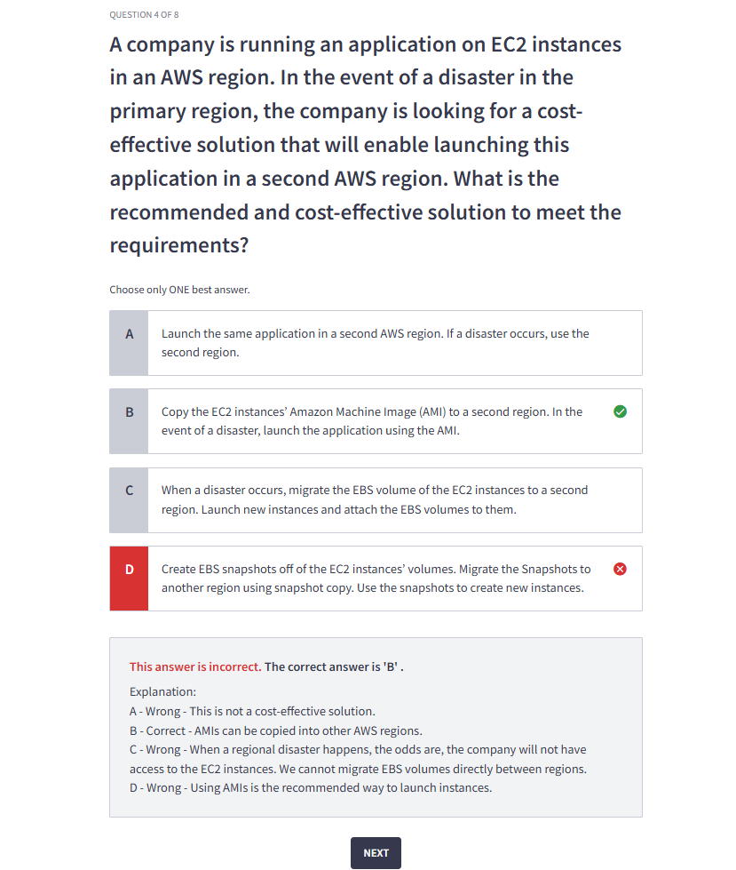
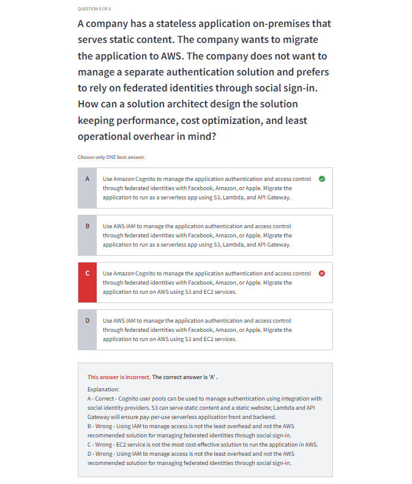
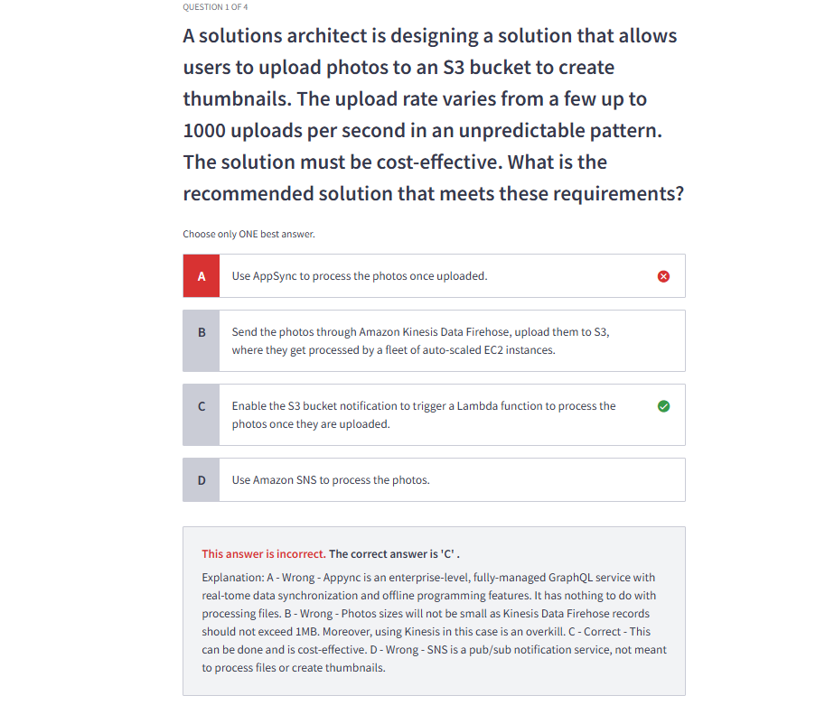
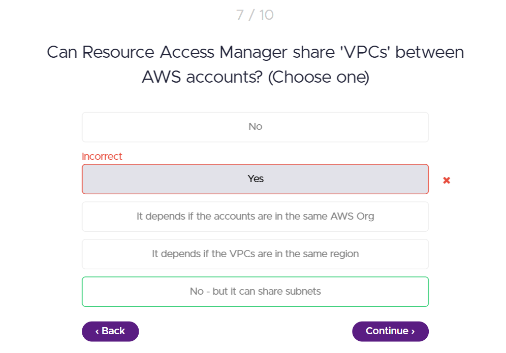
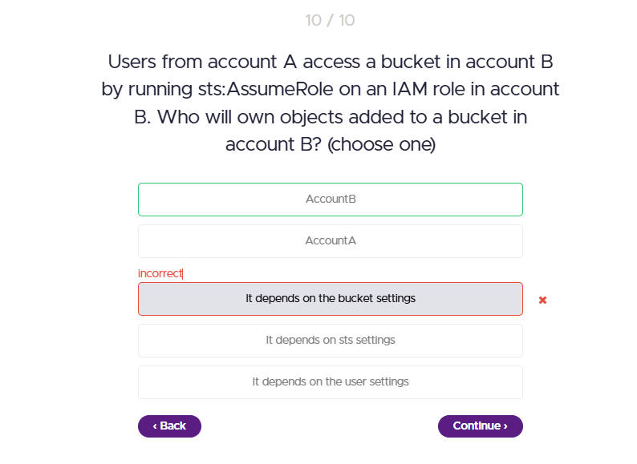
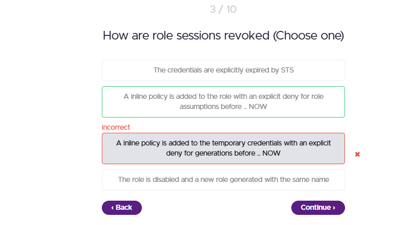
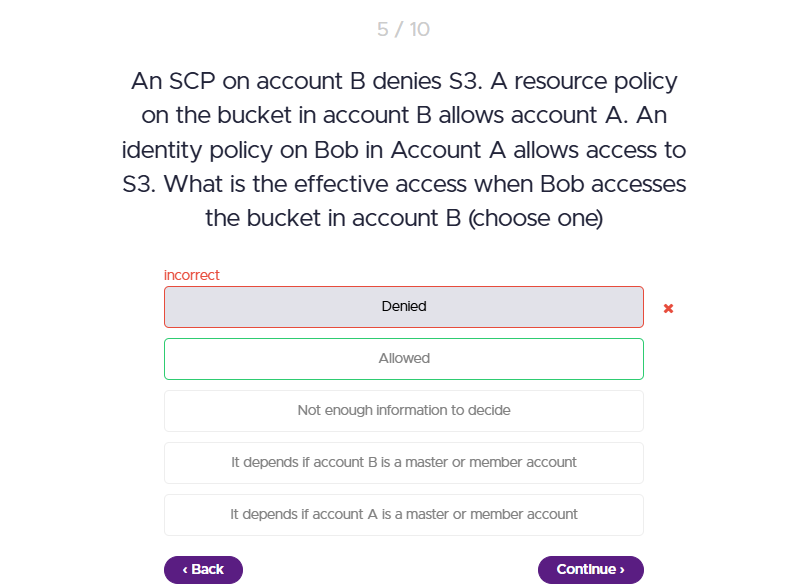
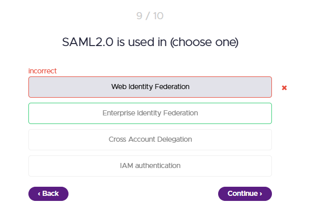

# Quiz Errors

    <h1>EC2, EBS</h1>
    
    <h1>S3</h1>
    
    
    
    <h1>Security</h1>
    
    <h1>No SQL</h1>
    
    <h1>Analytics</h1>
    
    <h1>Other</h1>
    
    
    

    
    When a user assumes a role in another account and uploads objects to an S3 bucket, the objects are owned by the bucket owner (Account B in this case) by default.
    

    
    
    SCP's only impact identities in the account they are attached to in this case the SCP is on account B, and bob's identity is in account A .. so the SCP doesn't apply this leaves the identity policy and the resource policy together which allow bobs access.
    

    

    
    SAML 2.0 is designed for enterprise scenarios, while Web Identity Federation allows users to log in with social media accounts for consumer-facing applications. They serve different purposes and contexts.
    

