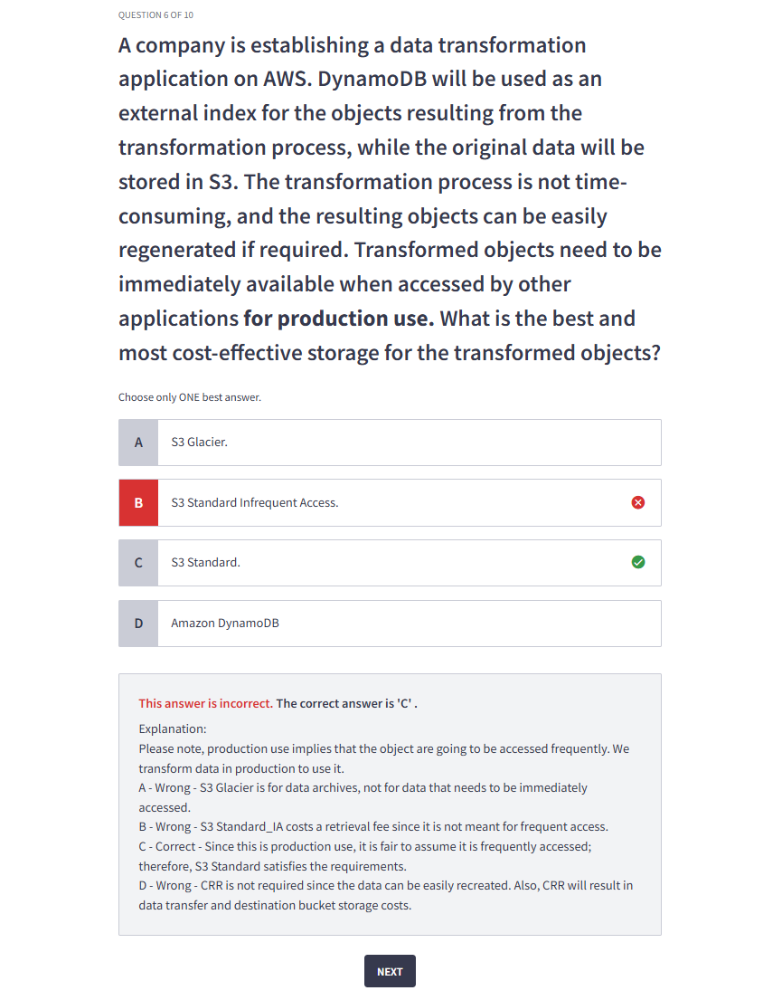
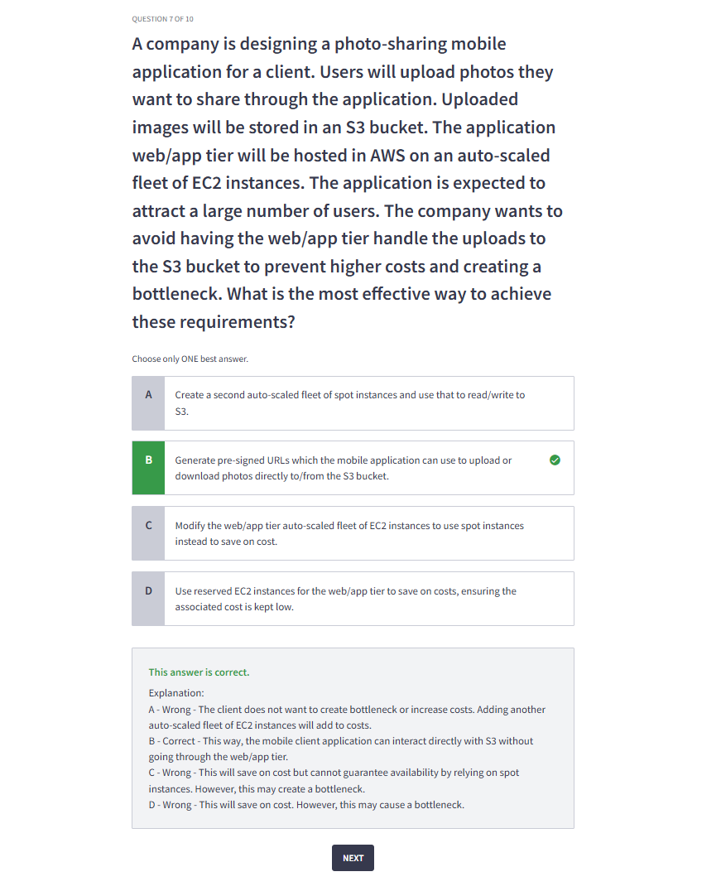
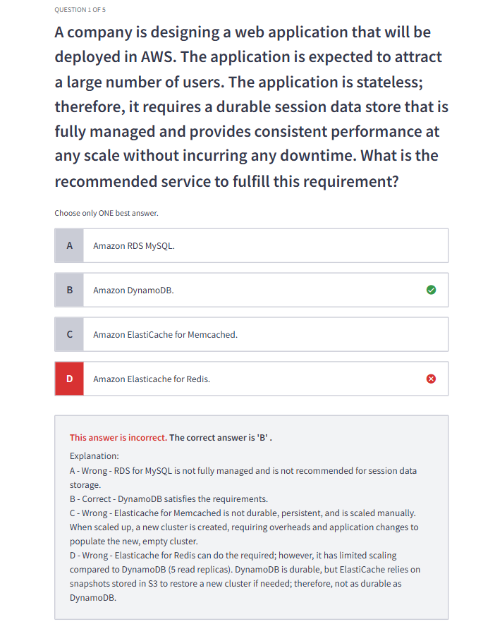
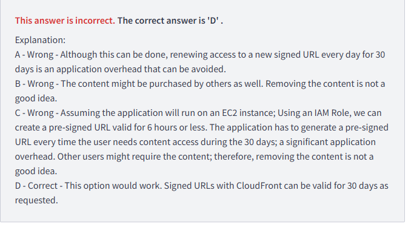

# Quiz Errors

<h1>EC2, EBS</h1>

<h2>Error 1</h2>

    

<h1>S3</h1>

<h2>Error 1</h2>

    

<h2>Error 2</h2>

    

<h2>Error 3</h2>

    

<h1>Security</h1>

<h2>Error 1</h2>

    

<h1>No SQL</h1>

<h2>Error 1</h2>

    

<h1>Analytics</h1>

<h2>Error 1</h2>

    

<h1>Other</h1>

<h2>Error 1</h2>

    

<h2>Error 2</h2>

    

<h2>Error 3</h2>

    

- When a user assumes a role in another account and uploads objects to an S3 bucket, the objects are owned by the bucket owner (Account B in this case) by default.

<h2>Error 4</h2>

    

<h2>Error 5</h2>

    

- SCP's only impact identities in the account they are attached to in this case the SCP is on account B, and bob's identity is in account A .. so the SCP doesn't apply this leaves the identity policy and the resource policy together which allow bobs access.

<h2>Error 6</h2>

    

- SAML 2.0 is designed for enterprise scenarios, while Web Identity Federation allows users to log in with social media accounts for consumer-facing applications. They serve different purposes and contexts.

<h2>Error 7</h2>

    

<h2>Error 8</h2>

    

<h1>Networking</h1>

<h2>Error 1</h2>

    

- You're absolutely correct that making an S3 bucket private restricts access to unauthorized users. However, in this scenario, where the goal is to serve global users (who may not have AWS authorization or authentication), the **CloudFront Origin Access Identity (OAI)** or **Origin Access Control (OAC)** provides the necessary mechanism to securely handle access without needing individual user authentication.

**Why This Works for "Global Unauthorized Users":**

- **Bucket Privacy**: Making the S3 bucket private ensures that **direct access** to the bucket is not possible, adding a security layer.
- **CloudFront as a Gateway**: With OAI/OAC, CloudFront acts as the authorized intermediary, fetching content from the private bucket on behalf of the users. It doesn't matter if the end users are authorized in AWS or not—they only interact with CloudFront.
- **Public Accessibility Through CloudFront**: Users are not interacting with the S3 bucket directly. Instead, they access the content via the CloudFront distribution, which securely retrieves and serves the content.

**Assumption in the Solution:**

The solution assumes:

1. Users (even "global unauthorized" ones) **don't need direct access to AWS services**, but they need access to the training video via CloudFront.
2. **No individual user-level authorization** is required for access. If it were, additional mechanisms like signed URLs or cookies would be necessary.

<h2>Error 2</h2>

    

    

<h2>Error 3</h2>

    

