# Quiz Errors

<div align="center">

<h1>EC2, EBS</h1>

<h2>Error 1</h2>

<div align="center">
    
</div>

<h1>S3</h1>

<h2>Error 1</h2>
<div align="center">
    
</div>

<h2>Error 2</h2>
<div align="center">
    
</div>

<div align="left">
You're absolutely right that both methods—using pre-signed URLs or having the app handle uploads—will incur S3 data transfer costs. However, the distinction lies in the **additional costs and potential bottlenecks** introduced when the app tier handles the upload process.

**If the web/app tier intermediates the uploads:**

1. **EC2 Costs:** The EC2 instances in the app tier will need to process and temporarily store the incoming data before forwarding it to the S3 bucket. This increases the computational load, requiring more resources, which translates to higher costs for running and scaling the app tier.
2. **Performance Bottlenecks:** As the number of users grows, the app tier may struggle to handle concurrent uploads, creating a bottleneck. This not only impacts performance but could necessitate scaling out more EC2 instances to meet demand, which further increases costs.

**With pre-signed URLs:**

1. **Direct Uploads to S3:** The mobile application bypasses the app tier entirely, directly uploading data to the S3 bucket. This eliminates the additional computational load on the app tier, reducing EC2 instance costs.
2. **Improved Scalability:** S3 is highly scalable and capable of handling massive amounts of concurrent data transfers without additional intervention. The app tier remains focused on handling other application logic rather than data transfers, improving overall efficiency.

In both cases, you're paying for the data transfer to S3, but pre-signed URLs streamline the process and prevent unnecessary resource consumption on the app tier, making it the more cost-effective solution. Let me know if you'd like further clarification!

```ts
import { Component } from "@angular/core";
import { HttpClient } from "@angular/common/http";

@Component({
  selector: "app-upload",
  templateUrl: "./upload.component.html",
  styleUrls: ["./upload.component.css"],
})
export class UploadComponent {
  selectedFile: File | null = null;

  constructor(private http: HttpClient) {}

  // Method to handle file selection
  onFileSelected(event: any): void {
    this.selectedFile = event.target.files[0];
  }

  // Method to upload file
  onUpload(): void {
    if (!this.selectedFile) {
      alert("Please select a file first!");
      return;
    }

    // Call your backend API to get the pre-signed URL
    this.http
      .get<{ url: string }>("/api/get-presigned-url", {
        params: { fileName: this.selectedFile.name },
      })
      .subscribe(
        (response) => {
          const presignedUrl = response.url;

          // Upload the file directly to S3 using the pre-signed URL
          this.http
            .put(presignedUrl, this.selectedFile, {
              headers: {
                "Content-Type": this.selectedFile.type, // Ensure correct content type
              },
            })
            .subscribe(
              () => {
                alert("File uploaded successfully!");
              },
              (error) => {
                console.error("Upload error", error);
                alert("Failed to upload file.");
              }
            );
        },
        (error) => {
          console.error("Error getting pre-signed URL", error);
          alert("Failed to get pre-signed URL.");
        }
      );
  }
}
```

</div>

<h2>Error 3</h2>
<div align="center">
    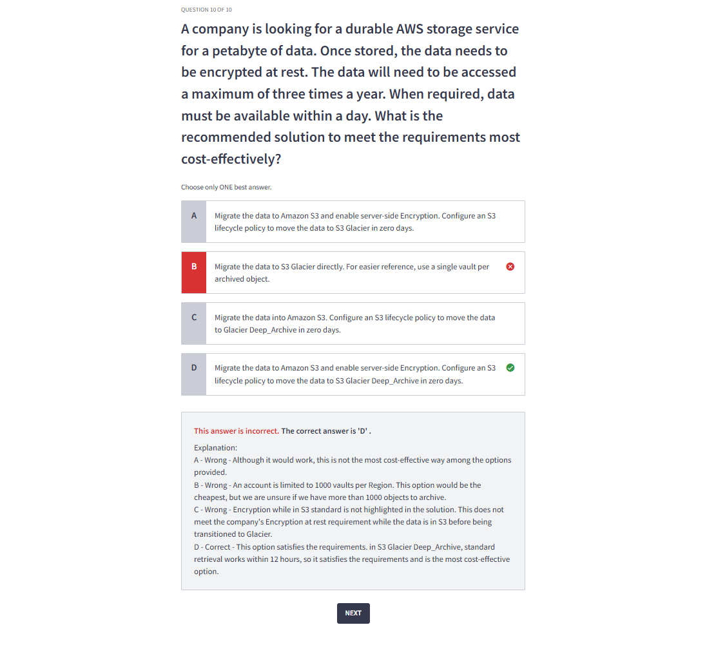
</div>

<h2>Error 4</h2>
<div align="center">
    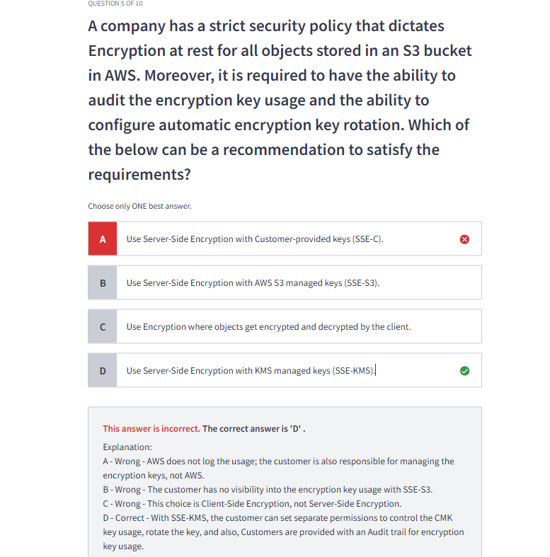
</div>

<h1>Security</h1>

<h2>Error 1</h2>
<div align="center">
    
</div>

<h1>No SQL</h1>

<h2>Error 1</h2>
<div align="center">
    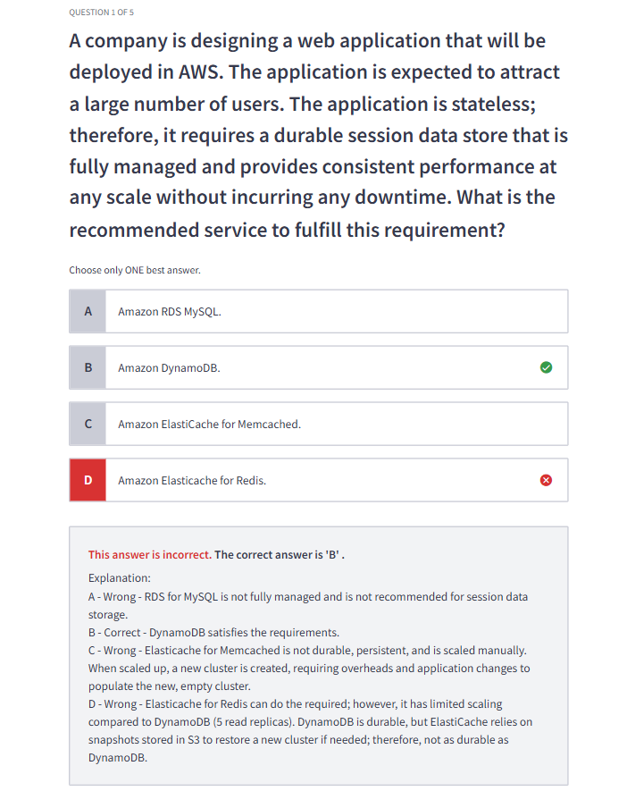
</div>

<h1>Analytics</h1>

<h2>Error 1</h2>
<div align="center">
    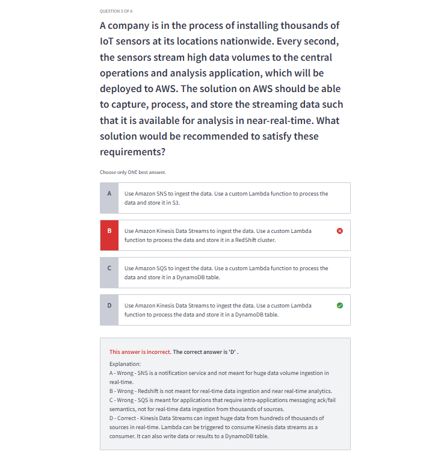
</div>

<h1>Other</h1>

<h2>Error 1</h2>
<div align="center">
    
</div>

<h2>Error 2</h2>
<div align="center">
    
</div>

<div>

<h2>Error 3</h2>
<div align="center">
    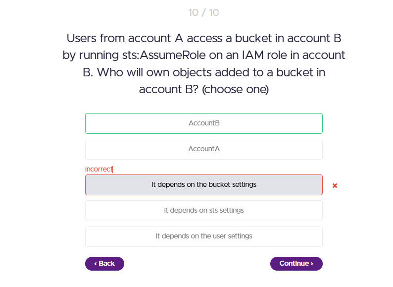
</div>

- When a user assumes a role in another account and uploads objects to an S3 bucket, the objects are owned by the bucket owner (Account B in this case) by default.

</div>

<h2>Error 4</h2>
<div align="center">
    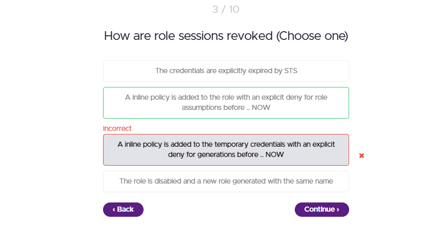
</div>

<h2>Error 5</h2>
<div align="center">
    
</div>

- SCP's only impact identities in the account they are attached to in this case the SCP is on account B, and bob's identity is in account A .. so the SCP doesn't apply this leaves the identity policy and the resource policy together which allow bobs access.

</div>

<div>

<h2>Error 6</h2>
<div align="center">
    
</div>

- SAML 2.0 is designed for enterprise scenarios, while Web Identity Federation allows users to log in with social media accounts for consumer-facing applications. They serve different purposes and contexts.

</div>

<div>

<h2>Error 7</h2>
<div align="center">
    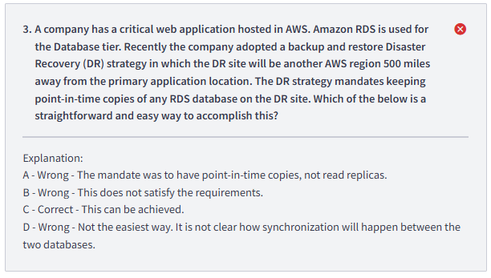
</div>

<h2>Error 8</h2>
<div align="center">
    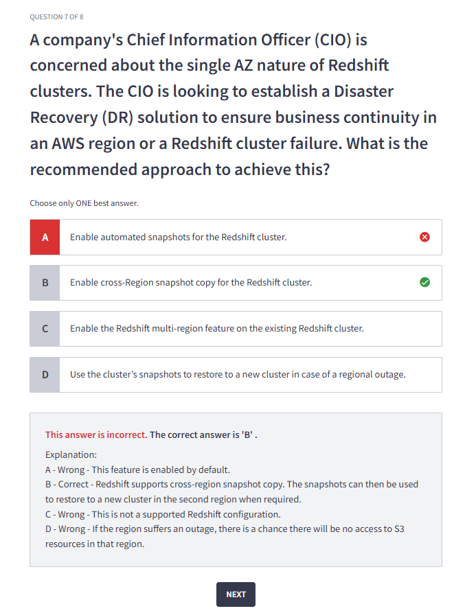
</div>

</div>

<h1>Networking</h1>

<div>

<h2>Error 1</h2>
<div align="center">
    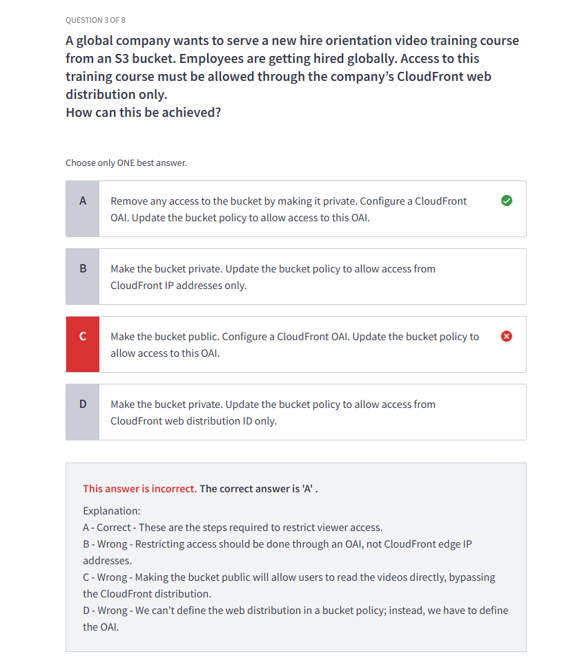
</div>

- You're absolutely correct that making an S3 bucket private restricts access to unauthorized users. However, in this scenario, where the goal is to serve global users (who may not have AWS authorization or authentication), the **CloudFront Origin Access Identity (OAI)** or **Origin Access Control (OAC)** provides the necessary mechanism to securely handle access without needing individual user authentication.

**Why This Works for "Global Unauthorized Users":**

- **Bucket Privacy**: Making the S3 bucket private ensures that **direct access** to the bucket is not possible, adding a security layer.
- **CloudFront as a Gateway**: With OAI/OAC, CloudFront acts as the authorized intermediary, fetching content from the private bucket on behalf of the users. It doesn't matter if the end users are authorized in AWS or not—they only interact with CloudFront.
- **Public Accessibility Through CloudFront**: Users are not interacting with the S3 bucket directly. Instead, they access the content via the CloudFront distribution, which securely retrieves and serves the content.

**Assumption in the Solution:**

The solution assumes:

1. Users (even "global unauthorized" ones) **don't need direct access to AWS services**, but they need access to the training video via CloudFront.
2. **No individual user-level authorization** is required for access. If it were, additional mechanisms like signed URLs or cookies would be necessary.

</div>

<div>

<h2>Error 2</h2>
<div align="center">
    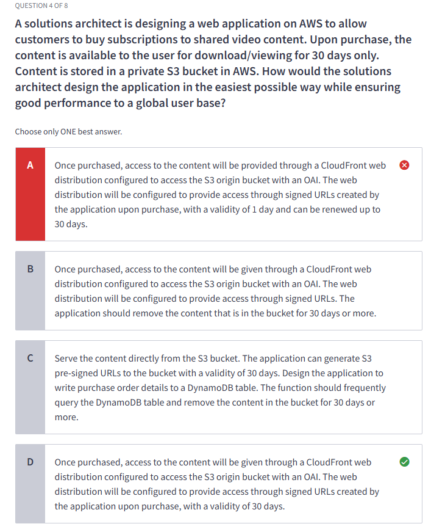
</div>

<div align="center">
    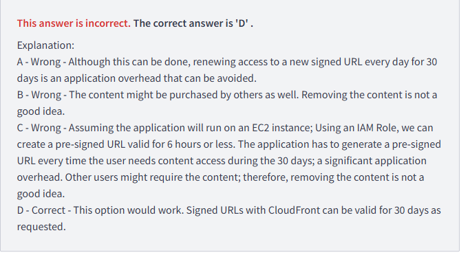
</div>

</div>

<h2>Error 3</h2>
<div align="center">
    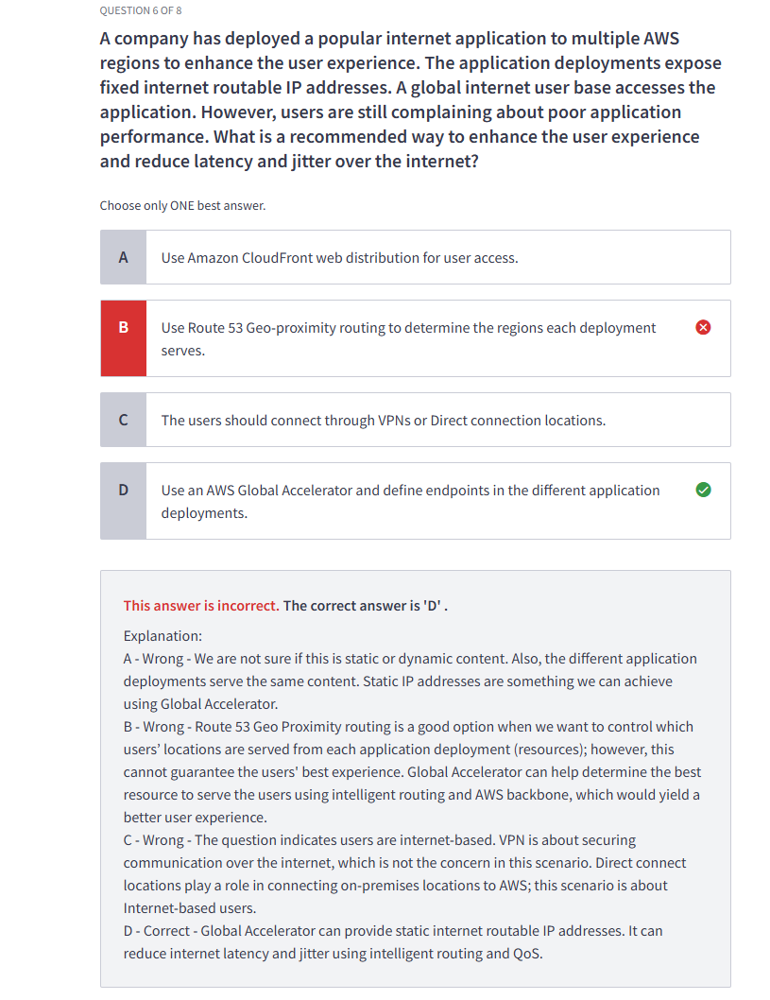
</div>

</div>

</div>
