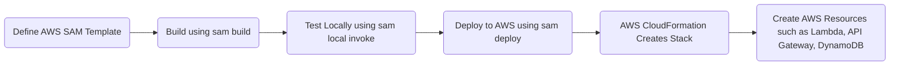

# 🚀 **Mastering AWS SAM (Serverless Application Model) – A Professional Guide**

AWS **Serverless Application Model (SAM)** is a **powerful framework** for **building, testing, and deploying serverless applications** on AWS. It simplifies defining **Lambda functions, API Gateway, DynamoDB, Step Functions, and more** using an easy-to-read YAML format.

This **professional guide** covers **everything you need to know** to master AWS SAM, from **installation to deployment, project structure, template syntax, local execution, testing, and advanced deployment strategies**.

---

## 📌 **Table of Contents**

- [What is AWS SAM?](#what-is-aws-sam)
- [How AWS SAM Works – Workflow & Diagram](#how-aws-sam-works--workflow--diagram)
- [AWS SAM Project Structure](#aws-sam-project-structure)
- [Understanding AWS SAM Template Syntax](#understanding-aws-sam-template-syntax)
- [How to Run & Test Locally (With Docker)](#how-to-run--test-locally-with-docker)
- [How to Deploy with AWS SAM](#how-to-deploy-with-aws-sam)
- [How AWS SAM Handles Dependencies](#how-aws-sam-handles-dependencies)
- [Best Practices & Advanced Features](#best-practices--advanced-features)
- [Final Thoughts & Next Steps](#final-thoughts--next-steps)

---

## 🔰 **What is AWS SAM?**

AWS **Serverless Application Model (SAM)** is an **open-source framework** that simplifies the development of **serverless applications** on AWS. It provides:

✅ **A simple YAML syntax** to define AWS resources.  
✅ **Built-in local testing and debugging** using Docker.  
✅ **Seamless deployment** via **CloudFormation**.  
✅ **Best practices** such as **least-privilege IAM policies, Lambda Layers, and API Gateway configuration**.

📌 **AWS SAM is an abstraction of AWS CloudFormation** that makes it easier to build serverless applications.

---

## ⚙️ **How AWS SAM Works – Workflow & Diagram**

The AWS SAM workflow consists of **four key steps**:

1️⃣ **Define your application** in `template.yaml`.  
2️⃣ **Build the application** using `sam build`.  
3️⃣ **Run and test locally** using `sam local invoke` or `sam local start-api`.  
4️⃣ **Deploy the application** to AWS using `sam deploy`.

### 📌 **AWS SAM Workflow Diagram**



💡 **AWS SAM uses CloudFormation under the hood to deploy resources to AWS**.

---

## 📂 **AWS SAM Project Structure**

A typical AWS SAM project has the following structure:

```plaintext
my-sam-app/
│── events/                 # Sample event JSON files for testing
│── hello_world/            # Lambda function source code
│   ├── app.py              # Function entry point (Python example)
│   ├── requirements.txt    # Dependencies for Python
│── tests/                  # Unit tests
│── template.yaml           # AWS SAM template (Infrastructure as Code)
│── README.md               # Documentation
```

---

## 📝 **Understanding AWS SAM Template Syntax**

The **AWS SAM template** (`template.yaml`) is the heart of an AWS SAM application.

### ✅ **Basic Template Structure**

```yaml
AWSTemplateFormatVersion: "2010-09-09"
Transform: AWS::Serverless-2016-10-31 # Required for AWS SAM

Resources:
  MyFunction:
    Type: AWS::Serverless::Function # AWS Lambda function
    Properties:
      Handler: hello_world.app # Function entry point
      Runtime: python3.8 # Lambda runtime
      CodeUri: hello_world/ # Location of function code
      MemorySize: 128
      Timeout: 5
      Events:
        ApiEvent:
          Type: Api # Creates an API Gateway trigger
          Properties:
            Path: /hello
            Method: get
```

### **Key Sections Explained**

✔ **Transform** – Defines this as an AWS SAM template.  
✔ **Resources** – Contains Lambda functions, API Gateway, DynamoDB, etc.  
✔ **Properties** – Configures runtime, handler, memory, and events.  
✔ **Events** – Specifies triggers like HTTP requests (API Gateway).

---

## 🖥️ **How to Run & Test Locally (With Docker)**

AWS SAM allows **local execution** using Docker containers.

### ✅ **Start Local API Gateway**

Run this command to **test API Gateway locally**:

```bash
sam local start-api
```

💡 **Access the local API at:**

```plaintext
http://127.0.0.1:3000/hello
```

### ✅ **Invoke Lambda Locally**

Run a **specific Lambda function** locally:

```bash
sam local invoke MyFunction
```

🔹 **Pass an event file** for testing:

```bash
sam local invoke MyFunction -e events/event.json
```

---

## 🚀 **How to Deploy with AWS SAM**

### ✅ **Step 1: Build the Application**

Run:

```bash
sam build
```

🔹 **This compiles the code** and prepares dependencies for deployment.

### ✅ **Step 2: Deploy to AWS**

```bash
sam deploy --guided
```

🔹 **Follow the prompts to set up the stack** (region, bucket, function names).  
🔹 AWS SAM uses **CloudFormation** to create and manage resources.

💡 **Subsequent deployments use** `sam deploy` **without prompts**.

---

## 📦 **How AWS SAM Handles Dependencies**

AWS SAM **automatically installs dependencies** for supported runtimes.

### ✅ **Python Example (requirements.txt)**

In `hello_world/requirements.txt`:

```plaintext
requests
boto3
```

### Install dependencies

```bash
sam build
```

🔹 **AWS SAM packages these dependencies inside the Lambda function deployment package**.

---

## 🔥 **Best Practices & Advanced Features**

### ✅ **Use Environment Variables**

```yaml
Environment:
  Variables:
    STAGE: "dev"
    API_KEY: "12345"
```

### ✅ **Enable Logging with CloudWatch**

```yaml
Policies:
  - AWSLambdaBasicExecutionRole
```

### ✅ **Use AWS Step Functions for Workflow Automation**

```yaml
Resources:
  MyStateMachine:
    Type: AWS::Serverless::StateMachine
    Properties:
      DefinitionUri: statemachine.asl.json
      Role: !GetAtt MyExecutionRole.Arn
```

---

## 🏆 **Final Thoughts & Next Steps**

AWS SAM is a **powerful tool** for deploying **AWS serverless applications** with **simplified YAML syntax, local testing capabilities, and automated deployments**.

### 🎯 **Next Steps**

✔ **Practice running AWS SAM locally (`sam local invoke`).**  
✔ **Deploy a real-world serverless API (`sam deploy`).**  
✔ **Explore AWS Step Functions, IAM policies, and Lambda Layers.**

---

Would you like a **hands-on project tutorial** with AWS SAM? 🚀😊
