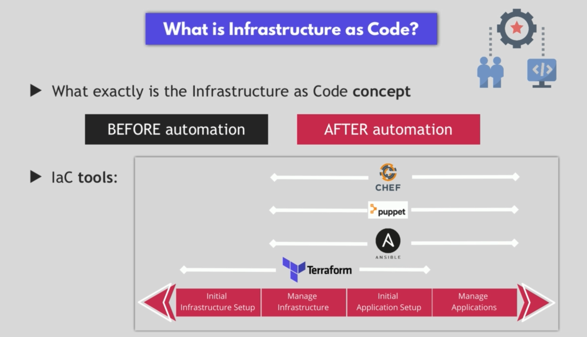
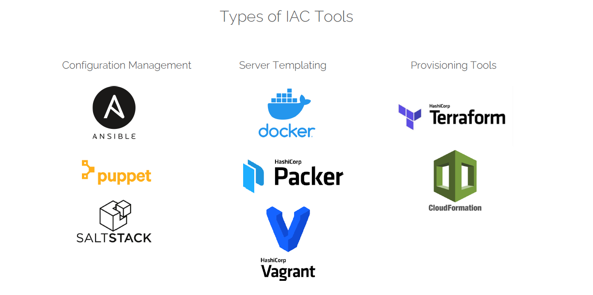

# 🌍 Terraform – Infrastructure as Code (IaC)

<div style="text-align: center">
  
</div>

---

## ⚙️ DevOps Tasks Before Automation

Before Infrastructure as Code (IaC), DevOps teams manually:

- Logged into cloud consoles or servers
- Created VMs, networks, firewalls manually
- Configured applications by hand
- Maintained lengthy setup docs and inconsistent environments

> ❌ This process was **slow**, **error-prone**, and **hard to scale**.

### ✅ 3 Main Categories of DevOps Tasks

1. **Infrastructure Provisioning**

   - Creating VMs, networks, storage, security groups

2. **Configuration of Provisioned Infrastructure**

   - Installing software, setting up services, OS hardening

3. **Application Deployment**

   - Deploying and managing app releases (versioned, staged)

> 📌 **Container technologies** (like Docker, Kubernetes) often **merge step 2 & 3**, since apps are pre-configured in images.

---

## 📖 What is IaC

🛠️ **IaC** stands for **Infrastructure as Code** — a powerful approach in IT and DevOps that lets you manage and provision infrastructure using code instead of manual processes.

### 🚀 What IaC Does

- Automates the setup of servers, networks, databases, and other infrastructure components
- Uses configuration files (like YAML, JSON, or HCL) to define the desired state of your infrastructure
- Enables consistent, repeatable deployments across environments (development, staging, production)

### 💡 Why It’s Useful

- **Speed**: Deploy environments in minutes, not hours
- **Consistency**: Avoid human errors and configuration drift
- **Version Control**: Track changes and roll back if needed
- **Scalability**: Easily replicate or scale infrastructure

### 🔧 Popular IaC Tools

| Tool               | Approach                 | Highlights                          |
| ------------------ | ------------------------ | ----------------------------------- |
| Terraform          | Declarative              | Multi-cloud support, modular design |
| AWS CloudFormation | Declarative              | Deep AWS integration                |
| Ansible            | Imperative & Declarative | Agentless, simple YAML playbooks    |
| Puppet             | Declarative              | Strong for complex configurations   |
| Chef               | Imperative               | Ruby-based, highly customizable     |

---

<div style="text-align: center">
  
</div>

---

## 🧠 Choosing the Right IaC Tool

Choosing between tools like **Terraform**, **Ansible**, **Chef**, or **Puppet** depends on 3 key factors:

### 🧾 Declarative vs Procedural

- **Declarative (Terraform, Puppet):**

  > You declare _what_ you want (desired state) — the tool figures out _how_ to get there.

- **Procedural (Ansible, Shell):**

  > You describe _how_ to get there step-by-step.

### 🧪 Mutable vs Immutable Infrastructure

- **Mutable:** Modify existing infrastructure (e.g., update live servers)
- **Immutable:** Recreate from scratch (e.g., replace entire server/image)

> Terraform is **mostly immutable** by design — ensures clean, reproducible state.

### 🔗 Agent vs Agentless

- **Agent-based (e.g., Puppet, Chef):**

  - Requires agent to run on target nodes

- **Agentless (e.g., Ansible, Terraform):**

  - Uses SSH or cloud APIs — no software installed on target systems

---

## 🔨 What Is Terraform?

Terraform is a **declarative, open-source Infrastructure as Code (IaC) tool** developed by HashiCorp.

<div style="text-align: center">
  
</div>

---

It uses a language called **HCL (HashiCorp Configuration Language)** to describe the desired state of your infrastructure.

### 🌎 You can use Terraform to provision:

- AWS / Azure / GCP resources
- Networks, VPCs, load balancers, S3 buckets, EC2s
- DNS records, Kubernetes clusters
- Even SaaS integrations like GitHub or Cloudflare!

---

## ⚔️ Terraform vs Ansible

| Feature          | **Terraform**                   | **Ansible**                       |
| ---------------- | ------------------------------- | --------------------------------- |
| Focus            | Infrastructure provisioning     | Configuration + Application setup |
| Language         | Declarative (HCL)               | Procedural (YAML with modules)    |
| Agentless?       | ✅ Yes (uses API)               | ✅ Yes (uses SSH or WinRM)        |
| State Management | ✅ Built-in state tracking      | ❌ No state tracking              |
| Idempotent       | ✅ Yes (reconciles state)       | ✅ Yes (if coded carefully)       |
| Typical Use      | Create & manage cloud resources | Setup software, deploy apps       |

> 💡 Use **Terraform** to create the machine, **Ansible** to configure it.

---

## 🧱 Terraform Commands for Different Stages

Here’s a simple Terraform flow with its stages and commands:

### 🔄 `refresh`

```bash
terraform refresh
```

- Syncs Terraform’s state file with actual resources in the cloud

---

### 🧠 `plan`

```bash
terraform plan
```

- Shows **what Terraform will do** without actually doing it
- Helps you **review** and **prevent mistakes**

---

### 🚀 `apply`

```bash
terraform apply
```

- Applies the plan: creates or updates infrastructure

---

### 💣 `destroy`

```bash
terraform destroy
```

- Destroys all resources defined in the current `.tf` files

---

## 📄 Example HCL (Terraform Config)

```ini
provider "aws" {
  version = "~> 2.0"
  region  = "us-east-1"
}

resource "aws_vpc" "example" {
  cidr_block = "10.0.0.0/16"
}
```

This example:

- Configures the AWS provider
- Provisions a new VPC in `us-east-1` with the CIDR block `10.0.0.0/16`

---

## 🧠 Terraform Summary

| Concept        | Terraform Does This...                       |
| -------------- | -------------------------------------------- |
| Define state   | Using `.tf` files to describe desired state  |
| Track state    | Saves state in `.tfstate` file               |
| Plan execution | Show changes before applying                 |
| Apply changes  | Provision/update infrastructure in the cloud |
| Destroy        | Cleanly tear down infrastructure             |

---

## ⚔️ Terraform vs. Ansible

While both **Terraform** and **Ansible** are powerful Infrastructure as Code (IaC) tools, they serve **different purposes** and operate at **different layers** of the DevOps stack. Understanding when and why to use each is key for effective automation.

---

### 🎯 Purpose

- **Terraform** is used for **provisioning infrastructure** (e.g., creating VMs, networks, storage, DNS).
- **Ansible** is used for **configuring infrastructure** (e.g., installing packages, updating configs, managing services).

---

### 🧠 Comparison Table

| Feature                  | **Terraform**                            | **Ansible**                               |
| ------------------------ | ---------------------------------------- | ----------------------------------------- |
| 🔧 **Primary Use**       | Infrastructure provisioning (IaC)        | Configuration management & app deployment |
| 📜 **Language Type**     | Declarative (HCL)                        | Procedural (YAML + modules)               |
| 🚫 **Agent Requirement** | Agentless (uses cloud APIs)              | Agentless (uses SSH / WinRM)              |
| 📦 **State Management**  | ✅ Maintains state (`.tfstate` file)     | ❌ No native state tracking               |
| 📂 **Idempotency**       | Built-in: plans before apply             | Requires careful coding for idempotency   |
| ☁️ **Cloud Support**     | All major clouds, SaaS, custom providers | Also supports cloud but via roles/modules |
| 🛠️ **Tool Role**         | "Create the machine"                     | "Configure the machine"                   |
| 🔁 **Workflow**          | plan → apply → destroy                   | playbook → tasks → handlers               |
| 🧩 **Integrations**      | Easily integrates with CI/CD & Packer    | Integrates well with Jenkins, Tower, AWX  |

---

### 🧪 Example Workflow

- **Terraform:**

  ```bash
  terraform init
  terraform plan
  terraform apply
  ```

  → Provisions an AWS EC2 instance

- **Ansible:**

  ```bash
  ansible-playbook webserver.yml
  ```

  → Installs Nginx, updates packages on the EC2 instance

---

### 🧠 When to Use What?

| Scenario                                | Best Tool        |
| --------------------------------------- | ---------------- |
| Provisioning cloud infrastructure       | ✅ Terraform     |
| Managing software/config inside servers | ✅ Ansible       |
| Full-stack automation                   | ✅ Both Together |

> 💡 **Pro Tip:** Use Terraform to provision resources, and hand off IPs to Ansible for configuration.
