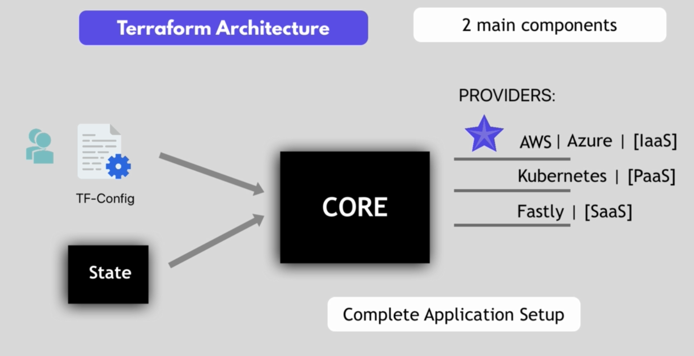
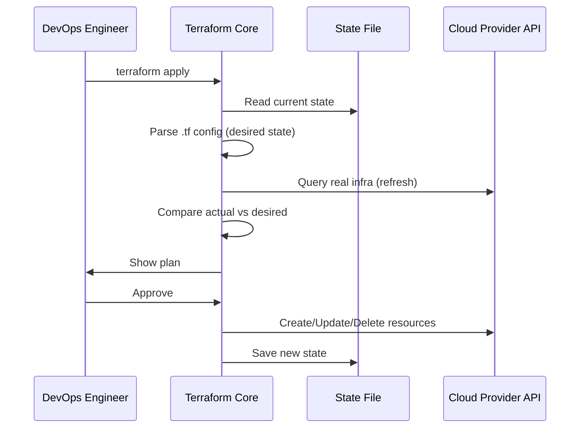

# 🏗️ Terraform Architecture – How Terraform Works Behind the Scenes

<div style="text-align: center">
  
</div>

---

## 🚀 What is Terraform?

Terraform is an **open-source Infrastructure as Code (IaC) tool** by HashiCorp that enables you to **provision**, **modify**, and **destroy** infrastructure safely and efficiently using declarative configuration files.

---

## 🧩 Core Terraform Architecture

Terraform has **2 major components** at its core:

### 1. 🧠 Core (Terraform Engine)

This is the **heart of Terraform**. It takes care of:

- **Reading the configuration files**
- **Parsing the current state**
- **Comparing desired vs current infrastructure**
- **Generating an execution plan**
- **Calling the appropriate providers' APIs**

> Think of it as the "brain" that knows what should exist, what already exists, and what to change.

---

### 2. 📦 Providers

Providers are **plugins** that allow Terraform to manage external services like:

| Provider | Type     | Examples                            |
| -------- | -------- | ----------------------------------- |
| ☁️ IaaS  | Compute  | AWS, Azure, GCP, OpenStack          |
| ☸️ PaaS  | Platform | Kubernetes, Heroku                  |
| 📨 SaaS  | Services | GitHub, Datadog, Fastly, Cloudflare |

Each provider exposes **resources** (e.g., `aws_instance`, `azurerm_vm`) that Terraform can manage.

---

## 📁 Terraform Input: TF Configuration Files (`.tf`)

You describe your **desired infrastructure state** using **HCL (HashiCorp Configuration Language)**:

```hcl
provider "aws" {
  region = "us-east-1"
}

resource "aws_vpc" "my_vpc" {
  cidr_block = "10.0.0.0/16"
}
```

These are human-readable **.tf files** written by users or automation pipelines.

---

## 🧾 Terraform State File (`terraform.tfstate`)

The **state file** is a local or remote file that records the **actual resources provisioned** by Terraform.

- Keeps track of all resource metadata.
- Allows Terraform to detect drift (changes made outside Terraform).
- Required to safely perform updates, deletes, or plans.

> 💡 You can store it remotely (e.g., in S3 + DynamoDB for locking) for team collaboration.

---

## 🔄 How Terraform Works – Behind the Scenes



---

## 🔑 Summary

| Component      | Role                                                     |
| -------------- | -------------------------------------------------------- |
| **Core**       | Brain that executes logic and manages resource lifecycle |
| **Providers**  | Plugins that interface with external APIs                |
| **.tf Files**  | Declarative definitions of desired infrastructure        |
| **State File** | Snapshot of what’s deployed and managed by Terraform     |

---

## 🧠 Final Thought

Terraform acts like a **smart orchestrator**. It doesn’t just throw infra into the cloud—it:

- ✅ Plans changes before applying
- ✅ Tracks what it built
- ✅ Knows how to **destroy** exactly what it created
- ✅ Bridges the gap between desired state and actual state

> It’s like having Git + a cloud robot that listens to you 😄
