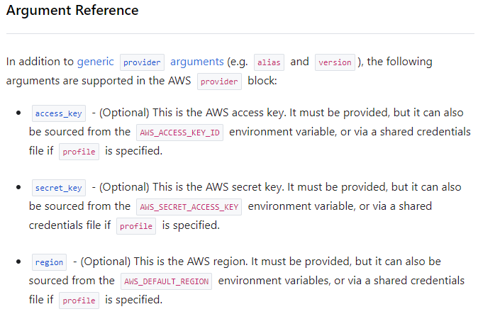
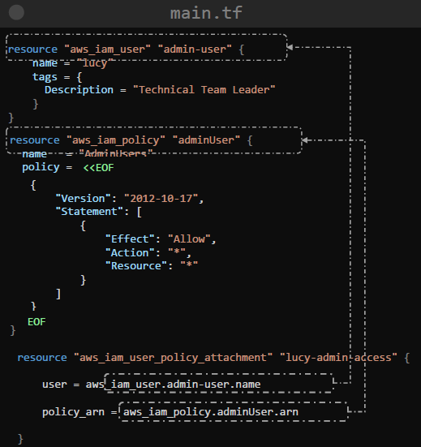
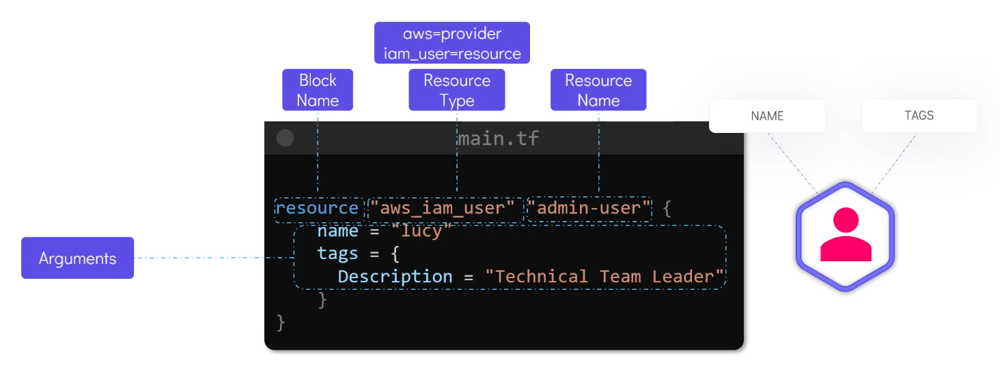
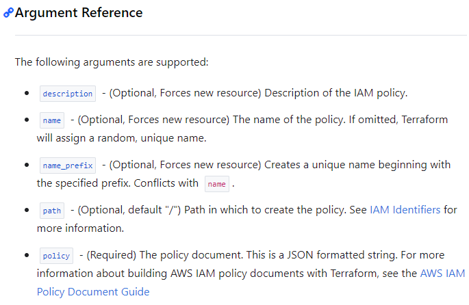
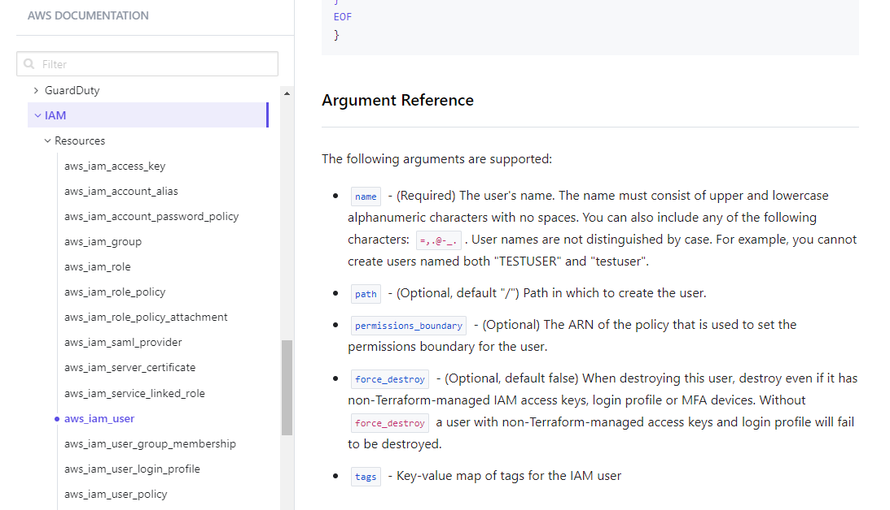
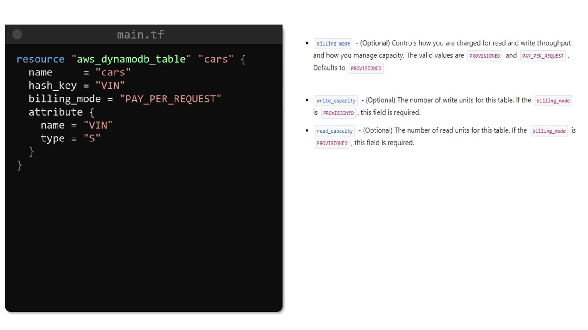

# 🚀 AWS with Terraform

## 🌍 Setup AWS Provider in Terraform

To work with AWS resources in Terraform, you need to configure **authentication** and **provider** setup.

---

### 🛑 Method 1: Hardcoded Credentials (Not Secure)

> ❗ Avoid this in production. It's useful only for learning/demo purposes.

```ini
provider "aws" {
  region     = "us-west-2"
  access_key = "AKIAFAKEACCESSKEY"
  secret_key = "aFAKESecretAccessKeyThatShouldNotBeUsed"
}
```

---

<div style="text-left: center">
    
</div>

---

### ✅ Method 2: AWS Shared Credentials File (`~/.aws/credentials`)

> 🌟 This is a secure and scalable method.

```ini
# ~/.aws/credentials
[default]
aws_access_key_id = YOUR_ACCESS_KEY
aws_secret_access_key = YOUR_SECRET_KEY
```

```ini
provider "aws" {
  region = "us-west-2"
  profile = "default"
}
```

---

### ✅ Method 3: Environment Variables

> 🔐 Good for CI/CD pipelines and temporary auth.

```bash
export AWS_ACCESS_KEY_ID=YOUR_ACCESS_KEY
export AWS_SECRET_ACCESS_KEY=YOUR_SECRET_KEY
export AWS_REGION=us-west-2
```

No need to pass keys in the Terraform code!

---

## 🔐 IAM with Terraform

```ini
# main.tf
resource "aws_iam_user" "admin user" {
    name = "lucy"
    tags = {
        Description = "Technical Team Leader"
    }
}

resource "aws_iam_policy" "adminUser" {
    name = "AdminUsers"
    policy = file("admin-policy.json)
}

resource "aws_iam_user_policy_attachment" "lucy-admin-access" {
    user = aws_iam_user.admin user.name
    policy_arn = aws_iam_policy.adminUser.arn
}
```

```json
// admin-policy.json
{
  "Version": "2012 10 17",
  "Statement": [
    {
      "Effect": "Allow",
      "Action": "*",
      "Resource": "*"
    }
  ]
}
```

<div style="text-align: center">
    
</div>

---

### ✅ 1. Creating an IAM User

```ini
resource "aws_iam_user" "admin_user" {
  name = "lucy"
  tags = {
    Description = "Technical Team Leader"
  }
}
```

---

<div style="text-align: center">
    
</div>

---

### ✅ 2.Create a Custom IAM Policy

```ini
# (Using Heredoc)
resource "aws_iam_policy" "admin_policy" {
  name = "AdminAccess"
  policy = <<EOF
            {
                "Version": "2012-10-17",
                "Statement": [
                    {
                        "Effect": "Allow",
                        "Action": "*",
                        "Resource": "*"
                    }
                ]
            }
EOF
}
```

---

> ✅ **Heredoc syntax** (`<<EOF ... EOF`) allows embedding large JSON or script blocks inline. Easier to maintain.

---

### ✅ 3.Attach Policy to IAM User

```ini
resource "aws_iam_user_policy_attachment" "lucy_admin_access" {
  user       = aws_iam_user.admin_user.name
  policy_arn = aws_iam_policy.admin_policy.arn
}
```

---

## 🪣 S3 Bucket with Terraform

```ini
resource "aws_s3_bucket" "finance" {
  bucket = "my-app-data-bucket-12345"
  acl    = "private"

  tags = {
    Name        = "AppBucket"
    Environment = "Dev"
  }
}

resource "aws_s3_bucket_object" "finance-2020" {
    content = "/root/finance/finance-2020.doc"
    key = "finance-2020.doc"
    bucket = aws_s3_bucket.finance.id
}

resource "aws_s3_bucket_policy" "finance-policy" {
    bucket = aws_s3_bucket.finance.id
    policy = <<EOF
    {
        "Version": "2012-10-17",
        "Statement": [
            {
                "Sid": "PublicReadGetObject",
                "Effect": "Allow",
                "Principal": "*",
                "Action": [
                    "s3:GetObject"
                ],
                "Resource": [
                    "arn:aws:s3:::${aws_s3_bucket.finance.id}/*"
                ],
                "Principal": {
                    "AWS": ["${data.aws_iam_group.finance_group.arn}"]
                }
            }
        ]
    }
    EOF
}

data "aws_iam_group" "finance_group" {
    group_name = "Finance"
}
```

---

## 🔢 DynamoDB Table with Terraform

```ini
resource "aws_dynamodb_table" "user_table" {
  name         = "UserProfiles"
  billing_mode = "PAY_PER_REQUEST"
  hash_key     = "user_id"

  attribute {
    name = "user_id"
    type = "S"
  }

  tags = {
    Name = "UserProfileTable"
    Env  = "Dev"
  }
}
```

---

## 🧠 Summary

| Feature         | Covered Example                           |
| --------------- | ----------------------------------------- |
| Provider Setup  | Secure/Unsafe methods, env vars, profiles |
| IAM User/Policy | User creation, Heredoc inline JSON policy |
| IAM Attachment  | Policy attached to user                   |
| S3 Bucket       | Simple S3 resource with tags              |
| DynamoDB        | Pay-per-request table with attributes     |

## Reference

<div style="text-align: center">
    
</div>

<div style="text-align: center">
    
</div>

<div style="text-align: center">
    
</div>

---
