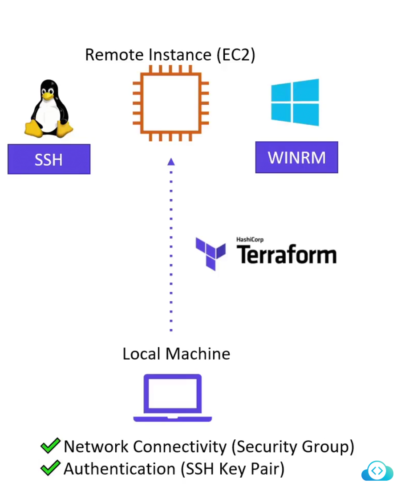
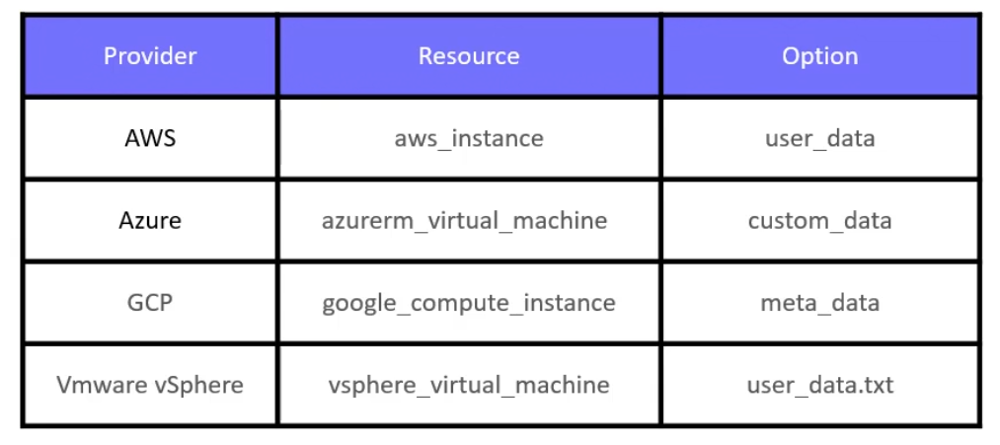

# 🧰 Terraform Provisioners

## 🧠 What is a Provisioner?

A **Terraform provisioner** is a way to execute custom commands or scripts on the **local machine** or **remote resource** **after** it's created or before it's destroyed.

> _Provisioners act as post-deployment “bootstrappers” to configure or initialize infrastructure resources._

---

## 🔄 When Do Provisioners Run?

| Phase         | Triggered When?                  |
| ------------- | -------------------------------- |
| `creation`    | After the resource is created    |
| `destruction` | Before the resource is destroyed |

You can control this behavior via `when = "create"` or `when = "destroy"`.

---

## 🧭 Provisioner Types

| Provisioner      | Where It Runs         | Example Use Case                           |
| ---------------- | --------------------- | ------------------------------------------ |
| ✅ `local-exec`  | On your local machine | Log IP to local file, send Slack message   |
| ✅ `remote-exec` | On the remote VM/EC2  | Install NGINX using SSH                    |
| ✅ `file`        | Push file to remote   | Upload config files before installing apps |

---

## 1️⃣ `local-exec` — Run Locally

Runs a command **on the Terraform host** (where you execute `terraform apply`).

### ✅ Example: Append public IP to local file

```ini
resource "aws_instance" "web" {
  ami           = "ami-123456"
  instance_type = "t2.micro"

  provisioner "local-exec" {
    command = "echo ${self.public_ip} >> ips.txt"
  }
}
```

🧠 `self` refers to the resource.

---

## 2️⃣ `remote-exec` — SSH Into Resource

Runs commands **on the remote machine** via SSH (Linux) or WinRM (Windows).

<div style="text-align: center">
    
</div>

---

### ✅ Example: Install NGINX via SSH

```ini
resource "aws_instance" "web" {
  ami           = "ami-123456"
  instance_type = "t2.micro"

  provisioner "remote-exec" {
    inline = [
      "sudo apt update",
      "sudo apt install nginx -y"
    ]
  }

  connection {
    type        = "ssh"
    host        = self.public_ip
    user        = "ubuntu"
    private_key = file("~/.ssh/web.pem")
  }

  key_name               = aws_key_pair.web.id
  vpc_security_group_ids = [aws_security_group.allow_ssh.id]
}
```

---

## 3️⃣ `file` — Upload File to Remote VM

Use this to **copy a local file** to the remote machine.

### ✅ Example: Copy config file

```ini
resource "aws_instance" "web" {
  ami           = "ami-123456"
  instance_type = "t2.micro"

  provisioner "file" {
    source      = "config/app.conf"
    destination = "/etc/app/app.conf"
  }

  connection {
    type        = "ssh"
    host        = self.public_ip
    user        = "ubuntu"
    private_key = file("~/.ssh/web.pem")
  }
}
```

---

## 🔄 Provisioner Execution Behavior

### 🔧 `when` Meta-Argument

Use `when = "create"` or `when = "destroy"` to control when provisioners execute.

```ini
provisioner "local-exec" {
  command = "echo Destroying..."
  when    = "destroy"
}
```

---

### 🧨 `on_failure` Meta-Argument

Controls what Terraform does if the provisioner fails:

| Value      | Behavior                     |
| ---------- | ---------------------------- |
| `fail`     | Stop the apply               |
| `continue` | Ignore and continue applying |

```ini
provisioner "remote-exec" {
  inline     = ["exit 1"]
  on_failure = "continue"
}
```

---

## 🛑 Why You Should Avoid Provisioners in Production

| ⚠ Problem                   | 💥 Why It’s Bad                                               |
| --------------------------- | ------------------------------------------------------------- |
| ❌ Not Idempotent           | They don’t track state. Rerunning may break or duplicate work |
| ❌ Difficult to Debug       | No retry, no logs, no visibility                              |
| ❌ Breaks Terraform Model   | Imperative logic inside declarative language                  |
| ❌ Poor CI/CD Compatibility | SSH issues, timeout, broken key forwarding, etc.              |

---

## ✅ Recommended Alternatives

| Alternative      | Why It’s Better                              | Example                                |
| ---------------- | -------------------------------------------- | -------------------------------------- |
| `<user_data>`    | Native to cloud, easy to bootstrap VMs       | Install apps during EC2 startup        |
| Custom AMIs      | Fast launch, pre-installed dependencies      | Use Packer to build pre-baked images   |
| Config Mgmt Tool | Ansible / Chef / Puppet = full configuration | Integrate in CI/CD post-Terraform step |

---

<div style="text-align: center">
  
</div>

---

### 👨‍🍳 Example: Replacing `remote-exec` with `user_data`

```ini
resource "aws_instance" "web" {
  ami           = "ami-123456"
  instance_type = "t2.micro"

  user_data = <<-EOF
    #!/bin/bash
    apt update
    apt install nginx -y
  EOF
}
```

✅ Better than SSH — works natively, repeatable, logs in EC2 Console.

---

## 🧪 Terraform Plan Behavior

Provisioners are **not shown in `terraform plan`** because:

- They don’t change infrastructure state
- They only run at **apply** time

🧠 So if your plan looks empty, don’t panic. Provisioners ≠ plan-aware.

---

## 🎯 Summary Table

| Feature            | Supported? | Notes                                         |
| ------------------ | ---------- | --------------------------------------------- |
| `local-exec`       | ✅         | Good for local logging, notifications         |
| `remote-exec`      | ⚠️         | Works, but fragile. Use only in bootstrapping |
| `file`             | ✅         | Useful for uploading configs                  |
| `when = "destroy"` | ✅         | Run provisioners before deletion              |
| `on_failure`       | ✅         | Avoid breaking apply due to script failure    |

---

## 🛡️ Final Best Practices

✅ **Avoid provisioners** for anything production-related  
✅ **Use `user_data`** or prebuilt **custom AMIs**  
✅ Keep your bootstrapping **stateless, idempotent, and trackable**  
✅ If you must use provisioners, **scope them to prototyping only**
