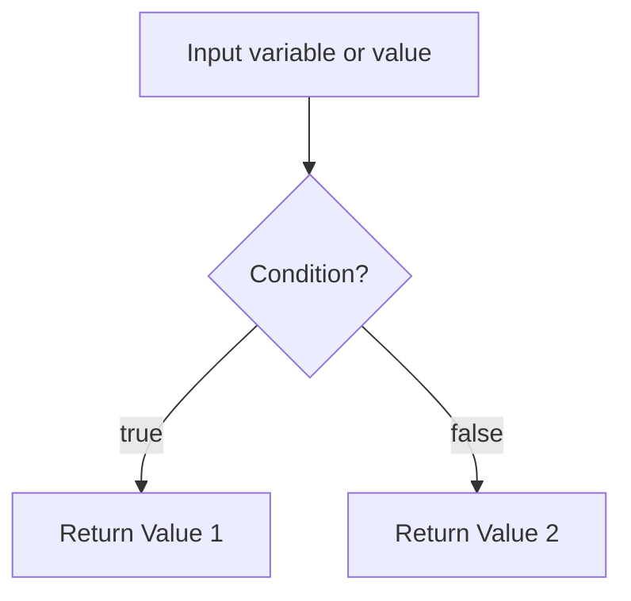

# ⚙️ Terraform Operators & Conditional Expressions

Terraform provides a set of **operators** (like arithmetic and logical) and **expressions** (like `if-else` style conditionals) to enable dynamic and reusable infrastructure code.

---

## 🧮 1. Arithmetic Operators

Use arithmetic operators for numeric values (integers or floats).

| Operator | Description         | Example  | Result |
| -------- | ------------------- | -------- | ------ |
| `+`      | Addition            | `3 + 4`  | `7`    |
| `-`      | Subtraction         | `10 - 2` | `8`    |
| `*`      | Multiplication      | `2 * 6`  | `12`   |
| `/`      | Division            | `10 / 2` | `5`    |
| `%`      | Modulus (remainder) | `10 % 3` | `1`    |

> 🔍 **Note**: Division returns a **float**, not an integer.

---

## 🔍 2. Comparison Operators

Used to compare values in conditional logic or validation blocks.

| Operator | Description      | Example              | Result |
| -------- | ---------------- | -------------------- | ------ |
| `==`     | Equals           | `var.env == "dev"`   | `true` |
| `!=`     | Not equals       | `var.region != "us"` | `true` |
| `>`      | Greater than     | `var.count > 2`      | `true` |
| `<`      | Less than        | `var.size < 10`      | `true` |
| `>=`     | Greater or equal | `count >= 1`         | `true` |
| `<=`     | Less or equal    | `cpu <= 4`           | `true` |

---

## 🔗 3. Logical Operators (Boolean)

These work on `true`/`false` values (often combined with conditions).

| Operator | Description | Example                                 | Result                      |
| -------- | ----------- | --------------------------------------- | --------------------------- |
| `&&`     | AND         | `var.env == "dev" && var.size == 1`     | `true`                      |
| `\|\|`   | OR          | `var.env == "dev" \|\| var.env == "qa"` | `true`                      |
| `!`      | NOT         | `!var.enabled`                          | `true` if `enabled = false` |

---

## 🧠 4. Conditional Expressions (Ternary)

### 🔄 Syntax:

```ini
condition ? value_if_true : value_if_false
```

### ✅ Example:

```hcl
variable "env" {
  default = "dev"
}

output "instance_type" {
  value = var.env == "prod" ? "t3.large" : "t3.micro"
}
```

> Output will be:

```hcl
"t3.micro"
```

---

## 🧪 5. Using `count` + condition

You can dynamically create resources based on a condition:

```hcl
resource "aws_s3_bucket" "logs" {
  count = var.create_logs_bucket ? 1 : 0
  bucket = "my-logs-bucket"
}
```

Only created if `var.create_logs_bucket = true`.

---

## 🔁 6. Using `for` and `if` inside expressions

### 🧺 List filtering:

```hcl
variable "names" {
  default = ["alice", "bob", "carol"]
}

output "a_names" {
  value = [for name in var.names : name if startswith(name, "a")]
}
```

Output: `["alice"]`

---

## 🚨 7. Equality Pitfalls

- `==` compares **strings, numbers, booleans**
- Don’t use `==` with complex objects like maps/lists unless you're 100% sure of the structure.

✅ Good:

```hcl
var.env == "prod"
```

⚠️ Risky:

```hcl
var.tags == {"env" = "prod"} # may break if key order differs
```

---

## 📦 8. `can()` and `try()` for Safe Evaluation

### `try(...)`: returns first valid value, avoids crashes

```hcl
output "env_value" {
  value = try(var.env, "default")
}
```

### `can(...)`: check if expression would work

```hcl
output "can_access" {
  value = can(length(var.env))
}
```

---

## 🌟 Terraform Splat Expressions (`[*]`)

A **splat expression** in Terraform is a special syntax (`[*]`) used to **extract multiple values from a list of similar resources or objects**.

It’s like saying:

> “Get me **all** the values of this attribute across all elements in the list!”

### 📦 Syntax

```ini
<resource>.<name>.<attribute>[*]
```

Or the newer version using `for` expression:

```ini
[for obj in <resource>.<name> : obj.<attribute>]
```

### 🎯 Use Cases

| Use Case                                 | Example                          |
| ---------------------------------------- | -------------------------------- |
| Get all public IPs of EC2 instances      | `aws_instance.web[*].public_ip`  |
| List of names of all created subnets     | `aws_subnet.my_subnets[*].id`    |
| Count length of a list of resource attrs | `length(aws_instance.web[*].id)` |

---

### 🧪 Example 1: EC2 Instances - Old Style

```ini
resource "aws_instance" "web" {
  count         = 3
  ami           = "ami-123456"
  instance_type = "t2.micro"
}

output "instance_ids" {
  value = aws_instance.web[*].id
}
```

#### ✅ Output:

```ini
[
  "i-0ab123",
  "i-0cd456",
  "i-0ef789"
]
```

🧠 `aws_instance.web[*].id` returns **all `id` values** for each instance created.

---

### ✨ Example 2: For-Expression Equivalent (Newer Style)

```ini
output "instance_ids" {
  value = [for inst in aws_instance.web : inst.id]
}
```

✅ This gives the same result as the splat.

---

### ⚠️ Subtle Gotcha: List vs Single Resource

| Expression Type    | Output                 | Example                          |
| ------------------ | ---------------------- | -------------------------------- |
| `web.public_ip`    | string (single value)  | When only 1 instance (count = 1) |
| `web[*].public_ip` | list of strings        | When count > 1                   |
| `web[0].public_ip` | string (first element) | Get a specific one               |

---

## 📘 Example Use Case: AMI Based on Environment

```hcl
variable "env" {
  type    = string
  default = "dev"
}

locals {
  ami_id = var.env == "prod" ? "ami-123456" : "ami-987654"
}

resource "aws_instance" "web" {
  ami           = local.ami_id
  instance_type = "t3.micro"
}
```

---

## ✅ Best Practices Summary

| Practice                                     | Recommendation                                |
| -------------------------------------------- | --------------------------------------------- |
| ✅ Use conditional `? :` for small decisions | Works great for small environment-based logic |
| ✅ Use `count = var.enabled ? 1 : 0`         | To control resource creation                  |
| ✅ Use `can()`/`try()` to avoid crashes      | Safe for optional variables                   |
| 🚫 Avoid complex object comparison with `==` | Maps/lists should be compared carefully       |
| 🚫 Don’t nest too many ternaries             | It gets unreadable fast! Use `locals` instead |

---

## 🧠 Visual: Condition Flow


