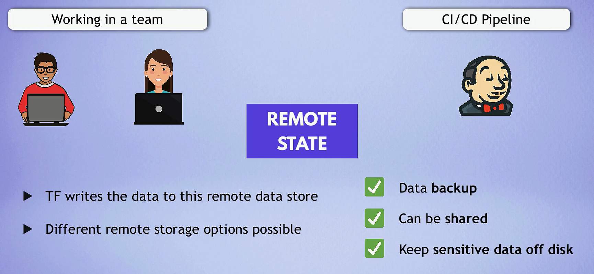

# Terraform Best Practices

## **Recommended Approaches**

### 1. **Use Modules for Reusability**

- **Modularization**: Break down complex infrastructure into smaller, reusable modules. This improves organization and promotes code reuse.

**Example Structure for a Module:**

```txt
modules/
└── vpc/
    ├── main.tf
    ├── variables.tf
    └── outputs.tf
```

### 2. **Environment-Specific Configurations**

- **Separate Environments**: Organize configurations for different environments (e.g., `dev`, `staging`, `prod`) using separate directories. This helps prevent accidental changes to production resources.

**Example Structure for Environments:**

```txt
environments/
├── dev/
│   ├── main.tf
│   ├── variables.tf
│   └── terraform.tfvars
├── staging/
│   ├── main.tf
│   ├── variables.tf
│   └── terraform.tfvars
└── prod/
    ├── main.tf
    ├── variables.tf
    └── terraform.tfvars
```

**How to Run Terraform Commands for Specific Environments:**

```bash
terraform init -reconfigure -backend-config=environments/dev/backend.tfvars
terraform plan -var-file=environments/dev/terraform.tfvars
terraform apply -var-file=environments/dev/terraform.tfvars
```

### 3. **Use Descriptive Naming Conventions**

- **Resource Naming**: Use descriptive names for resources and variables to enhance clarity.

**Example:**

```ini
resource "aws_s3_bucket" "my_app_bucket" {
  bucket = "my-app-bucket"
}
```

### 4. **Version Control for State Files**



- **Remote State Management**: Store Terraform state files in a remote backend (e.g., AWS S3, Terraform Cloud) to manage state collaboratively and prevent conflicts.

**Example for S3 Backend:**

```ini
terraform {
  backend "s3" {
    bucket         = "my-tf-bucket-name"
    key            = "my-tf/terraform.tfstate"
    region         = "us-west-2"
  }
}
```

### 5. **Use `terraform.tfvars` for Default Variables**

- **Variable Files**: Use `terraform.tfvars` to provide default values for variables, keeping sensitive or environment-specific data out of the main configuration files.

**Example:**

`terraform.tfvars`:

```ini
region = "us-west-2"
access_key = "your-access-key"
secret_key = "your-secret-key"
```

### 6. **Organize Resources Logically**

- **Resource Grouping**: Group related resources together within a module or directory. This improves readability and maintainability.

**Example:**

```ini
module "networking" {
  source = "./modules/networking"
}

module "compute" {
  source = "./modules/compute"
}
```

### 7. **Use Output Values for Inter-Module Communication**

- **Outputs for Modules**: Use output values to share data between modules, allowing for better encapsulation and reuse.

**Example:**

In a VPC module:

```ini
output "vpc_id" {
  value = aws_vpc.my_vpc.id
}
```

In the main configuration:

```ini
module "vpc" {
  source = "./modules/vpc"
}

resource "aws_subnet" "my_subnet" {
  vpc_id     = module.vpc.vpc_id
  cidr_block  = "10.0.1.0/24"
}
```

## **Best Practices for Terraform**

### 1. **Keep Your Code DRY (Don’t Repeat Yourself)**

- **Use Variables and Modules**: Avoid repetition by utilizing variables and modules effectively.

### 2. **Implement Version Control**

- **Use Git**: Maintain your Terraform code in a version control system (like Git) to track changes and collaborate with team members.

### 3. **Document Your Code**

- **Add Comments**: Use comments to explain complex configurations or to provide context for why certain decisions were made.

**Example:**

```ini
# Create a VPC with a specific CIDR block
resource "aws_vpc" "my_vpc" {
  cidr_block = "10.0.0.0/16"
}
```

### 4. **Use `terraform plan` Before Applying Changes**

- **Always Plan**: Run `terraform plan` before applying changes to understand what Terraform intends to change.

```bash
terraform plan
```

### 5. **Regularly Review and Refactor**

- **Maintain Code Quality**: Regularly review and refactor your Terraform code to improve clarity and maintainability.

### 6. **Secure Sensitive Data**

- **Use Terraform Variables and Environment Variables**: Store sensitive data (e.g., access keys, passwords) securely and avoid hardcoding them in your configuration files.

**Example:**

```ini
variable "db_password" {
  type      = string
  sensitive = true
}
```

- **Use Environment Variables**: Pass sensitive data through environment variables or secure storage solutions.

```bash
export TF_VAR_db_password="your-db-password"
```

### 7. **Use `locals` for Reusable Values**

- **Use Local Values**: Define local values for commonly used expressions to avoid repetition and enhance readability.

**Example:**

```ini
locals {
  environment = "dev"
  region      = "us-west-2"
}
```
