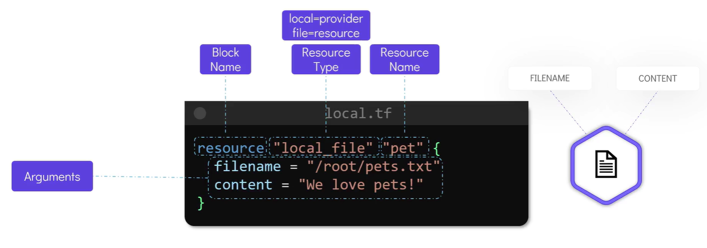

# 🌱 Terraform Basics: HCL Language + Resource Types + Examples

## 🧠 What is HCL (HashiCorp Configuration Language)?

**HCL** is the language Terraform uses to describe **infrastructure as code**.

- 💎 **Immutable** -- Once created, a resource cannot be changed.
- 🧾 **Declarative syntax** — You **describe** what you want, not how to do it.
- 🌍 Used in `.tf` files
- ❤️ Human-readable + machine-friendly

### 🔤 HCL Example

```ini
resource "aws_instance" "my_vm" {
  ami           = "ami-123456"
  instance_type = "t2.micro"
}
```

> ✅ This says: “Terraform, please create an AWS EC2 instance using this AMI and instance type.”
> You don’t tell Terraform _how_ to create it — just _what_ you want.

---

## 📦 What Are Resource Types?

A **resource** is a piece of infrastructure — like a file, virtual machine, network, or secret.

- **Type** → The kind of thing (e.g., `local_file`, `aws_instance`, `azurerm_storage_account`)
- **Name** → A label YOU choose
- **Block** → The set of attributes you define

### 💡 Structure

```ini
resource "<PROVIDER_TYPE>" "<NAME>" {
  # configuration here
}
```

---

<div style="text-align: center">
  
</div>

---

## 📝 `local_file` Resource (Simple Demo)

This resource **creates a local file on your system** with given content.

### Example:

```ini
resource "local_file" "hello_file" {
  filename = "${path.module}/hello.txt"
  content  = "Hello from Terraform!"
}
```

🧠 Let’s break this down:

| Part         | Meaning                                   |
| ------------ | ----------------------------------------- |
| `local_file` | Resource TYPE (from the `local` provider) |
| `hello_file` | NAME — You can call it anything           |
| `filename`   | Where the file should be saved            |
| `content`    | What should go inside the file            |

🧪 After running `terraform apply`, Terraform will create a file `hello.txt` in the current folder with the text inside.

---

## 🔐 `sensitive_local_file` Resource

This is like `local_file`, but it marks the content as **sensitive**, so it **won’t appear in Terraform logs or output** (great for passwords, secrets, etc.)

### Example:

```ini
resource "local_sensitive_file" "secret_file" {
  filename = "${path.module}/secret.txt"
  content  = "TOP_SECRET_PASSWORD"
}
```

> 🔐 Terraform will create the file, but if you run `terraform plan`, the value will be hidden:

```bash
+ content (sensitive)
```

---

## 💡 Tip: When to Use These Resources?

| Resource               | Use Case                                  |
| ---------------------- | ----------------------------------------- |
| `local_file`           | Writing a public/local config or log file |
| `local_sensitive_file` | Writing secrets or passwords securely     |

These are usually used **during testing**, **bootstrapping configs**, or writing **output files for other tools**.

---

## 🔁 Re-run Behavior

If you change the content and re-`apply`, Terraform **detects the difference** and updates the file.

```ini
content = "Changed content!"
```

Terraform notices:

```bash
~ content: "Hello from Terraform!" => "Changed content!"
```

That’s the power of **state tracking** — Terraform always tries to make **reality match your code**.

---

## 🧩 Summary

| Concept                | Meaning                                         |
| ---------------------- | ----------------------------------------------- |
| HCL                    | Declarative language to describe infrastructure |
| Resource               | The unit of infrastructure (VM, file, DB, etc.) |
| `local_file`           | Creates a plain text file                       |
| `local_sensitive_file` | Creates a secret-protected file                 |
| `terraform apply`      | Makes the real world match your `.tf` config    |
| `${path.module}`       | Built-in variable to reference current folder   |
