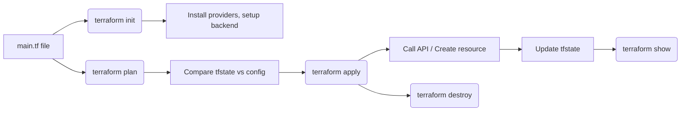

# ⚙️ Terraform Core Commands

## 📁 1. `terraform init`

> ✅ Initializes a new or existing Terraform working directory

### 🔍 What It Does Behind the Scenes:

- **Downloads required providers** (e.g., AWS, local, Azure) specified in `.tf` files
- **Creates `.terraform/` directory** to hold provider plugins and internal data
- Initializes **backend configuration** if using remote state

### 💡 Think of it like:

> "Set up everything I need to start using Terraform in this folder"

```bash
terraform init
```

---

## 🧠 2. `terraform plan`

> 🔍 Shows what **will happen** without doing anything yet

### 🔍 Behind the Scenes:

- Parses your `.tf` files (desired state)
- Reads the existing `terraform.tfstate` (current state)
- **Compares current vs desired**
- Outputs a **diff/preview** of changes (add, modify, destroy)

```bash
terraform plan
```

### 📌 Example Output:

```diff
+ create local_file.hello_file
~ update aws_instance.my_vm
- destroy null_resource.old_backup
```

### 💡 Think of it like:

> "Show me what would change if I run this right now"

---

## 🚀 3. `terraform apply`

> 🚧 Actually **creates, updates, or deletes** infrastructure to match `.tf` files

### 🔍 Behind the Scenes:

- Executes the same **diff comparison** as `plan`
- Prompts you to **approve** (or auto-approve with `-auto-approve`)
- Makes real **API calls** to cloud providers or systems
- Updates the **terraform.tfstate** file with the new state

```bash
terraform apply
```

### 💡 Think of it like:

> "Make the real world match my `.tf` files"

---

## 👁️ 4. `terraform show`

> 📖 Displays the current **state** in a human-readable form

### 🔍 Behind the Scenes:

- Reads the `.tfstate` file
- Displays the resources currently **known and tracked** by Terraform

```bash
terraform show
```

### 💡 Think of it like:

> "What infrastructure does Terraform believe exists right now?"

---

## 💣 5. `terraform destroy`

> 💥 Safely destroys all resources managed by Terraform

### 🔍 Behind the Scenes:

- Parses all `.tf` files
- Matches them to the state
- Plans to delete every tracked resource
- Executes `DELETE` calls to providers
- Updates the `.tfstate` file to reflect a clean slate

```bash
terraform destroy
```

### 💡 Think of it like:

> "Nuke everything I created using these Terraform configs"

---

## 🧪 Real Terraform Example – With Expected Output

### 📄 `main.tf` content:

```hcl
resource "local_file" "demo_file" {
  filename = "${path.module}/demo.txt"
  content  = "Hello from Terraform!"
}
```

This will create a file called `demo.txt` in the current directory with the given text.

---

### 1️⃣ `terraform init`

```bash
terraform init
```

#### ✅ Expected Output:

```text
Initializing the backend...

Initializing provider plugins...
- Finding latest version of hashicorp/local...
- Installing hashicorp/local v2.4.0...
- Installed hashicorp/local v2.4.0 (signed by HashiCorp)

Terraform has been successfully initialized!
```

> 🧠 Terraform sets up `.terraform/` directory and downloads the required provider plugin (`local` in this case).

---

### 2️⃣ `terraform plan`

```bash
terraform plan
```

#### ✅ Expected Output:

```text
Terraform used the selected providers to generate the following execution plan. Resource actions are indicated with the following symbols:
  + create

Terraform will perform the following actions:

  # local_file.demo_file will be created
  + resource "local_file" "demo_file" {
      + content              = "Hello from Terraform!"
      + directory_permission = "0777"
      + file_permission      = "0777"
      + filename             = "./demo.txt"
      + id                   = (known after apply)
    }

Plan: 1 to add, 0 to change, 0 to destroy.
```

> 🧠 Terraform compares `.tf` config and `.tfstate` (which is empty at first) and **plans to create** the file.

---

### 3️⃣ `terraform apply`

```bash
terraform apply
```

Terraform will show the same plan again, then ask:

```text
Do you want to perform these actions?
  Terraform will perform the actions described above.
  Only 'yes' will be accepted to approve.

  Enter a value: yes
```

#### ✅ Expected Output After Approval:

```text
local_file.demo_file: Creating...
local_file.demo_file: Creation complete after 0s [id=abc123456]

Apply complete! Resources: 1 added, 0 changed, 0 destroyed.
```

> ✅ A file named `demo.txt` is now created in your current directory!

```bash
cat demo.txt
# Output: Hello from Terraform!
```

---

### 4️⃣ `terraform show`

```bash
terraform show
```

#### ✅ Expected Output:

```text
# local_file.demo_file:
resource "local_file" "demo_file" {
    content              = "Hello from Terraform!"
    directory_permission = "0777"
    file_permission      = "0777"
    filename             = "./demo.txt"
    id                   = "abc123456"
}
```

> 📖 Shows the **current tracked state** from `terraform.tfstate`.

---

### 5️⃣ `terraform destroy`

```bash
terraform destroy
```

Terraform shows:

```text
Terraform will perform the following actions:

  # local_file.demo_file will be destroyed
  - resource "local_file" "demo_file" {
      - content              = "Hello from Terraform!" -> null
      - directory_permission = "0777" -> null
      - file_permission      = "0777" -> null
      - filename             = "./demo.txt" -> null
      - id                   = "abc123456" -> null
    }

Plan: 0 to add, 0 to change, 1 to destroy.

Do you really want to destroy all resources?
  Terraform will destroy all your managed infrastructure.
  There is no undo. Only 'yes' will be accepted to confirm.

  Enter a value: yes
```

#### ✅ Expected Output After Confirmation:

```text
local_file.demo_file: Destroying... [id=abc123456]
local_file.demo_file: Destruction complete after 0s

Destroy complete! Resources: 1 destroyed.
```

> 🧨 Your `demo.txt` file is now deleted, and `terraform.tfstate` no longer tracks it.

---

### 📦 Files Created During This Demo

| File Name           | Purpose                        |
| ------------------- | ------------------------------ |
| `main.tf`           | Your Terraform configuration   |
| `demo.txt`          | The file created by Terraform  |
| `.terraform/`       | Internal plugin & setup folder |
| `terraform.tfstate` | Terraform state tracking file  |

---

## 📦 Behind the Scenes Flow



---

## 🔑 Summary Table

| Command   | Purpose                            | Behind the Scenes                               |
| --------- | ---------------------------------- | ----------------------------------------------- |
| `init`    | Initialize Terraform project       | Downloads providers, sets up `.terraform/`      |
| `plan`    | Preview infrastructure changes     | Compares `.tf` config vs `.tfstate`             |
| `apply`   | Apply changes to infrastructure    | Makes API calls to create/update/destroy things |
| `show`    | Show current infrastructure state  | Reads `.tfstate` and prints human-readable data |
| `destroy` | Remove all Terraform-managed infra | Destroys resources, updates `.tfstate`          |

---

## 🧠 Terraform Thinks in Terms of:

- **Config (.tf files)** → What you want
- **State (.tfstate)** → What exists
- **Plan** → What to change
- **Apply** → Makes it happen
- **Destroy** → Cleans it up
