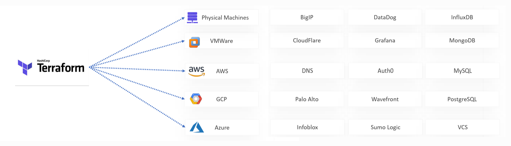

# 🧠 Terraform Provider Concept

## 🔹 What is a Provider?

A **provider** in Terraform is a plugin that lets Terraform interact with external APIs (like AWS, Azure, Docker, or even local files). You declare providers in your `.tf` files.

```hcl
provider "aws" {
  region = "us-west-2"
}
```

---

<div style="text-align: center">
  
</div>

---

## 🧰 Where are providers stored?

When you run `terraform init`, Terraform **downloads provider binaries** into a special directory:

```ini
.terraform/providers/registry.terraform.io/<NAMESPACE>/<PROVIDER>/<VERSION>/<OS_ARCH>/
```

Each part tells you:

- `registry.terraform.io` → Source registry (default is Terraform public registry)
- `NAMESPACE` → Who publishes or maintains the provider
- `PROVIDER` → Name of the provider (e.g., aws, azurerm, local)
- `VERSION` → Plugin version (e.g., 2.5.3)
- `OS_ARCH` → Platform (e.g., `linux_amd64`)

---

## 🔍 Classifying Provider Types

| Provider Type            | Namespace Example                | How to Identify                        |
| ------------------------ | -------------------------------- | -------------------------------------- |
| ✅ Official              | `hashicorp/<provider>`           | Maintained by HashiCorp                |
| 🤝 Verified Partner      | e.g., `datadog/datadog`          | Logo + Verified badge on registry site |
| ⚠️ Community / 3rd Party | `nbering/ansible`, `john/custom` | Anyone can publish                     |

---

## 🧾 Your Screenshot Paths Breakdown

### 📁 1. `.terraform/providers/registry.terraform.io/hashicorp/local/2.5.3/linux_amd64`

- ✅ **Provider Name:** `local`
- ✅ **Namespace:** `hashicorp`
- ✅ **Type:** ✅ **Official**
- ✅ **Use Case:** Interacts with local filesystem (e.g., to write local files)

---

### 📁 2. `.terraform/providers/registry.terraform.io/linode/linode/1.13.3/linux_amd64`

- 🔹 **Provider Name:** `linode`
- 🔹 **Namespace:** `linode`
- 🔹 **Type:** 🤝 **Partner** (Verified on Terraform Registry)
- ✅ **Use Case:** Manage Linode cloud resources

🔗 Confirm at: [https://registry.terraform.io/providers/linode/linode](https://registry.terraform.io/providers/linode/linode)
🟢 Marked as "Verified"

---

### 📁 3. `.terraform/providers/registry.terraform.io/nbering/ansible/1.0.4/linux_amd64`

- ❗ **Provider Name:** `ansible`
- ❗ **Namespace:** `nbering`
- ❗ **Type:** ⚠️ **Community / Third-Party**
- ✅ **Use Case:** Interface Terraform with Ansible

🔗 Check: [https://registry.terraform.io/providers/nbering/ansible](https://registry.terraform.io/providers/nbering/ansible)
🔴 Not verified — any user can publish

---

## 📌 What Are Version Constraints in Terraform?

Terraform **version constraints** are used to **control which versions** of a provider or module your configuration is compatible with. This ensures your code doesn't accidentally use a **breaking change** from a newer version.

Terraform supports constraints for:

- Terraform CLI itself
- Providers (like AWS, Azure, etc.)
- Modules from public/private registries

---

### 🧠 Why Use Version Constraints?

Without version constraints:

- You risk pulling newer, incompatible versions of providers/modules.
- This can lead to **unexpected behavior** or **deployment failures**.

With constraints:

- You protect your infrastructure from breaking.
- You can **safely upgrade** versions when you're ready.

---

### 🔢 Common Constraint Syntax

Terraform supports several constraint operators:

| Operator | Meaning                                  | Example    |
| -------- | ---------------------------------------- | ---------- |
| `=`      | Exact version                            | `= 2.1.0`  |
| `!=`     | Exclude a specific version               | `!= 2.0.0` |
| `>`      | Greater than                             | `> 2.0.0`  |
| `<`      | Less than                                | `< 3.0.0`  |
| `>=`     | Greater than or equal                    | `>= 2.2.0` |
| `<=`     | Less than or equal                       | `<= 3.0.0` |
| `~>`     | Compatible with (pessimistic constraint) | `~> 2.1.0` |

---

### 🤓 What is `~>` (Pessimistic Constraint)?

The `~>` operator is the **most commonly used** version constraint in Terraform. It locks the major/minor version but allows patch updates.

#### Example:

```hcl
version = "~> 2.1.0"
```

✅ This means:

- Allow `>= 2.1.0` but `< 2.2.0`
- Accepts 2.1.1, 2.1.9, but **not** 2.2.0

Another example:

```hcl
version = "~> 2.1"
```

✅ Means:

- Allow `>= 2.1.0` but `< 3.0.0`

---

#### ✅ Example: Terraform CLI Version

```hcl
terraform {
  required_version = ">= 1.3.0, < 1.6.0"
}
```

This means:

- Must use a version **between 1.3.0 and 1.6.0**
- Compatible with `1.4.x`, `1.5.x`
- Rejects Terraform 1.6.0 or 1.2.0

---

#### ✅ Example: Provider Version

```hcl
terraform {
  required_providers {
    aws = {
      source  = "hashicorp/aws"
      version = "~> 5.10.0"
    }
  }
}
```

This means:

- Use version `>= 5.10.0` but `< 5.11.0`
- You’ll get latest safe patch releases (like 5.10.1)

---

#### ✅ Example: Module Version

```hcl
module "vpc" {
  source  = "terraform-aws-modules/vpc/aws"
  version = "~> 3.0"
}
```

This means:

- Accept any `3.x.x` version like `3.5.1`
- But **not** `4.0.0`

---

#### 🧪 Tips and Best Practices

✅ Always pin versions using `~>` unless you have a strong reason not to
✅ Avoid hard-coding `= version` unless replicating legacy behavior
✅ Keep dependencies updated using `terraform providers lock`
✅ Use `terraform init -upgrade` to manually upgrade versions
✅ Use version constraints to avoid accidental breaking changes in CI/CD

---

## 🧪 Summary Table

| Path              | Provider  | Namespace   | Type                     |
| ----------------- | --------- | ----------- | ------------------------ |
| `hashicorp/local` | `local`   | `hashicorp` | ✅ Official              |
| `linode/linode`   | `linode`  | `linode`    | 🤝 Partner Verified      |
| `nbering/ansible` | `ansible` | `nbering`   | ⚠️ Community / 3rd-party |

---

## ✅ How to Check Provider Type (Official Way)

You can always verify with the CLI and Registry:

### 1. CLI:

```bash
terraform providers
```

Example Output:

```text
provider[registry.terraform.io/hashicorp/local] ~> 2.5
provider[registry.terraform.io/linode/linode] ~> 1.13
provider[registry.terraform.io/nbering/ansible] ~> 1.0
```

### 2. Terraform Registry URL format:

```ini
https://registry.terraform.io/providers/<namespace>/<provider>
```

---

## 🧠 Bonus Tip: Why does this matter?

- ✅ **Official** = Maintained by HashiCorp → high quality, stable, long support.
- 🤝 **Partner** = Maintained by trusted vendors → usually safe and well-tested.
- ⚠️ **Community** = Could be unstable, limited support, no guarantees.

---

## Terraform (TF) Version constraint types examples

### ✅ `1. Modules`

When referencing external modules, you can constrain the version:

```hcl
module "vpc" {
  source  = "terraform-aws-modules/vpc/aws"
  version = ">= 3.0.0, < 4.0.0"

  name = "my-vpc"
  cidr = "10.0.0.0/16"
}
```

🧠 **Purpose**: Ensures compatibility by locking the module version.

---

## ✅ `2. Provider requirements`

Use version constraints to lock down the provider version in your `required_providers` block:

```hcl
terraform {
  required_providers {
    aws = {
      source  = "hashicorp/aws"
      version = "~> 5.10" # Compatible with >=5.10, <6.0
    }
  }
}
```

🧠 **Purpose**: Ensures stable provider behavior across environments.

---

### ✅ `3. Terraform CLI version (required_version)`

You can lock the required Terraform CLI version using `required_version`:

```hcl
terraform {
  required_version = ">= 1.4.0, < 1.6.0"
}
```

🧠 **Purpose**: Prevents applying code with an incompatible Terraform version.

---

### ✅ `4. Combined block`

For reference, here’s a block combining all the constraints:

```hcl
terraform {
  required_version = ">= 1.4.0, < 1.6.0"

  required_providers {
    aws = {
      source  = "hashicorp/aws"
      version = "~> 5.10"
    }
    azurerm = {
      source  = "hashicorp/azurerm"
      version = "~> 3.0"
    }
  }
}
```

---

Let me know if you want to test any of these examples or include them in a reusable module structure!
