# 🗃️ Terraform Remote State & State Locking — Full Guide

## 🤕 The Problem: Storing State Locally or in Git

### ❌ What happens by default?

When you run Terraform commands like `terraform apply`, Terraform creates a file named:

```ini
terraform.tfstate
```

This file stores the full infrastructure state — what was created, updated, destroyed, and all resource details including **names, ARNs, secrets, IPs**, etc.

---

### ❌ Why is this a problem?

1. **Security risk**:
   State files can contain sensitive data (like secrets, passwords, tokens). Storing them in Git is a big **security vulnerability**.

2. **Collaboration hell**:
   If multiple people use the same repo and push/pull `terraform.tfstate`, they might:

   - Overwrite each other’s state
   - Apply out-of-date changes
   - Face merge conflicts

3. **No locking**:
   There's no mechanism to stop 2 people from running `terraform apply` at the same time, which leads to:

   - Resource corruption
   - Broken deployments

---

## ✅ The Solution: Remote Backends + State Locking

Terraform allows you to **store your state in a shared location** using **Remote Backends**.

One of the most popular solutions is:

> 📦 **S3 Bucket for Remote State**
> 🔐 **DynamoDB Table for State Locking**

---

## 🎯 What Is a Remote Backend?

A backend is **where Terraform stores its state**. The default is `local` (on your machine), but you can change it to **remote (like S3)**.

---

## 🧩 S3 + DynamoDB Architecture Diagram

```mermaid
flowchart TD
    Developer -->|terraform apply| Terraform
    Terraform -->|store state| S3[🪣 S3 Bucket - terraform.tfstate]
    Terraform -->|lock| DynamoDB[🔒 DynamoDB Table - State Lock]
    note1[Note: Ensures only one person applies at a time]
```

<div align="center">



</div>

---

## 🔨 Step-by-Step Implementation

### Step 1: Create S3 Bucket for Remote State

You can use the AWS Console or Terraform to create this bucket:

```hcl
resource "aws_s3_bucket" "tf_state" {
  bucket = "my-terraform-remote-state"
  acl    = "private"
  versioning {
    enabled = true
  }

  tags = {
    Name        = "TerraformState"
    Environment = "Dev"
  }
}
```

---

### Step 2: Create DynamoDB Table for State Locking

```hcl
resource "aws_dynamodb_table" "tf_lock" {
  name         = "terraform-locks"
  billing_mode = "PAY_PER_REQUEST"
  hash_key     = "LockID"

  attribute {
    name = "LockID"
    type = "S"
  }

  tags = {
    Name = "TerraformLockTable"
  }
}
```

---

### Step 3: Configure Backend in `main.tf`

Create a `backend` block **before** running `terraform init`.

```hcl
terraform {
  backend "s3" {
    bucket         = "my-terraform-remote-state"
    key            = "dev/terraform.tfstate"  # path in bucket
    region         = "us-west-2"
    dynamodb_table = "terraform-locks"
    encrypt        = true
  }
}
```

> 🔄 This is not a resource block. It’s part of the Terraform CLI configuration.
> This **doesn't create the S3 bucket or DynamoDB** — they must already exist.

---

### Step 4: Initialize Backend

```bash
terraform init
```

- Terraform detects the `backend` block.
- It prompts you to **migrate local state** to remote.

> ✅ Accept it. Terraform will upload your existing `terraform.tfstate` to the S3 bucket.

---

## 📦 What's Stored in the S3 Remote State?

The S3 object looks like:

```plaintext
dev/terraform.tfstate
```

It contains:

- All created resource metadata (IDs, ARNs, IPs)
- Outputs
- Dependency graph

---

## 🔐 How State Locking Works with DynamoDB

When you run:

```bash
terraform plan
terraform apply
```

Terraform creates a **temporary lock** in DynamoDB:

```json
{
  "LockID": "dev/terraform.tfstate"
}
```

- If another user tries to run `apply`, they'll get:

  ```ini
  Error: Error acquiring the state lock
  ```

> 🛡️ This prevents **concurrent executions**, avoiding corruption.

---

## 🧪 Example Folder Structure

```ini
infra/
│
├── main.tf
├── provider.tf
├── backend.tf      <-- defines remote backend (no resources here)
├── outputs.tf
├── variables.tf
```

---

## 🧠 Best Practices

| ✅ Practice                   | Why It Matters                                    |
| ----------------------------- | ------------------------------------------------- |
| Use versioning on S3 bucket   | Track and recover from accidental state changes   |
| Use a separate backend file   | Keep backend isolated from code                   |
| Use remote locking (DynamoDB) | Prevent concurrent access and resource corruption |
| Do not store state in Git     | Avoid leaking sensitive data                      |
| Enable bucket encryption      | Protect state at rest                             |

---

## 📌 Summary

| Feature        | Description                                            |
| -------------- | ------------------------------------------------------ |
| Local state    | Stored on disk. Unsafe for teams.                      |
| Remote backend | Stores `.tfstate` in shared cloud storage (S3)         |
| State locking  | Prevents multiple concurrent executions using DynamoDB |
| Implementation | S3 bucket for state + DynamoDB for locking             |
| terraform init | Required to initialize or migrate to backend           |
