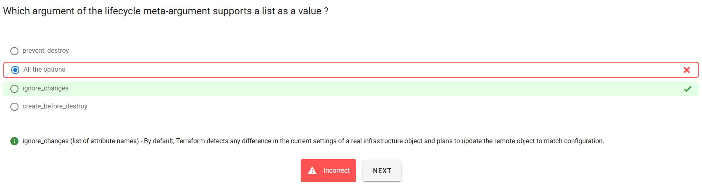
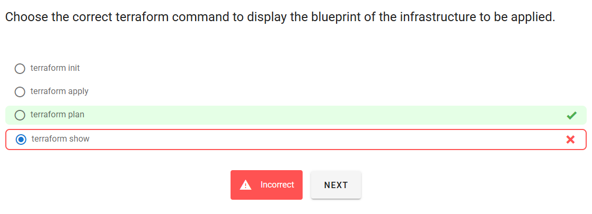
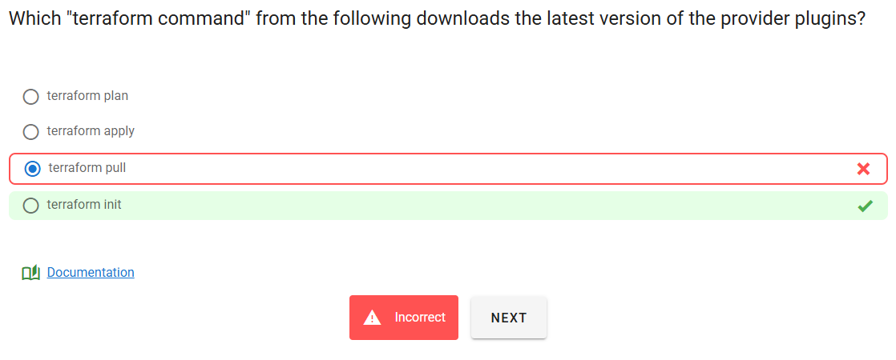

# 🏁 KodeKloud Exam 1

## 📌 Q46



---

### ❌ Why `All the options` is wrong

You selected **“All the options”**, but that’s incorrect because **only `ignore_changes` accepts a list** as its value.
The other two (`prevent_destroy`, `create_before_destroy`) are just **boolean flags** (`true` or `false`).

---

### ✅ Correct answer: `ignore_changes`

---

### 💡 Explanation with Example

#### ✅ `ignore_changes` supports a list:

```hcl
lifecycle {
  ignore_changes = [
    tags,
    user_data,
    metadata["foo"]
  ]
}
```

This tells Terraform to **ignore updates** to those attributes during future `apply`.

---

#### ❌ The others:

```hcl
lifecycle {
  prevent_destroy = true              # ✅ Boolean only
  create_before_destroy = false       # ✅ Boolean only
}
```

They **don’t** take a list — using a list there would cause a syntax error.

---

## 📌 Q18



> 😔 BLUEPRINT === PLAN

---

## 📌 Q09



> 📖 [References](https://developer.hashicorp.com/terraform/cli/commands/init)
