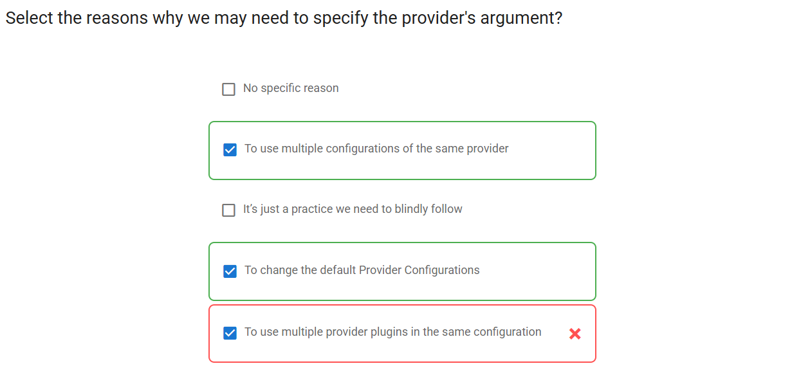

# Exam 2

## 📌 Q42



---

### ❌ Why `"To use multiple provider plugins in the same configuration"` is wrong

That statement is misleading.
Terraform **doesn’t support loading multiple plugins for the same provider** in one config.
You can only use **multiple configurations** of a **single provider plugin**, not multiple plugins.

---

### ✅ Correct answers:

1. **`To use multiple configurations of the same provider`**
   Example:

   ```ini
   provider "aws" {
     region = "us-east-1"
   }

   provider "aws" {
     alias  = "eu"
     region = "eu-west-1"
   }
   ```

2. **`To change the default Provider Configurations`**
   → You can override the default by setting attributes like region, profile, or endpoint.

---

### 🧠 Bonus Tip

To use a specific provider config in a resource:

```ini
resource "aws_instance" "web" {
  provider = aws.eu     # ✅ use the aliased provider
  ...
}
```

---

So the **incorrect one** is:

- `"To use multiple provider plugins in the same configuration"` ❌

Terraform loads one plugin per provider name.

---

## 📌 Q39


---

### ❌ Why `True` is wrong

The statement says:

> "Logging **can not** be enabled separately... using `TF_LOG_PROVIDER`."

That’s incorrect — it **can** be enabled.

---

### ✅ Correct answer: `False`

---

### 💡 Explanation

Terraform supports **separate logging** using:

- `TF_LOG_CORE` → Logs only **Terraform core** engine behavior
- `TF_LOG_PROVIDER` → Logs only **provider plugin** behavior

They both take standard log levels: `TRACE`, `DEBUG`, `INFO`, `WARN`, `ERROR`.

---

### ✅ Example:

```bash
export TF_LOG_PROVIDER=DEBUG
```

This enables logs **only from provider plugins** (like AWS, Azure, etc.) without spamming Terraform’s core logs.

---

## 📌 Q37


> 😔 i though this wrong because we must use module if wanna use multiple dir

---

## 📌 Q32


---

### ❌ Why `locals` (plural) is wrong for referencing

You selected:

> ✅ Local values are referenced as attributes on an object named `locals`

That’s incorrect because **`locals` is the block name**, but you **reference local values using `local` (singular)**.

---

### ✅ Correct answers:

1. ✅ `Local values are created by a locals block`
   Example:

   ```hcl
   locals {
     region = "us-east-1"
     app    = "myapp"
   }
   ```

2. ✅ `Local values are referenced as attributes on an object named local` (not selected in the screenshot)

   Example usage:

   ```hcl
   provider "aws" {
     region = local.region
   }
   ```

---

### ❌ Incorrect answers:

- `Local values are created by a local block` → ❌ Wrong keyword (`local` block doesn’t exist)
- `Terraform supports creation with both local and locals` → ❌ Only `locals` is valid

---

### ✅ Summary

| Purpose          | Keyword                    |
| ---------------- | -------------------------- |
| Create locals    | `locals` (plural) block ✅ |
| Reference locals | `local.name` (singular) ✅ |

Keep the `s` out of `local` when using it! 😄
