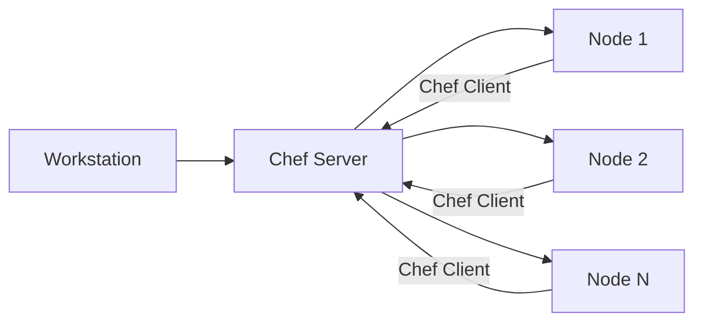

# 🍽️ Chef

> _📖 Infrastructure as Code with a Ruby Twist._

Chef is a **pull-based configuration management tool** that treats infrastructure as code using a **Ruby DSL**. It’s designed for **scalable, auditable, and reusable system configuration** — ideal for enterprises managing complex, multi-cloud environments.

---

## 🧠 Architectural Overview

Chef follows a **master-agent model** with three core components:

| Component             | Description                                                           |
| --------------------- | --------------------------------------------------------------------- |
| 🧑‍💻 **Workstation** | Dev machine where you write and test cookbooks/recipes.               |
| 🏢 **Chef Server**    | Central hub storing cookbooks, node data, and orchestration logic.    |
| 🖥️ **Nodes**          | Target systems (VMs, containers, etc.) running the Chef Client agent. |

Each node **pulls configuration** from the Chef Server and applies it locally using the Chef Client.

---

## 📦 Key Features

- 📚 **Cookbooks & Recipes**: Modular configuration units written in Ruby DSL.
- 🧪 **Test Kitchen**: Local testing framework for validating cookbooks.
- 🔍 **Ohai**: Metadata collector for node attributes (OS, IP, etc.).
- 🔧 **Knife CLI**: Command-line interface to manage nodes and cookbooks.
- 🛡️ **Chef InSpec**: Compliance-as-code framework for auditing.
- 📊 **Chef Automate**: Dashboard for visibility, workflow, and compliance.
- 🧭 **Chef Solo**: Lightweight mode without a central server (good for small setups).

---

## 🧭 When to Use Chef

Chef is ideal when you need:

- ✅ **Declarative, code-driven infrastructure** across hybrid/multi-cloud setups.
- 🏢 **Enterprise-grade compliance and auditability**.
- 🔁 **Reusable configuration logic** across teams and environments.
- 🔐 **Security and visibility** via Chef Automate and InSpec.
- 🧱 **Complex orchestration** with fine-grained control.

Chef excels in **regulated industries**, **large-scale deployments**, and **legacy modernization**.

---

## ⚔️ Chef vs. Ansible: Strategic Comparison

| Feature          | 🧾 **Chef**                                   | 📜 **Ansible**                                 |
| ---------------- | --------------------------------------------- | ---------------------------------------------- |
| Language         | Ruby DSL                                      | YAML (Playbooks)                               |
| Architecture     | Agent-based (Chef Client)                     | Agentless (SSH/WinRM)                          |
| Execution Model  | Pull-based                                    | Push-based                                     |
| Setup Complexity | Requires Chef Server & Clients                | Lightweight, quick setup                       |
| Learning Curve   | Steep (requires Ruby knowledge)               | Easier (YAML-based)                            |
| Community        | Mature, but smaller                           | Large and active                               |
| Orchestration    | Via Chef Automate                             | Native in playbooks                            |
| Error Handling   | Requires deeper debugging                     | Human-readable output                          |
| Use Case Fit     | Large, complex, compliance-heavy environments | Fast-moving, cloud-native, small-medium setups |
| Maintenance      | Requires server upkeep                        | Minimal                                        |

Chef is more **robust and scalable**, while Ansible is **simpler and faster to adopt**.

---

## 🗺️ Visual Model (Mermaid-style)

This shows Chef’s **pull-based model**, where nodes fetch configuration from the server and report back.

---

## 🧩 Strategic Fit for You, Hady

- 🧠 **Architectural mastery**: Chef’s DSL and modular cookbooks are perfect for showcasing reusable infrastructure logic.
- 📁 **Portfolio-ready**: Build sample cookbooks for CI/CD, identity provisioning, or cloud onboarding.
- 🧪 **Compliance signaling**: Use Chef InSpec to demonstrate audit-readiness in regulated environments.
- 📊 **Tool benchmarking**: Compare Chef vs Ansible vs Terraform for cost, support, and scalability in your CI/CD selection matrix.

---

Want to simulate a cookbook, visualize a node lifecycle, or benchmark Chef against Puppet, SaltStack, or Terraform next? I’ve got diagrams, code snippets, and strategic commentary ready. Just say the word 💡
