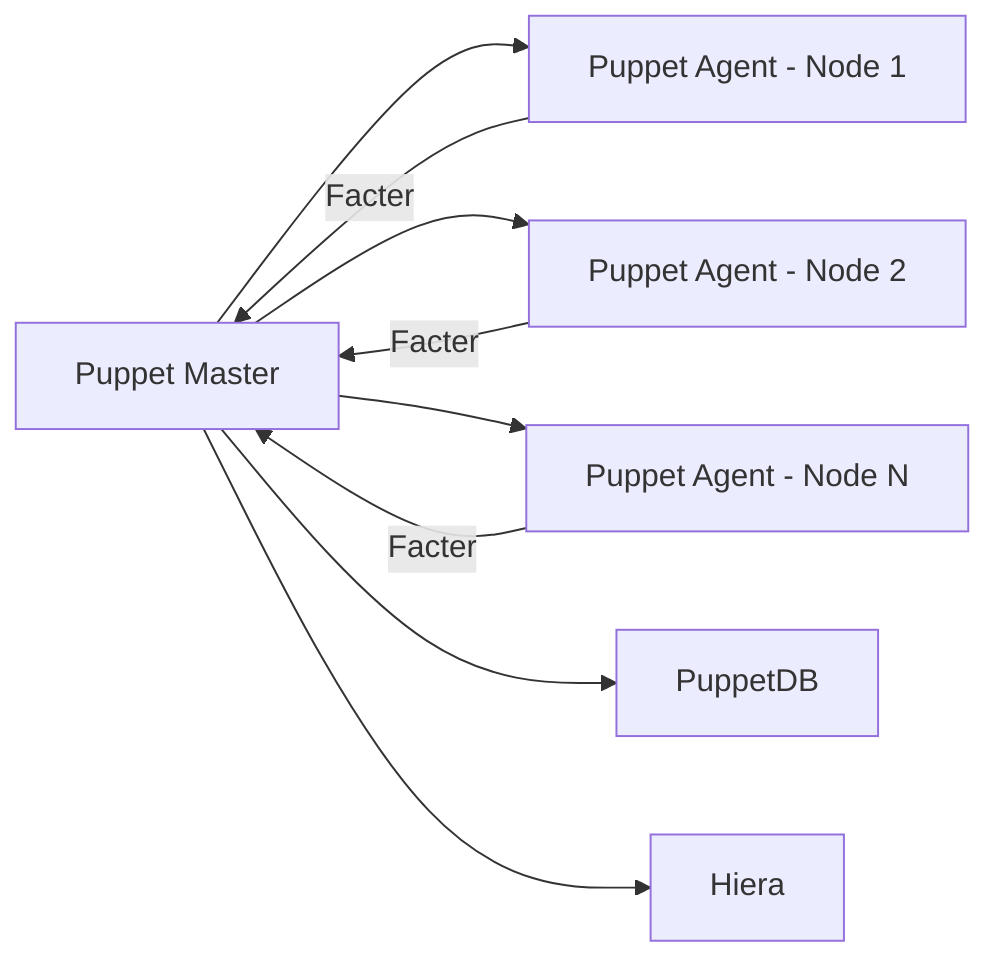

# 🎭 Puppet

> _📖 Declarative Configuration Management for Scalable, Compliant Infrastructure._

**Puppet** is a powerful, agent-based configuration management tool that uses a **declarative language** to define and enforce the desired state of infrastructure. It’s built for **large-scale, long-lived environments** where consistency, compliance, and automation are critical — making it a favorite in enterprise DevOps and hybrid cloud setups.

---

## 🧠 Architectural Overview

Puppet follows a **master-agent model** with several modular components:

| Component               | Role                                                                   |
| ----------------------- | ---------------------------------------------------------------------- |
| 🧑‍💻 **Puppet Master** | Central server that compiles configurations and serves them to agents. |
| 🖥️ **Puppet Agent**     | Installed on each node; pulls and applies configuration catalogs.      |
| 📦 **Manifests**        | Declarative files written in Puppet DSL that define desired state.     |
| 📊 **Facter**           | Gathers system facts (OS, IP, memory, etc.) for dynamic config.        |
| 🗂️ **Hiera**            | External data lookup system for separating config from logic.          |
| 🧠 **PuppetDB**         | Stores facts, catalogs, and reports for visibility and auditing.       |
| 🧰 **Puppet Forge**     | Public repository of reusable modules and manifests.                   |

---

## 📦 Key Features

- 🧾 **Declarative Language**: Define _what_ the system should look like, not _how_ to get there.
- 🔁 **Idempotency**: Reapplying configs results in the same state — safe and predictable.
- 🧱 **Resource Abstraction**: Platform-agnostic definitions for files, packages, services, etc.
- 🔗 **Dependency Management**: Automatically orders resources based on relationships.
- 🧩 **Modularity**: Use and share modules across teams via Puppet Forge.
- 📈 **Reporting & Logging**: Track changes, audit history, and troubleshoot issues.
- 🔐 **Compliance Enforcement**: Maintain security baselines and regulatory standards.
- 🌐 **Multi-Cloud Support**: Works across AWS, Azure, GCP, and on-prem environments.

---

## 🚀 When to Use Puppet

Puppet is ideal for:

- 🏢 **Enterprise-scale infrastructure** with thousands of nodes.
- 🔐 **Compliance-heavy environments** (finance, healthcare, government).
- 🧠 **Long-lived systems** that require ongoing configuration enforcement.
- 🧰 **Hybrid cloud orchestration** with consistent state enforcement.
- 🧪 **Audit-ready pipelines** with detailed reporting and drift detection.

---

## ⚔️ Puppet vs. Ansible: Strategic Comparison

| Feature                | 🎭 **Puppet**                          | 📜 **Ansible**                         |
| ---------------------- | -------------------------------------- | -------------------------------------- |
| Language               | Puppet DSL (declarative)               | YAML (procedural)                      |
| Architecture           | Agent-based, master-agent              | Agentless, push-based (SSH/WinRM)      |
| Execution Model        | Pull-based                             | Push-based                             |
| Setup Complexity       | Moderate (certs, agents, master setup) | Simple (no agents, no certs)           |
| Learning Curve         | Steeper (custom DSL)                   | Easier (YAML)                          |
| Platform Support       | Strong Windows & Linux support         | Linux-native; Windows via WinRM        |
| Compliance & Reporting | Strong (PuppetDB, reports, Hiera)      | Basic (logs, limited audit features)   |
| Modularity & Reuse     | Puppet Forge modules                   | Ansible Galaxy roles                   |
| Scalability            | Excellent for large, persistent infra  | Great for dynamic, cloud-native setups |
| Community & Ecosystem  | Mature, enterprise-focused             | Large, fast-evolving                   |

**TL;DR**: Puppet is built for **deep control and long-term consistency**, while Ansible excels in **speed, simplicity, and cloud-native agility**.

---

## 🗺️ Visual Model (Mermaid-style)

This shows Puppet’s **pull-based model**, with agents fetching compiled catalogs and reporting back facts and logs.

---

## 🧩 Strategic Fit for You, Hady

- 🧠 **Architectural mastery**: Puppet’s declarative model and modular manifests are perfect for modeling reusable infrastructure logic.
- 📁 **Portfolio-ready**: Build modules for identity provisioning, compliance enforcement, or hybrid cloud orchestration.
- 🧪 **Compliance signaling**: Use PuppetDB and Hiera to demonstrate audit-readiness and separation of concerns.
- 📊 **Tool benchmarking**: Compare Puppet vs Ansible vs Terraform for CI/CD tool selection, especially in regulated or legacy-heavy environments.
