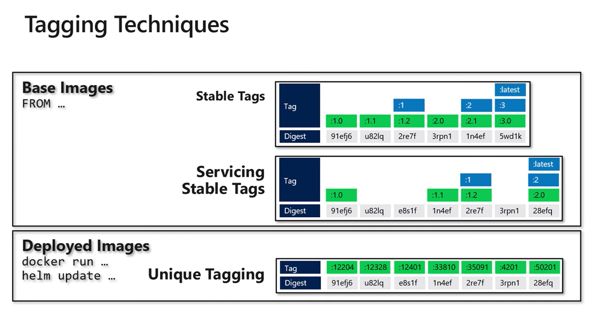

# Docker Image Tagging

## 📚 Reference

- [Pros and cons of stable and unique tags in Docker image tagging | Azure Friday](https://www.youtube.com/watch?v=qEIu-nb-Yc0)

---

## ⚙️ Tagging Techniques

  

---

- **Static tags**: `:dev`, `:qa`, `:prod`, `:stable`, `:1.4`, `:1`, `:latest`
- **Dynamic tags**: `:git-<sha>`, `:1.4.0-rc.N`, `:1.4.0`, `:1.4`, `:1`, `:stable`
- **Semantic tags**: `:1.4.0`, `:1.4`, `:1`, `:stable`

## 🧠 TL;DR

- **Build once per merge to `dev`**, tag `git-<sha>`, **push**.
- **Build once per merge to `main`**, tag `1.4.0`, **push**.
- For PRs, **don’t push** by default (build/test/scan only). Use **opt-in previews**.
- **Promote** the **same digest** to RC on PR `dev→main`, then to `1.4.0`, `1.4`, `1`, `stable` on merge to `main`.
