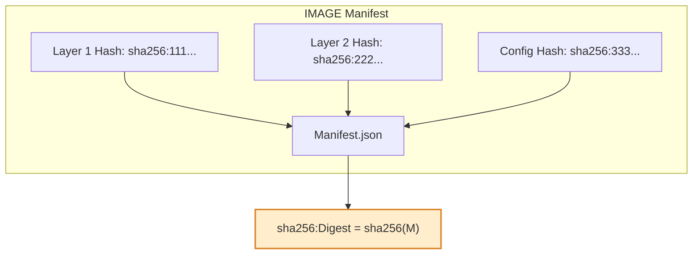

# 🧩 What is a Docker Image Digest?

A **digest** is a **unique, immutable cryptographic hash** that identifies the exact contents of a Docker (or OCI) image.
It’s basically a **fingerprint** of the image, generated from all the layers and metadata inside it.

👉 Think of it as:

> “This specific combination of files, config, and history = this one unique hash.”

So while a **tag** (`latest`, `1.4.0`, etc.) can change and point to _different images over time_,
a **digest** always points to _one and only one exact image forever_.

---

## 🧠 Official Definition

According to the OCI (Open Container Initiative) image spec:

> An image digest is the **SHA-256 hash** of the image’s **manifest** (a JSON document that describes all layers, configurations, and their digests).

So the digest isn’t just a hash of the filesystem —
it’s a hash of the **manifest**, which includes:

- Layer digests (hashes of each layer tarball)
- Image config digest
- Size and order of layers
- Media types and schema version

---

## 🏗️ How It’s Calculated (Step-by-Step)

Let’s demystify how Docker or any OCI registry generates it.

Imagine you built an image like this:

```bash
FROM ubuntu:22.04
COPY app /usr/src/app
RUN apt install -y curl
CMD ["python3", "/usr/src/app/main.py"]
```

When you run:

```bash
docker build -t myapp:git-abc123 .
```

Docker creates:

1. **Layer tarballs** for each step in your Dockerfile.

   - Each layer (filesystem delta) gets its own SHA-256 hash.

2. A **config JSON** file that describes environment variables, entrypoint, etc. → also gets its own hash.
3. A **manifest JSON** file that lists:

   - all layer digests,
   - the config digest,
   - media types and sizes.

Then Docker computes:

```bash
digest = sha256( canonical_json_representation_of_manifest )
```

So your digest might look like:

```ini
sha256:222bbbcccddeff112233445566778899aabbccddeeff0011223344556677889
```

This is what you see when you push:

```bash
$ docker push contoso.azurecr.io/ordersvc:git-abc123
The push refers to repository [contoso.azurecr.io/ordersvc]
digest: sha256:222bbbcccddeff112233445566778899aabbccddeeff0011223344556677889 size: 2610
```

---

## 🔍 Inspecting the Digest

You can view the digest locally after push:

```bash
docker inspect --format='{{index .RepoDigests 0}}' contoso.azurecr.io/ordersvc:git-abc123
```

Output:

```ini
contoso.azurecr.io/ordersvc@sha256:222bbbcccddeff112233445566778899aabbccddeeff0011223344556677889
```

💡 Notice that digests are written with **@** instead of `:` because they’re immutable identifiers, not mutable tags.

---

## 🔐 Example Breakdown (Visual)



Each layer + config contributes to the manifest → hash(manifest) = **digest**.

If _any_ byte changes in any layer or config,
the final digest changes too.

---

## 📦 Why Use Digest Instead of Tags

| Aspect                                 | Tag (e.g. `:latest`)               | Digest (e.g. `@sha256:abc...`) |
| -------------------------------------- | ---------------------------------- | ------------------------------ |
| Mutable?                               | ✅ Can change anytime              | ❌ Immutable                   |
| Unique?                                | ❌ Might point to different builds | ✅ Always unique               |
| Human-readable?                        | ✅                                 | ❌                             |
| Suitable for CI/CD promotion?          | ❌                                 | ✅                             |
| Suitable for reproducible deployments? | ❌                                 | ✅                             |

**Tags** are for humans;  
**Digests** are for machines and reliability.

---

## 🧮 Small Digest Demo (Local Example)

Let’s simulate two identical builds and one changed build.

### Build 1:

```bash
docker build -t myapp:v1 .
docker push myapp:v1
```

Digest → `sha256:111aaabbbccc...`

### Build 2 (same code):

```bash
docker build -t myapp:v1 .
docker push myapp:v1
```

Digest → still `sha256:111aaabbbccc...` ✅ (same content)

### Build 3 (tiny code change):

Digest → now `sha256:999zzzyyyxxx...` 🚨 (completely new fingerprint)

---

## ⚙️ Example of Deployment by Digest

Kubernetes manifest:

```yaml
apiVersion: apps/v1
kind: Deployment
metadata:
  name: ordersvc
spec:
  template:
    spec:
      containers:
        - name: ordersvc
          image: contoso.azurecr.io/ordersvc@sha256:222bbbcccdde...
```

Even if someone retags `1.4.0` later, your cluster **still runs the same bytes**.
Perfect for **immutability** and **auditability**.

---

## 🧰 Registry Behavior

When you push an image:

1. Registry stores all layers and manifest.
2. Computes digest = SHA256(manifest JSON).
3. Stores reference:

   ```ini
   tag → digest
   digest → image data
   ```

So multiple tags can point to the same digest, for example:

```ini
ordersvc:git-9a8b7c6d      -> sha256:222bbb...
ordersvc:1.4.0-rc.1        -> sha256:222bbb...
ordersvc:1.4.0             -> sha256:222bbb...
ordersvc:prod              -> sha256:222bbb...
```

---

## 🛡️ Bonus — Content Trust and Signing

Digests are the foundation for:

- **Docker Content Trust (Notary v2)**
- **Cosign image signing**
- **SLSA provenance**

These tools _sign the digest_ so you can verify integrity later:

```bash
cosign sign contoso.azurecr.io/ordersvc@sha256:222bbb...
cosign verify contoso.azurecr.io/ordersvc@sha256:222bbb...
```

---

## 🧾 TL;DR — Digest in One Sentence

> **A digest is a SHA-256 hash of the image manifest that uniquely identifies the exact binary content of a container image, ensuring it’s immutable, traceable, and safe for promotion between environments.**
