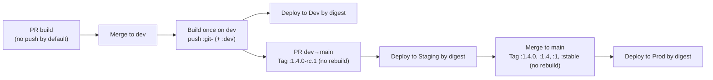

# 🏷️ Container Image Tagging & Promotion — The Complete Playbook (2025)

## 📚 **References**

- [Docker Tagging: Best practices for tagging and versioning docker images](https://stevelasker.blog/2018/03/01/docker-tagging-best-practices-for-tagging-and-versioning-docker-images/)
- [Docker Tagging](https://docs.docker.com/engine/reference/commandline/tag/)
- [Dockerfile Best Practices](https://docs.docker.com/develop/develop-images/dockerfile_best-practices/)
- [Docker Tagging Best Practices](https://docs.docker.com/engine/reference/commandline/tag/)

## 🧠 **TL;DR**

- **Build once per merge to `dev`**, tag `git-<sha>`, **push**.
- **Deploy by digest** (`@sha256:...`) across all envs.
- For PRs, **don’t push** by default (build/test/scan only). Use **opt-in previews**.
- **Promote** the **same digest** to RC on PR `dev→main`, then to `1.4.0`, `1.4`, `1`, `stable` on merge to `main`.
- Tags are for humans 🤝, **digests are for machines** 🤖 (immutability).
- Add **signatures** (Cosign) + **SBOM** (Syft), and keep **traceability** (OCI labels).

---

## 🧱 **Image vs Layers vs Manifest vs Digest**

- **Layers**: filesystem deltas (each one has its own sha256).
- **Config**: entrypoint/env/etc. (has its own sha256).
- **Manifest**: JSON that lists layers + config (the “table of contents”).
- **Digest**: `sha256(manifest)`. The **immutable identity** of the image.
- **Tag**: A **mutable pointer** to a digest (e.g., `:1.4.0`, `:dev`, `:latest`).

> Rule of thumb: **deploy by digest**, use tags for convenience & communication.

---

## 🧪 **Strategy Catalog** (what companies actually do)

I’ll group them into **Mutable Pointers** (for humans/channels) and **Immutable Identities** (for machines).

### 🅰️ **Mutable Pointers** (these move)

#### 1. `latest`-only

- **How it works:** All pushes update `:latest`.
- ✅ Simple for demos.
- ❌ No reproducibility, racing updates, rollback pain.
- **Verdict:** Avoid in CI/CD pipelines.

#### 2. Environment tags (`:dev`, `:staging`, `:prod`)

- **Two variants:**

  - **(Anti-pattern)** Rebuild per environment → different artifacts → drift.
  - **(Good)** **Promote** the same digest and move the env tag pointer.

- **Verdict:** Only use if you **also** pin deployments by digest.

#### 3. Channel tags (`:stable`, `:canary`, `:nightly`)

- **How it works:** Pointers to rollouts/tracks.
- ✅ Great for gradual delivery / A/B.
- ❌ Still mutable; must pair with digest in deploys.
- **Verdict:** Useful in larger orgs; optional but nice.

#### 4. Floating SemVer “lines” (`:1`, `:1.4`)

- **How it works:** `:1.4` always points to the latest `1.4.x`.
- ✅ Consumer-friendly.
- ❌ Mutable; never deploy only by `:1.4`.
- **Verdict:** Keep for humans; deploy by digest.

#### 5. Architecture/OS tags (`:linux-amd64`, `:linux-arm64`, `-alpine`)

- ✅ Communicates platform/scratch base.
- **Verdict:** Fine as extra clarity; combine with immutable ID.

---

### 🅱️ Immutable Identities (don’t move)

#### 6. Git SHA tags (`:git-<shortsha>`)

- ✅ Perfect traceability to source.
- ✅ Deterministic rollbacks.
- **Verdict:** Make this your **primary immutable** tag.

#### 7. Build ID tags (`:build-12345`)

- ✅ Traceability to CI run.
- ❌ Not directly tied to code history.
- **Verdict:** Optional as a secondary tag.

#### 8. Timestamp tags (`:2025-10-26.1420`)

- ✅ Sortability.
- ❌ Not tied to code.
- **Verdict:** Optional, usually unnecessary if you have SHAs.

#### 9. SemVer releases (`:1.4.0`)

- ✅ Human-friendly releases.
- ✅ Stays constant per version.
- **Verdict:** Use on **promote**, not as the build identity.

#### 10. Pre-release tags (`:1.4.0-rc.1`, `:1.4.0-beta.2`)

- ✅ Clear gating between staging and prod.
- **Verdict:** Great for PR `dev→main` validation.

---

## 🚫 **Anti-Patterns** (learn from past pain)

- **Rebuild per environment** (dev/stg/prod) → _drift and “works in dev not prod”._
- **Deploy by tag only** (“pull `:prod` and hope”) → _not reproducible._
- **Use `:latest` in Kubernetes** → _rollouts change silently._
- **Delete immutable tags too early** → _no audit/rollback._
- **Skipping image scanning/signing** → _security blind spot._

---

## 🥇 **The Strategy I Recommend** (tailored to your flow)

You: **feature → PR dev → dev→ PR main → main**  
You prefer **not** to push on every PR update (cost/noise). Perfect.

### 🔧 Policy (concise)

1. **PR to `dev`**

   - Build, test, SAST, secrets, IaC, SCA.
   - Optionally **build an image locally** in CI and scan it; **don’t push**.
   - **Opt-in previews** only when labeled → push `:git-<sha>` + `:pr-<id>` and deploy ephemeral **by digest**.

2. **After merge to `dev`** (canonical artifact)

   - **Build once**, push `:git-<sha>` (+ optional `:dev`).
   - **Deploy to Dev by digest**.

3. **PR `dev` → `main`** (RC)

   - **Don’t rebuild.** Tag the **same digest**: `:1.4.0-rc.N`.
   - Deploy to **Staging by digest**. Run heavy tests/security/perf.

4. **Merge to `main`** (Release)

   - **No rebuild.** Tag: `:1.4.0`, `:1.4`, `:1`, `:stable`.
   - **Prod deploy by digest**.

5. **Hotfix**

   - Branch from last prod commit, fix, merge to `dev`, then **promote** same way.
   - If urgent, you can mint `:1.4.1-rc.1` from the known-good commit’s digest.

---

## 🗺️ **Visual: Build-Once, Promote-by-Digest**



---

## 🔬 **Concrete Walkthrough** (numbers + outputs)

Assume:

- Commit on dev: **`9a8b7c6d`**
- Registry: `contoso.azurecr.io/ordersvc`
- Dev build digest: `sha256:222bbbcccdde1122abcd...` (example)

**After dev merge → build & push:**

```ini
docker build -t contoso.azurecr.io/ordersvc:git-9a8b7c6d .
docker push  contoso.azurecr.io/ordersvc:git-9a8b7c6d
docker tag   contoso.azurecr.io/ordersvc:git-9a8b7c6d contoso.azurecr.io/ordersvc:dev
docker push  contoso.azurecr.io/ordersvc:dev
# digest
docker inspect --format='{{index .RepoDigests 0}}' contoso.azurecr.io/ordersvc:git-9a8b7c6d
# -> contoso.azurecr.io/ordersvc@sha256:222bbbcccdde1122abcd...
```

**Dev deploy (Helm):**

```bash
helm upgrade --install ordersvc-dev charts/ordersvc \
  --set image.repository="contoso.azurecr.io/ordersvc" \
  --set image.digest="sha256:222bbbcccdde1122abcd..."
```

**PR dev→main (RC) — NO rebuild:**

```ini
docker pull contoso.azurecr.io/ordersvc:git-9a8b7c6d
docker tag  contoso.azurecr.io/ordersvc:git-9a8b7c6d contoso.azurecr.io/ordersvc:1.4.0-rc.1
docker push contoso.azurecr.io/ordersvc:1.4.0-rc.1
```

**Staging deploy:**

```bash
helm upgrade --install ordersvc-stg charts/ordersvc \
  --set image.repository="contoso.azurecr.io/ordersvc" \
  --set image.digest="sha256:222bbbcccdde1122abcd..."
```

**Merge to main (Release) — NO rebuild:**

```ini
docker pull contoso.azurecr.io/ordersvc:git-9a8b7c6d
for T in 1.4.0 1.4 1 stable; do
  docker tag  contoso.azurecr.io/ordersvc:git-9a8b7c6d contoso.azurecr.io/ordersvc:$T
  docker push contoso.azurecr.io/ordersvc:$T
done
```

**Prod deploy:**

```bash
helm upgrade --install ordersvc-prod charts/ordersvc \
  --set image.repository="contoso.azurecr.io/ordersvc" \
  --set image.digest="sha256:222bbbcccdde1122abcd..."
```

---

## 🧰 **Azure DevOps snippets** (lean & focused)

### PR (default) — no push

```yaml
pr: { branches: [dev] }
pool: { vmImage: "ubuntu-latest" }
steps:
  - script: dotnet build src/Orders.Api/Orders.Api.csproj -c Release
  - script: dotnet test  src/Orders.Api/Orders.Api.csproj -c Release --no-build
  - script: |
      semgrep --config p/ci
      gitleaks detect --no-banner
      checkov -d .
      trivy fs --exit-code 1 --severity HIGH,CRITICAL .
    displayName: Static scans
  - script: |
      IMG="contoso.azurecr.io/ordersvc"
      SHORT=$(echo $(Build.SourceVersion) | cut -c1-8)
      docker build -t $IMG:git-$SHORT .
      trivy image --exit-code 1 --severity HIGH,CRITICAL $IMG:git-$SHORT
    displayName: Build image (no push) + scan
```

### Dev — canonical build + deploy by digest

```yaml
trigger: { branches: [dev] }
variables:
  IMAGE: "contoso.azurecr.io/ordersvc"
  ACR_NAME: "contoso"
stages:
  - stage: BuildPush
    jobs:
      - job: build
        steps:
          - bash: |
              set -e
              SHORT=$(echo $(Build.SourceVersion) | cut -c1-8)
              docker build -t $(IMAGE):git-$SHORT .
              az acr login -n $(ACR_NAME)
              docker push $(IMAGE):git-$SHORT
              DIGEST=$(docker inspect --format='{{index .RepoDigests 0}}' $(IMAGE):git-$SHORT)
              echo $DIGEST > image_digest.txt
              docker tag $(IMAGE):git-$SHORT $(IMAGE):dev
              docker push $(IMAGE):dev
          - publish: image_digest.txt
            artifact: image
  - stage: Deploy
    dependsOn: BuildPush
    jobs:
      - job: deploy_dev
        steps:
          - download: current
            artifact: image
          - bash: |
              DIGEST=$(cat $(Pipeline.Workspace)/image/image_digest.txt)
              helm upgrade --install ordersvc-dev charts/ordersvc \
                --set image.repository="$(IMAGE)" \
                --set image.digest="${DIGEST#*@}"
```

### RC (PR dev→main) — promote only

```yaml
pr: { branches: [main] }
variables:
  IMAGE: "contoso.azurecr.io/ordersvc"
  ACR_NAME: "contoso"
  RC_TAG: "1.4.0-rc.1"
steps:
  - bash: |
      SHORT=$(echo $(Build.SourceVersion) | cut -c1-8)
      az acr login -n $(ACR_NAME)
      docker pull $(IMAGE):git-$SHORT
      docker tag  $(IMAGE):git-$SHORT $(IMAGE):$(RC_TAG)
      docker push $(IMAGE):$(RC_TAG)
      DIGEST=$(docker inspect --format='{{index .RepoDigests 0}}' $(IMAGE):git-$SHORT)
      echo $DIGEST > image_digest.txt
  - publish: image_digest.txt
    artifact: rc_image
```

### Release (merge to main) — promote only

```yaml
trigger: { branches: [main] }
variables:
  IMAGE: "contoso.azurecr.io/ordersvc"
  ACR_NAME: "contoso"
  VERSION: "1.4.0"
steps:
  - bash: |
      SHORT=$(echo $(Build.SourceVersion) | cut -c1-8)
      az acr login -n $(ACR_NAME)
      docker pull $(IMAGE):git-$SHORT
      for T in $(VERSION) ${VERSION%.*} ${VERSION%%.*} stable; do
        docker tag  $(IMAGE):git-$SHORT $(IMAGE):$T
        docker push $(IMAGE):$T
      done
      DIGEST=$(docker inspect --format='{{index .RepoDigests 0}}' $(IMAGE):git-$SHORT)
      echo $DIGEST > image_digest.txt
  - publish: image_digest.txt
    artifact: prod_image
```

---

## 🔐 Security, Provenance & Governance (quick wins)

- **Image scanning**: Trivy/Grype on **filesystem** (PR) and **image** (post-merge).
- **Signing**: Cosign sign/verify on **digest**. Enforce in cluster admission.
- **SBOM**: `syft packages image > sbom.spdx.json` attached to build.
- **Provenance**: Attest build (SLSA, GitHub OIDC/Workload Identity).
- **Runtime policies**: Gate with Kyverno/OPA (allow only signed digests, block `:latest`).
- **OCI labels**:

  ```dockerfile
  LABEL org.opencontainers.image.revision="$GIT_SHA"
  LABEL org.opencontainers.image.source="https://dev.azure.com/org/proj/_build/results?buildId=$(Build.BuildId)"
  ```

---

## 🧹 Registry Hygiene & Retention

- Keep **all `:git-<sha>`** for **N days** (e.g., 30-90).
- Keep **release tags** indefinitely.
- Garbage-collect unreferenced layers periodically.
- Keep a **cache ref** for BuildKit: `image:cache` to speed future builds.

---

## 🆘 Rollback / Hotfix Playbook

- **Rollback**: redeploy an older **digest** (one line Helm upgrade). No rebuild required.
- **Hotfix**: branch from last prod commit → fix → merge to `dev` → new digest → `-rc.1` → promote → release.

---

## ❓ FAQ (the “but what about…” section)

**Q: Do we ever need `:latest`?**
A: Only for dev laptops or demo charts. Never for production deploys.

**Q: Can I rely only on SemVer tags?**
A: Use them for releases **and** always keep `:git-<sha>` for traceability. Deploy by digest.

**Q: What about monorepos?**
A: Detect changed paths; build only impacted services; each service keeps its own `:git-<sha>` and SemVer. Promotion remains the same.

**Q: Multi-arch images?**
A: Use Docker manifest lists (`buildx bake`) and still deploy by digest (manifest’s digest, not a single arch layer).

---

## ✅ Final Recommendation (your exact setup)

- **PR to `dev`**: build/test/scan, optional preview builds **only when requested**.
- **Merge to `dev`**: **build once**, push `:git-<sha>` (+ `:dev`), **deploy to Dev by digest**.
- **PR `dev→main`**: tag `:X.Y.Z-rc.N` on the **same digest**, deploy Staging by digest, run heavy tests.
- **Merge to `main`**: tag `:X.Y.Z`, `:X.Y`, `:X`, `:stable` on that **same digest**, deploy Prod by digest.
- Add **signing**, **SBOM**, and **admission policies** to lock it all down.
