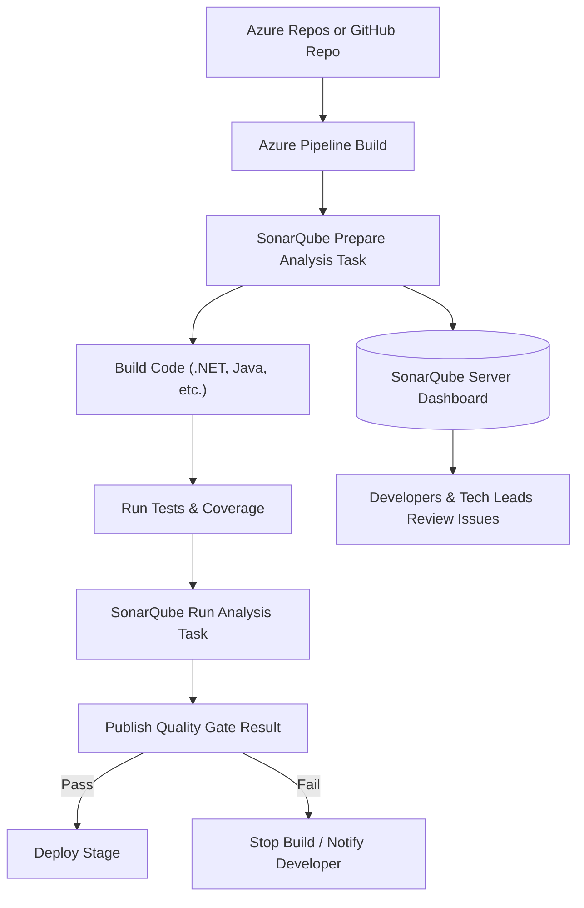
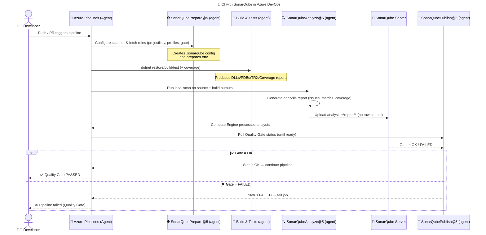
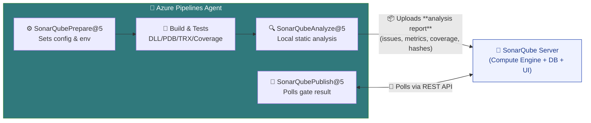
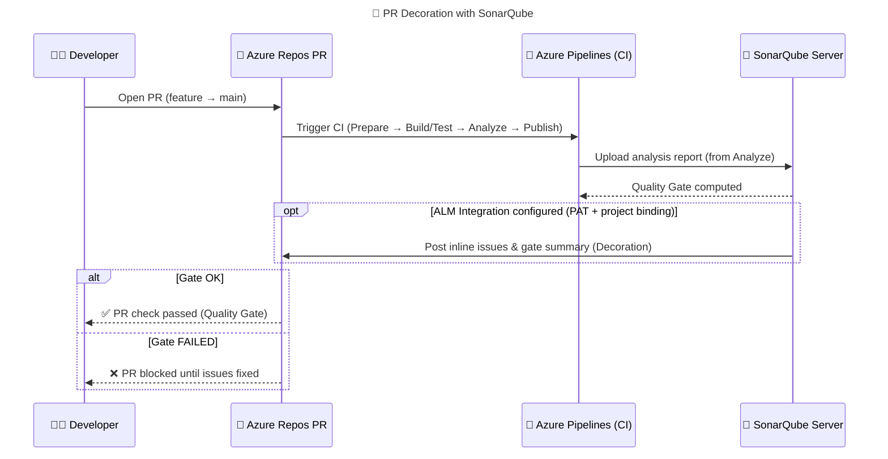
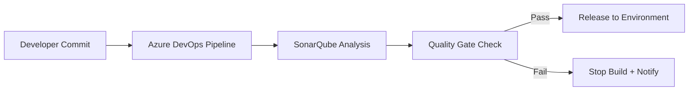

# ☁️ **SonarQube + Azure DevOps** — End-to-End Integration Guide

## 🗺️ **Architecture Overview**

Before we touch YAML or the portal, let’s visualize how everything fits together 👇

<div align="center" style="background-color: #141a19ff;color: #a8a5a5ff; border-radius: 10px; border: 2px solid">



</div>

**Goal:** Every pull request or build is analyzed by SonarQube automatically.  
If it doesn’t meet the **Quality Gate**, the pipeline will fail. 😈

---

## 🧰 **Prerequisites Checklist**

<div align="center" style="background-color: #141a19ff;color: #a8a5a5ff; border-radius: 10px; border: 2px solid">

| Requirement                                      | Why Needed                                   |
| ------------------------------------------------ | -------------------------------------------- |
| ✅ SonarQube Server                              | The central brain (can be on-prem or Docker) |
| ✅ Azure DevOps Organization                     | Where your pipeline lives                    |
| ✅ SonarQube Token                               | For secure authentication                    |
| ✅ SonarQube Extension for Azure DevOps          | Adds tasks for integration                   |
| ✅ Build Agent (Self-hosted or Microsoft-hosted) | Runs the analysis and build                  |
| ✅ Code Coverage Tool (optional but ideal)       | For quality metrics                          |

</div>

---

## 1️⃣ Step 1 — **Install the SonarQube Extension in Azure DevOps**

### 📦 A. From the Marketplace

1. Go to [**Visual Studio Marketplace → SonarQube**](https://marketplace.visualstudio.com/items?itemName=SonarSource.sonarqube)
2. Click **Get it free**
3. Choose your Azure DevOps organization
4. Click **Install**

This installs tasks like:

- **Prepare Analysis on SonarQube**
- **Run Code Analysis**
- **Publish Quality Gate Result**

💡 These tasks become available in both **Classic UI pipelines** and **YAML pipelines**.

---

## 2️⃣ Step 2 — **Create a SonarQube Service Connection**

We’ll connect Azure DevOps securely to your SonarQube instance.

### 🪜 Steps:

1. Go to **Project Settings → Service connections → New Service Connection**
2. Choose **SonarQube**
3. Fill in:

   - **Server URL:** `http://<your-sonarqube-server>:9000`
   - **Token:** your generated SonarQube token (from _My Account → Security → Generate Tokens_)

4. Give it a name (e.g., `SonarQube-Service`)
5. Click **Verify and Save**

✅ This allows pipelines to authenticate automatically to SonarQube.

---

## 3️⃣ Step 3 — **Prepare Your Project in SonarQube**

1. Log in to **SonarQube Dashboard**
2. Click **Create Project → Manually**
3. Give it a **Key** and **Name** (e.g., `azure-sample-api`)
4. Select **Azure DevOps** or _Other CI tool_
5. Generate a **project token** (we’ll use this in the pipeline)
6. Note down:

   - **Project Key**
   - **SonarQube Server URL**
   - **Token**

---

## 4️⃣ Step 4 — **YAML Pipeline Setup** (The Heart 💙)

Now let’s craft your Azure DevOps pipeline.

We’ll take a real example: a **.NET 6 Web API** analyzed by SonarQube during CI.

---

### 🧾 YAML Pipeline: `azure-pipelines.yml`

```yaml
trigger:
  branches:
    include:
      - main
      - feature/*

pool:
  vmImage: "windows-latest"

variables:
  buildConfiguration: "Release"
  sonarProjectKey: "azure-sample-api"
  sonarServiceConnection: "SonarQube-Service"
  sonarProjectName: "Azure Sample API"

stages:
  - stage: Build_And_Analyze
    displayName: "🏗️ Build and Analyze with SonarQube"
    jobs:
      - job: Build
        displayName: "🔍 SonarQube Analysis Job"
        steps:
          - task: UseDotNet@2
            inputs:
              packageType: "sdk"
              version: "6.0.x"
              installationPath: $(Agent.ToolsDirectory)/dotnet

          - task: Checkout@1
            displayName: "📥 Checkout Source Code"

          # 1️⃣ Prepare Analysis Configuration
          - task: SonarQubePrepare@5
            inputs:
              SonarQube: $(sonarServiceConnection)
              scannerMode: "MSBuild"
              projectKey: $(sonarProjectKey)
              projectName: $(sonarProjectName)

          # 2️⃣ Build Your Application
          - task: DotNetCoreCLI@2
            inputs:
              command: "build"
              projects: "**/*.csproj"
              arguments: "--configuration $(buildConfiguration)"

          # 3️⃣ Run Tests (with coverage)
          - task: DotNetCoreCLI@2
            inputs:
              command: "test"
              projects: "**/*Tests/*.csproj"
              arguments: '--configuration $(buildConfiguration) --collect:"XPlat Code Coverage"'

          # 4️⃣ Run SonarQube Analysis
          - task: SonarQubeAnalyze@5
            displayName: "🔎 Run SonarQube Code Analysis"

          # 5️⃣ Publish Quality Gate Result
          - task: SonarQubePublish@5
            inputs:
              pollingTimeoutSec: "300"
```

---

## ⚙️ **How It Works Internally**

<div align="center" style="background-color: #141a19ff;color: #a8a5a5ff; border-radius: 10px; border: 2px solid">



---



---



</div>

---

🔹 **SonarQubePrepare@5** (agent): sets up scanner config, fetches rules/gates, prepares env.  
🔹 **Build & Tests** (agent): compile + run tests + produce coverage.  
🔹 **SonarQubeAnalyze@5** (agent): **local** static analysis; generates & **uploads report** (no raw source).  
🔹 **SonarQubePublish@5** (agent): polls server’s **Quality Gate** result → pass/fail the job.

---

## 🚦 Step 5 — **Quality Gate Enforcement**

The **`SonarQubePublish`** task checks if the build meets your **Quality Gate**.

If it fails:

- The pipeline **fails** (status = red)
- Developers are notified immediately
- They must fix the issues before merging

> 💡 **Pro Tip:**  
> ✅ You can add this in your **Pull Request policy**, so the merge is **blocked** until SonarQube passes.

---

## 📈 Step 6 — **View Results in SonarQube Dashboard**

After the pipeline runs successfully:

- Go to **SonarQube → Projects → [Your Project]**
- You’ll see:

| Metric          | Example   |
| --------------- | --------- |
| Bugs            | 0         |
| Vulnerabilities | 0         |
| Code Smells     | 14        |
| Coverage        | 87%       |
| Duplications    | 1.2%      |
| Maintainability | A         |
| Security        | A         |
| Quality Gate    | ✅ Passed |

You can drill down into issues by file, severity, or category.

---

## 🎨 Step 7 — **PR Decoration** (Bonus Visual Integration)

SonarQube can comment **directly in your Azure DevOps Pull Requests**! 💬

### ⚙️ How to Enable:

1. Go to **Administration → ALM Integrations**
2. Choose **Azure DevOps**
3. Add:

   - **URL:** `https://dev.azure.com/your-org`
   - **Personal Access Token (PAT)** from Azure DevOps (with `Code → Read & Write` permissions)

4. Save and associate your project

Now when a PR is created:

- SonarQube runs analysis
- Posts comments in the PR (e.g., “Code smell in `UserService.cs` line 54”)
- Shows a **summary badge**: ✅ Passed / ❌ Failed Quality Gate

---

## 📝 **Example**: Classic Pipeline Equivalent (if not YAML)

For visual-lovers using **Classic UI**:

| Order | Task                          | Description                        |
| ----- | ----------------------------- | ---------------------------------- |
| 1     | Prepare analysis on SonarQube | Configure connection & project key |
| 2     | Build solution                | Compile code                       |
| 3     | Run tests                     | Optional, with coverage            |
| 4     | Run Code Analysis             | Upload analysis                    |
| 5     | Publish Quality Gate Result   | Enforce pass/fail                  |

---

## 🔴 **Troubleshooting Common Issues**

| Problem                       | Fix                                                      |
| ----------------------------- | -------------------------------------------------------- |
| `401 Unauthorized`            | Token expired → regenerate SonarQube token               |
| `No analysis found`           | Missing `SonarQubeAnalyze@5` task                        |
| `Quality Gate timeout`        | Increase `pollingTimeoutSec` (default: 300)              |
| `No coverage shown`           | Use proper coverage format (`.coveragexml`, `lcov.info`) |
| `Build passes but gate fails` | Add `failPipeline: true` in `SonarQubePublish`           |

---

## 📃 **Adding Coverage Reports Manually (Optional)**

If you generate coverage reports manually:

```yaml
- task: PublishCodeCoverageResults@2
  inputs:
    codeCoverageTool: "cobertura"
    summaryFileLocation: "$(System.DefaultWorkingDirectory)/**/coverage.cobertura.xml"
```

SonarQube automatically merges these results into its dashboard. 📊

---

## 🔒 **Security Best Practices**

- ✅ Use **Service Connection** instead of hardcoding tokens
- ✅ Rotate tokens periodically
- ✅ Restrict token permissions to minimal scopes
- ✅ Store tokens in **Azure DevOps variable groups** marked as secrets
- ✅ Do not run analysis on **production secrets/configs**

---

## 🧰 **Bonus: Multi-Stage CI/CD Example** (Full Flow)

Let’s extend your pipeline to **block deployment** if SonarQube fails. 🚦

```yaml
stages:
  - stage: Build_And_Analyze
    jobs:
      - job: Build
        steps:
          - task: SonarQubePrepare@5
            inputs:
              SonarQube: "SonarQube-Service"
              projectKey: "azure-sample-api"
          - task: DotNetCoreCLI@2
            inputs:
              command: "build"
          - task: SonarQubeAnalyze@5
          - task: SonarQubePublish@5
            inputs:
              pollingTimeoutSec: "300"

  - stage: Deploy
    dependsOn: Build_And_Analyze
    condition: succeeded() # Only runs if SonarQube passes
    jobs:
      - job: DeployToDev
        steps:
          - script: echo "Deploying to DEV environment..."
```

> If the Quality Gate fails ❌ — the **Deploy** stage never runs.  
> That’s how you enforce **“No bad code shall pass.”** 🧙‍♂️

---

## 🧭 **SonarQube in Azure DevOps Ecosystem**

| Integration             | Purpose                    |
| ----------------------- | -------------------------- |
| **Repos**               | Source for analysis        |
| **Pipelines**           | Run build + analysis       |
| **Boards**              | Link issues from SonarQube |
| **Artifacts**           | Store analyzed packages    |
| **Service Connections** | Secure token-based linking |

---

## 🧾 **Quick Recap** (Cheat Sheet)

<div align="center" style="background-color: #141a19ff;color: #a8a5a5ff; border-radius: 10px; border: 2px solid">

| Component           | Description                  |
| ------------------- | ---------------------------- |
| SonarQube Server    | Code quality brain           |
| SonarQube Extension | Adds tasks to pipeline       |
| Service Connection  | Secure communication         |
| SonarQubePrepare@5  | Setup step                   |
| SonarQubeAnalyze@5  | Run scan                     |
| SonarQubePublish@5  | Evaluate gate                |
| Quality Gate        | Pass/fail rule for build     |
| PR Decoration       | Inline feedback in Azure PRs |

</div>

---

## 🧠 **Final Thoughts** — Enterprise Ready Setup

When you scale SonarQube with Azure DevOps:

<div align="center" style="background-color: #141a19ff;color: #a8a5a5ff; border-radius: 10px; border: 2px solid">

| Aspect            | Recommendation                                       |
| ----------------- | ---------------------------------------------------- |
| Server            | Host on VM with 4+ vCPU, 8GB+ RAM                    |
| DB                | Use PostgreSQL (officially supported)                |
| Security          | Use HTTPS reverse proxy (Nginx)                      |
| High Availability | Use Enterprise Edition (clustered)                   |
| Scalability       | Run multiple build agents with scanner installed     |
| Monitoring        | Integrate with Prometheus or ELK stack               |
| Governance        | Define Quality Profiles + Quality Gates company-wide |

</div>

---

## 🏁 **Summary: The DevOps Holy Trinity** 🛠️

<div align="center" style="background-color: #141a19ff;color: #a8a5a5ff; border-radius: 10px; border: 2px solid">



</div>

👉 **SonarQube** = Code Guardian  
👉 **Azure DevOps** = Delivery Engine  
👉 **Quality Gate** = Moral Compass 🧭

Together, they make sure **bad code never reaches production** again.
