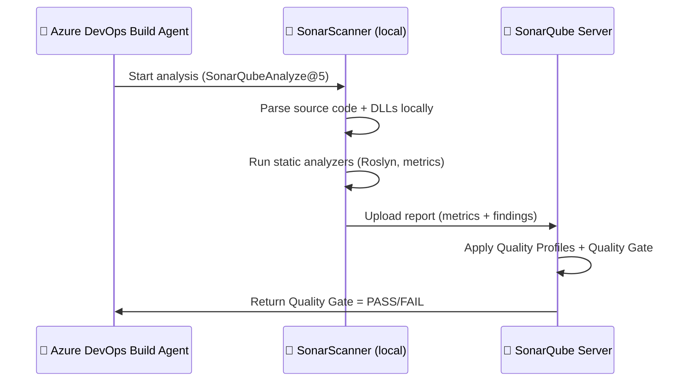

# 🧠 Task 2 — `SonarQubeAnalyze@5`: What Actually Happens

Let’s think of SonarQube as having **two parts**:

| Part                    | Where it runs                        | What it does                                                      |
| ----------------------- | ------------------------------------ | ----------------------------------------------------------------- |
| 🧰 **Sonar Scanner**    | In your **Azure DevOps build agent** | Scans the code locally and generates a big analysis report        |
| 🧠 **SonarQube Server** | Your **central SonarQube instance**  | Parses the report, applies rules, computes metrics, shows results |

So — the **scanner** does the local “reading and analyzing,”
and the **server** does the “thinking and visualization.”

---

## 🧩 Step-by-Step Breakdown

### 🧱 Step 1 — The scanner analyzes locally

When the task runs:

```yaml
- task: SonarQubeAnalyze@5
```

It invokes the **SonarScanner for MSBuild** (because your project is .NET).

That scanner:

- Reads the source code in your repo.
- Looks at the **compiled assemblies (.dll, .pdb)** from your `dotnet build`.
- Runs the **Roslyn analyzers** (C# static analysis rules) _locally_.
- Collects:

  - Syntax trees
  - Rule violations (bugs, smells, vulnerabilities)
  - Metrics (lines of code, complexity)
  - Test coverage (from coverage reports you generated)
  - File hashes for duplications

- Puts all this raw data into a **temporary folder**:

  ```ini
  .sonarqube/out/.sonar-scanner-report/
  ```

So yes — _it analyzes the code locally._
The **source code never leaves** the build agent.

---

### 🧱 Step 2 — Upload the report (not the code)

After the local analysis finishes, the scanner **compresses and uploads** only the **analysis results**, not the source files.

It sends:

- Issue data (`code smell`, `bug`, `vulnerability`)
- Metrics
- Coverage statistics
- Duplication info
- File paths (relative)
- Hashes (so SonarQube can identify changed files)

It does **not** send your raw source code text.

---

### 🧠 Step 3 — SonarQube server does the “thinking”

Once uploaded, your **SonarQube server (Compute Engine)** takes over:

1. Parses the analysis report.
2. Applies Quality Profiles (your rulesets).
3. Calculates:

   - Maintainability rating (A–E)
   - Reliability rating
   - Security rating
   - Coverage %
   - Duplications %

4. Compares results against your **Quality Gate**.
5. Stores everything in its internal database (Elasticsearch + PostgreSQL).
6. Displays results on the **SonarQube UI dashboard** and returns a pass/fail flag.

---

## 🔒 So to be clear:

| Question                                              | Answer                                                          |
| ----------------------------------------------------- | --------------------------------------------------------------- |
| Does it send my full source code to SonarQube server? | ❌ No                                                           |
| Does it analyze code locally on the build agent?      | ✅ Yes                                                          |
| What does it send to SonarQube?                       | ✅ A summarized, structured report (JSON/XML) — **no raw code** |
| Who decides pass/fail?                                | 🧠 SonarQube server (after it receives the report)              |
| Who uploads the report?                               | 🧰 SonarScanner (triggered by `SonarQubeAnalyze@5`)             |

---

## 🧭 Quick Analogy

Imagine you have:

- A **doctor (SonarQube server)**
- A **lab technician (SonarScanner)**

The lab technician (scanner) collects blood, X-rays, and test results (code metrics).
Then the doctor (SonarQube server) examines them and decides:

> “Healthy ✅” or “Needs attention ❌”

👉 The _scanner never sends your entire body_, just the **test data**.

---

## 🧩 Visual Flow (real picture)



---

## 🧾 TL;DR Summary

| Concept                                | What Happens                                   |
| -------------------------------------- | ---------------------------------------------- |
| **Where analysis runs**                | On your **Azure DevOps build agent**           |
| **What’s uploaded**                    | JSON/XML report with issues, metrics, coverage |
| **Who decides Quality Gate**           | **SonarQube server**                           |
| **What’s displayed in SonarQube UI**   | Results from the uploaded analysis             |
| **Does it ever send raw source code?** | ❌ Never (only metadata & findings)            |

---

✅ **In short:**

> `SonarQubeAnalyze@5` does the _heavy scanning locally_ on your build agent and then _uploads the results_ to the SonarQube server — the “brain” that computes metrics and decides pass/fail.
> The source code never leaves your pipeline.
