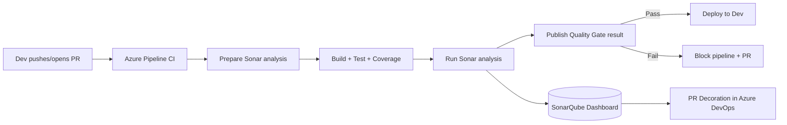

# 🚀 Case Study: .NET 8 Web API + Azure DevOps + SonarQube (A→Z)

## 🧭 Big-Picture Flow



---

## 🧩 Repository Structure (clean, testable)

```ini
dotnet8-azdo-sonar/
├─ src/
│  └─ Api/
│     ├─ Api.csproj
│     ├─ Program.cs
│     └─ Controllers/
│        └─ WeatherController.cs
├─ tests/
│  └─ Api.Tests/
│     ├─ Api.Tests.csproj
│     └─ WeatherControllerTests.cs
├─ Directory.Build.props
├─ global.json
└─ azure-pipelines.yml
```

### `global.json` (pin SDK for reproducibility)

```json
{
  "sdk": {
    "version": "8.0.401",
    "rollForward": "latestFeature"
  }
}
```

### `Directory.Build.props` (turn on analyzers + warnings as errors for discipline)

```xml
<Project>
  <PropertyGroup>
    <TreatWarningsAsErrors>true</TreatWarningsAsErrors>
    <AnalysisMode>AllEnabledByDefault</AnalysisMode>
  </PropertyGroup>
  <ItemGroup>
    <PackageReference Include="coverlet.collector" Version="6.0.0" />
    <PackageReference Include="Microsoft.NET.Test.Sdk" Version="17.11.1" />
    <PackageReference Include="xunit" Version="2.9.0" />
    <PackageReference Include="xunit.runner.visualstudio" Version="2.8.2" />
    <PackageReference Include="FluentAssertions" Version="6.12.0" />
  </ItemGroup>
</Project>
```

---

## 🧪 Minimal .NET 8 API + Test

### `src/Api/Program.cs`

```csharp
var builder = WebApplication.CreateBuilder(args);
builder.Services.AddEndpointsApiExplorer();
builder.Services.AddSwaggerGen();

var app = builder.Build();
app.UseSwagger();
app.UseSwaggerUI();

app.MapGet("/weather", () =>
{
    var data = new[] { "Sunny", "Cloudy", "Windy", "Rainy" };
    return Results.Ok(new { forecast = data[Random.Shared.Next(data.Length)] });
})
.WithName("GetWeather")
.WithOpenApi();

app.Run();
```

### `tests/Api.Tests/WeatherControllerTests.cs`

```csharp
using System.Net;
using System.Text.Json;
using FluentAssertions;
using Microsoft.AspNetCore.Mvc.Testing;
using Xunit;

public class WeatherControllerTests : IClassFixture<WebApplicationFactory<Program>>
{
    private readonly WebApplicationFactory<Program> _factory;
    public WeatherControllerTests(WebApplicationFactory<Program> factory) => _factory = factory;

    [Fact]
    public async Task GetWeather_ShouldReturn200_AndForecastField()
    {
        var client = _factory.CreateClient();
        var res = await client.GetAsync("/weather");
        res.StatusCode.Should().Be(HttpStatusCode.OK);

        var json = await res.Content.ReadAsStringAsync();
        using var doc = JsonDocument.Parse(json);
        doc.RootElement.TryGetProperty("forecast", out _).Should().BeTrue();
    }
}
```

> Tip: this uses the ASP.NET test host to hit your minimal API for real, yielding meaningful coverage.

---

## 🧰 **Azure DevOps plumbing** (one-time)

### 1. Install extension

**Project Settings → Extensions → Browse marketplace →** install **“SonarQube” (by SonarSource)**.

### 2. Service Connection

**Project Settings → Service connections → New → SonarQube:**

- **Server URL:** `https://<your-sonarqube-host>`
- **Token:** Personal token from SonarQube (**My Account → Security → Generate Tokens**)
- **Name it:** `SonarQube-Service`

### 3. (Optional) PR Decoration

In **SonarQube → Administration → ALM Integrations → Azure DevOps**

- Set Organization URL `https://dev.azure.com/<org>`
- Provide **PAT** with repo read/write
- Link the SonarQube project to your Azure DevOps repo

---

## 🧾 The Pipeline: `azure-pipelines.yml`

- Builds on **windows-latest** (good for .NET + VS Test)
- Prepares Sonar, builds, tests with coverage, analyzes, then **publishes gate** (blocking)
- Publishes coverage to Azure DevOps summary as well (nice for devs)

```yaml
trigger:
  branches:
    include: [main]
pr:
  branches:
    include: [main]

pool:
  vmImage: "windows-latest"

variables:
  buildConfiguration: "Release"
  # Change these to match your SonarQube project + service connection
  sonarProjectKey: "dotnet8-azdo-sonar"
  sonarProjectName: "dotnet8-azdo-sonar"
  sonarServiceConnection: "SonarQube-Service"

stages:
  - stage: BuildAndAnalyze
    displayName: "🔍 CI: Build, Test, SonarQube"
    jobs:
      - job: ci
        displayName: "Build & Analyze"
        steps:
          - task: UseDotNet@2
            displayName: "Use .NET 8 SDK"
            inputs:
              packageType: "sdk"
              version: "8.x"

          - checkout: self
            clean: true

          # 1) Prepare SonarQube Analysis
          - task: SonarQubePrepare@5
            displayName: "Prepare SonarQube Analysis"
            inputs:
              SonarQube: $(sonarServiceConnection)
              scannerMode: "MSBuild"
              projectKey: $(sonarProjectKey)
              projectName: $(sonarProjectName)
              # You can add extra properties here:
              extraProperties: |
                sonar.cs.vstest.reportsPaths=$(Agent.TempDirectory)/**/TestResults/*.trx
                sonar.cs.opencover.reportsPaths=$(Agent.TempDirectory)/**/coverage.opencover.xml
                sonar.coverage.exclusions=**/Program.cs,**/*Startup.cs

          # 2) Restore & Build
          - task: DotNetCoreCLI@2
            displayName: "Restore"
            inputs:
              command: "restore"
              projects: "**/*.sln"

          - task: DotNetCoreCLI@2
            displayName: "Build"
            inputs:
              command: "build"
              projects: "**/*.sln"
              arguments: "--configuration $(buildConfiguration) --no-restore"

          # 3) Test with Coverage (collect trx + opencover)
          - task: DotNetCoreCLI@2
            displayName: "Test (+Coverage)"
            inputs:
              command: "test"
              projects: "tests/**/*.csproj"
              arguments: >-
                --configuration $(buildConfiguration)
                --no-build
                --collect "XPlat Code Coverage"
                --logger trx
            continueOnError: false

          # Convert coverage to OpenCover (ReportGenerator)
          - task: reportgenerator@5
            displayName: "ReportGenerator to OpenCover"
            inputs:
              reports: "$(Agent.TempDirectory)/**/coverage.cobertura.xml"
              targetdir: "$(Build.SourcesDirectory)/CoverageReport"
              reporttypes: "HtmlInline_AzurePipelines;Cobertura;opencover"
          # Publish coverage summary in Azure DevOps
          - task: PublishCodeCoverageResults@2
            displayName: "Publish Code Coverage (Cobertura)"
            inputs:
              codeCoverageTool: "Cobertura"
              summaryFileLocation: "$(Build.SourcesDirectory)/CoverageReport/Cobertura.xml"
              reportDirectory: "$(Build.SourcesDirectory)/CoverageReport"
              failIfCoverageEmpty: false

          # 4) Run Sonar Analysis
          - task: SonarQubeAnalyze@5
            displayName: "Run SonarQube Analysis"

          # 5) Publish Quality Gate (BLOCK if failing)
          - task: SonarQubePublish@5
            displayName: "Publish Quality Gate Result"
            inputs:
              pollingTimeoutSec: "300"
```

> Notes:
>
> - We ask SonarQube to read **VSTest .trx** + **OpenCover**; `reportgenerator` converts Cobertura to OpenCover and HTML for the DevOps summary.
> - If you prefer **coverlet opencover** directly: `dotnet test /p:CollectCoverage=true /p:CoverletOutputFormat=opencover` (then skip ReportGenerator).

---

## 🛡️ **Blocking PRs with Quality Gate (Policy)**

1. **Project Settings → Repositories → [Your Repo] → Policies → Branch policies → main**
2. **Build Validation → Add**

   - Select your pipeline
   - Trigger: Automatic on PR
   - **Path filters** as needed

3. **Status checks**

   - If SonarQube decoration is enabled, add **SonarQube/Quality Gate** as a required check (appears after first run).

4. Result: PR cannot be completed if **Quality Gate** fails.

> Dev experience: they’ll see inline comments (issues), an overall **Passed/Failed** badge, and a link to SonarQube issues by file.

---

## 🖥️ **“Screenshot-Style” Portal Steps** (so you can mirror in interviews)

- **Azure DevOps → Pipelines → New Pipeline → Azure Repos Git → Select repo → “Existing Azure Pipelines YAML file” → `azure-pipelines.yml` → Run**
- **Run summary** shows:

  - Tasks in order (Prepare, Build, Test, Analyze, Publish Gate)
  - **Code Coverage** tab with HTML summary

- **Repos → Pull Requests**

  - Create a PR, push a change that violates a Sonar rule (e.g., duplicate code or `async void` test)…
  - You’ll see **SonarQube check** + inline comments + overall Gate badge.

- **SonarQube UI → Projects → dotnet8-azdo-sonar**

  - **Overview:** Reliability/Security/Maintainability ratings, coverage %, duplication %
  - **Issues:** sortable by severity/type, with quick-fix guidance
  - **Measures:** trend lines (great for “we improved X% over 4 sprints” narratives)

---

## 🧠 **Quality Gate & Profiles** (recommended starter)

- **Quality Gate** (new code):

  - Coverage on new code ≥ **80%**
  - Duplications on new code ≤ **3%**
  - **No** new Blocker/Critical issues
  - Security Hotspots Reviewed

- **Quality Profile:** start with **“Sonar way”** for C#, then clone & tailor (e.g., stricter complexity or naming).

---

## 🧯 **Troubleshooting** (fast fixes)

<div align="center" style="background-color: #141a19ff;color: #a8a5a5ff; border-radius: 10px; border: 2px solid">

| Symptom                          | Likely Cause             | Fix                                                                                                                          |
| -------------------------------- | ------------------------ | ---------------------------------------------------------------------------------------------------------------------------- |
| `Unauthorized (401)` in analysis | Bad/expired token        | Regenerate Sonar token, update service connection                                                                            |
| `Publish Quality Gate timed out` | Server under load/queue  | Increase `pollingTimeoutSec` to 600; check SonarQube Compute Engine logs                                                     |
| No coverage in Sonar             | Wrong report path/format | Ensure `sonar.cs.opencover.reportsPaths` matches produced `opencover.xml`; if Cobertura only, convert or switch to opencover |
| PR has no decoration             | ALM integration missing  | Configure Azure DevOps in SonarQube + PAT; map project to repo                                                               |
| Build passes though gate failed  | Gate not made “required” | Add status check / ensure `SonarQubePublish@5` runs and pipeline result is honored in PR policy                              |

</div>

---

## 🧪 **Deliberately Failing the Gate (demo)**

- Add a silly duplication to `Program.cs` or introduce a **critical** rule violation (e.g., catching general `Exception` and swallowing it).
- Push a PR: SonarQube will comment, the **Quality Gate** turns ❌, **PR cannot merge** until fixed.

---

## 🧭 **Multi-Stage: Safe Deploy only on Pass**

Add a deploy stage that **depends** on CI success:

```yaml
- stage: Deploy
  displayName: "🚀 Deploy to Dev (Only if Gate Passed)"
  dependsOn: BuildAndAnalyze
  condition: succeeded() # blocks on failed gate
  jobs:
    - job: deploy_dev
      steps:
        - script: echo "Deploying to Dev environment..."
```

> Replace with your real Infra (e.g., `AzureCLI@2` to deploy to App Service / Container Apps).

---

## 📊 **What to show in your portfolio/interview**

- **Screenshot** of **PR** showing Sonar inline comments + Quality Gate status
- **SonarQube dashboard** with key metrics + trend graph
- **Pipeline run** screenshot highlighting Sonar tasks and coverage tab
- **Short clip** (gif) of failing → fixing → passing

**Talking points:**

- “We enforce **Clean as You Code**: new code must meet the gate, legacy is improved gradually.”
- “We treat **sonar warnings as part of Definition of Done**.”
- “Security hotspots are reviewed in sprint; vulnerabilities block merges.”

---

## 🧾 **Bonus: Tightening Coverage**

Switch test step to generate **OpenCover** directly (skip ReportGenerator):

```yaml
- task: DotNetCoreCLI@2
  displayName: "Test (+OpenCover)"
  inputs:
    command: "test"
    projects: "tests/**/*.csproj"
    arguments: >-
      --configuration $(buildConfiguration)
      /p:CollectCoverage=true
      /p:CoverletOutputFormat=opencover
      /p:CoverletOutput=$(Agent.TempDirectory)/coverage/
      --logger trx
```

And ensure:

```ini
sonar.cs.opencover.reportsPaths=$(Agent.TempDirectory)/coverage/*.xml
```

---

## ✅ **Final Checklist**

- [ ] SonarQube extension installed
- [ ] Service connection configured
- [ ] YAML wired: Prepare → Build → Test+Coverage → Analyze → Publish Gate
- [ ] PR policy requires pipeline + Quality Gate
- [ ] PR decoration configured (optional but awesome)
- [ ] Coverage visible in both **Sonar** and **Azure DevOps**
