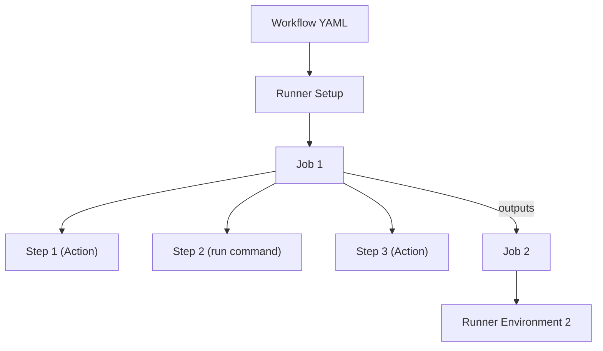

# ⚙️ GitHub Actions Internals

## 🧭 **High-Level Architecture: How a Workflow Executes**

Let’s visualize what happens when a workflow runs.

<div align="center" style="background-color: #141a19ff;color: #a8a5a5ff; border-radius: 10px; border: 2px solid">



</div>

---

- Each **job** runs on its own **runner** (VM or container).
- Inside the job, each **step** runs in sequence.
- Environment variables, outputs, and artifacts are how steps pass info.
- Between jobs, data must be explicitly shared via `outputs:` or `artifacts:` (not automatically shared).

---

## 🧩 **The Runner Environment**

When GitHub starts your job, it launches a **runner** (Ubuntu, Windows, or macOS VM) and:

- Exports environment variables like `GITHUB_WORKSPACE`, `GITHUB_REF`, `GITHUB_SHA`
- Checks out your code (if you use `actions/checkout`)
- Runs each `step` in order

Every **step** runs in a fresh shell, but **some files persist** between steps for communication.

---

## 🧰 **Special System Files (how data is shared)**

GitHub Actions uses **magic file interfaces** to share data between steps:

<div align="center" style="background-color: #141a19ff;color: #a8a5a5ff; border-radius: 10px; border: 2px solid">

| File                   | Purpose                                          | Access               |
| ---------------------- | ------------------------------------------------ | -------------------- |
| `$GITHUB_ENV`          | Set environment variables for later steps        | Write `KEY=value`    |
| `$GITHUB_OUTPUT`       | Define outputs from a step                       | Write `key=value`    |
| `$GITHUB_PATH`         | Add directories to the `PATH`                    | Write directory path |
| `$GITHUB_STATE`        | Store temporary state (used by pre/post actions) | Write key/value      |
| `$GITHUB_STEP_SUMMARY` | Append Markdown to the workflow summary page     | Write Markdown text  |

</div>

---

### 🧱 `$GITHUB_ENV` — Share Environment Variables Across Steps 🌍

Each step gets its own shell, so if you just `export MYVAR=value`, it disappears in the next step.

To persist it, write to `$GITHUB_ENV`:

```yaml
steps:
  - name: Set Env Var
    run: echo "MY_NAME=Batman" >> "$GITHUB_ENV"

  - name: Use Env Var
    run: echo "Hello $MY_NAME"
```

✅ Output:

```ini
Hello Batman
```

🧠 **Behind the scenes:**
GitHub appends your line into a temp file that the runner later sources for every new step.

---

### 📤 `$GITHUB_OUTPUT` — Pass Data Between Steps (step outputs)

If you want a step to produce a value other steps can consume:

```yaml
steps:
  - name: Generate Version
    id: version
    run: echo "version=1.2.${{ github.run_number }}" >> "$GITHUB_OUTPUT"

  - name: Print Version
    run: echo "App version is ${{ steps.version.outputs.version }}"
```

✅ Output:

```ini
App version is 1.2.15
```

This is how `outputs:` in composite or reusable workflows work internally.
Each step can write a key/value pair to `$GITHUB_OUTPUT`, and later steps access it using the `steps.<id>.outputs.<name>` syntax.

---

### 🧭 `$GITHUB_PATH` — Modify PATH Dynamically 🧩

Need to add a custom binary folder so your later steps can find an executable?

```yaml
steps:
  - name: Add custom tool
    run: echo "/opt/mytools" >> "$GITHUB_PATH"

  - name: Verify
    run: which mytool
```

✅ This modifies the system PATH for the **rest of the job**.

---

### 🔁 `$GITHUB_STATE` — Save Data Between Pre/Post Actions

Only relevant if you’re writing a **custom action** (Node or Docker).
You can store temporary state that’s restored later in a “post” script.

Example (inside Node action):

```js
const fs = require("fs");
fs.appendFileSync(process.env.GITHUB_STATE, `TMP_FILE=/tmp/cache.txt\n`);
```

In your **post** script:

```js
console.log(process.env.STATE_TMP_FILE);
```

🧩 Used by `actions/cache` to clean up temporary directories after a workflow ends.

---

### 🪄 `$GITHUB_STEP_SUMMARY` — Write Rich Markdown to Workflow Summary

Ever seen a nice Markdown summary at the end of a workflow? That’s this file.

```yaml
steps:
  - name: Add Markdown Summary
    run: |
      echo "### ✅ Test Results" >> "$GITHUB_STEP_SUMMARY"
      echo "- Passed: 120" >> "$GITHUB_STEP_SUMMARY"
      echo "- Failed: 2" >> "$GITHUB_STEP_SUMMARY"
```

The Markdown appears under the **“Summary”** tab of the workflow run.

---

## 🧱 **Job Outputs — Share Data Between Jobs**

You can use `$GITHUB_OUTPUT` + `jobs.<id>.outputs` to pass values to another job:

```yaml
jobs:
  build:
    runs-on: ubuntu-latest
    outputs:
      image_tag: ${{ steps.meta.outputs.tag }}
    steps:
      - id: meta
        run: echo "tag=build-${{ github.run_number }}" >> "$GITHUB_OUTPUT"

  deploy:
    runs-on: ubuntu-latest
    needs: build
    steps:
      - run: echo "Deploying tag ${{ needs.build.outputs.image_tag }}"
```

✅ Output:

```ini
Deploying tag build-12
```

---

## 🧩 **Workflow Environment Variables (Auto-Populated)**

These are **built-in** env vars you can use anywhere.

<div align="center" style="background-color: #141a19ff;color: #a8a5a5ff; border-radius: 10px; border: 2px solid">

| Variable            | Description                                      |
| ------------------- | ------------------------------------------------ |
| `GITHUB_WORKSPACE`  | Directory where your repo is cloned              |
| `GITHUB_REF`        | The branch or tag that triggered the workflow    |
| `GITHUB_REF_NAME`   | The short name of the branch or tag              |
| `GITHUB_SHA`        | Commit SHA that triggered the workflow           |
| `GITHUB_REPOSITORY` | `owner/repo`                                     |
| `GITHUB_ACTOR`      | Username who triggered the workflow              |
| `GITHUB_RUN_ID`     | Unique ID for the workflow run                   |
| `GITHUB_RUN_NUMBER` | Incremental number for this workflow             |
| `GITHUB_EVENT_NAME` | Name of the event (`push`, `pull_request`, etc.) |
| `GITHUB_EVENT_PATH` | JSON file path containing the webhook payload    |
| `RUNNER_OS`         | `Linux`, `Windows`, or `macOS`                   |
| `RUNNER_TEMP`       | Temp directory path                              |
| `RUNNER_TOOL_CACHE` | Path where setup actions store tools             |

</div>

---

## 🧩 **Communication Flow Inside Runner**

```mermaid
sequenceDiagram
  participant WF as Workflow
  participant R as Runner
  participant S1 as Step 1 (Action)
  participant S2 as Step 2 (Run Command)

  WF->>R: Start Job
  R->>S1: Execute Action
  S1->>R: Write output → $GITHUB_OUTPUT
  R->>S2: Inject outputs/env vars
  S2->>R: Uses env/outputs
  R->>WF: Send logs + summary
```

<div align="center" style="background-color: #141a19ff;color: #a8a5a5ff; border-radius: 10px; border: 2px solid">



</div>

---

> 💡 The runner orchestrates everything. You don’t directly “export” variables — you write to these system files so the runner can manage them.

---

## 🧰 **`$GITHUB_ENV` vs `$GITHUB_OUTPUT` — Know the Difference**

<div align="center" style="background-color: #141a19ff;color: #a8a5a5ff; border-radius: 10px; border: 2px solid">

| Use Case                                         | Variable         | Effect                                       |
| ------------------------------------------------ | ---------------- | -------------------------------------------- |
| Make data available to later steps (as env vars) | `$GITHUB_ENV`    | Good for static config (like `APP_ENV=prod`) |
| Make data available as structured outputs        | `$GITHUB_OUTPUT` | Best for computed values (`version=1.0.5`)   |

</div>

---

**Example:**

```yaml
- id: build
  run: |
    echo "APP_ENV=prod" >> "$GITHUB_ENV"
    echo "tag=app-${{ github.run_number }}" >> "$GITHUB_OUTPUT"
```

Then later:

```yaml
- run: echo "Environment: $APP_ENV"
- run: echo "Tag: ${{ steps.build.outputs.tag }}"
```

---

## ⚙️ **Expressions and Contexts: How Data Is Injected**

When you reference `${{ steps.build.outputs.tag }}`,  
GitHub’s runner parses the YAML, identifies dependencies, and evaluates these expressions **before** step execution.

Context hierarchy (priority order):

```ini
env → vars → inputs → secrets → github → job → steps → runner
```

---

## 🧩 **\$GITHUB_ACTION_PATH — Inside Custom Actions**

When writing your own action, `$GITHUB_ACTION_PATH` tells you where your action’s files are.

For example, if your composite action has scripts in the same folder:

```yaml
- run: bash $GITHUB_ACTION_PATH/setup.sh
```

This ensures the action runs its own local script path even when used in another repo.

---

## 🧱 **How Composite Actions Share Data Internally**

Composite actions also use `$GITHUB_OUTPUT` and `$GITHUB_ENV` internally.
For example, your composite action can pass data back to the caller:

```yaml
runs:
  using: "composite"
  steps:
    - id: set_version
      run: echo "version=2.1" >> "$GITHUB_OUTPUT"
outputs:
  version:
    value: ${{ steps.set_version.outputs.version }}
```

Then from a workflow:

```yaml
- uses: ./.github/actions/my-action
  id: myact
- run: echo "Got version ${{ steps.myact.outputs.version }}"
```

---

## 🧠 **Putting It All Together: Real Example**

```yaml
name: Advanced Data Flow
on: [push]

jobs:
  example:
    runs-on: ubuntu-latest
    steps:
      - uses: actions/checkout@v4

      - name: Set dynamic env
        run: echo "DEPLOY_ENV=prod" >> "$GITHUB_ENV"

      - name: Build App
        id: build
        run: echo "artifact=web-${{ github.run_number }}" >> "$GITHUB_OUTPUT"

      - name: Print everything
        run: |
          echo "Environment: $DEPLOY_ENV"
          echo "Artifact: ${{ steps.build.outputs.artifact }}"
          echo "Workspace: $GITHUB_WORKSPACE"
```

✅ Output:

```ini
Environment: prod
Artifact: web-15
Workspace: /home/runner/work/myrepo/myrepo
```

---

## 🔐 **Security Notes**

- **Never echo secrets** directly to `$GITHUB_ENV` or `$GITHUB_OUTPUT` without masking.
- GitHub automatically masks any secret that matches an existing secret value.
- You can manually mask logs:

  ```yaml
  run: echo "::add-mask::mysecretvalue"
  ```

---

## 🧩 **Debugging Environment Issues**

To debug what’s available in the runner:

```yaml
- run: env | sort
- run: cat "$GITHUB_ENV"
```

Or enable debug logging globally:

1. Go to **Settings → Secrets and variables → Actions → Variables**
2. Add variable: `ACTIONS_STEP_DEBUG=true`
3. Re-run the workflow → gets verbose step logs

---

## 🧠 **Summary**

<div align="center" style="background-color: #141a19ff;color: #a8a5a5ff; border-radius: 10px; border: 2px solid">

| Mechanism              | Purpose                        | Used For                     |
| ---------------------- | ------------------------------ | ---------------------------- |
| `$GITHUB_ENV`          | Persist env vars between steps | “Global” environment values  |
| `$GITHUB_OUTPUT`       | Create step/job outputs        | Structured data sharing      |
| `$GITHUB_PATH`         | Extend PATH                    | CLI tools                    |
| `$GITHUB_STEP_SUMMARY` | Add Markdown to summary        | Reports and dashboards       |
| `$GITHUB_STATE`        | Save data for post scripts     | Advanced custom actions      |
| `$GITHUB_ACTION_PATH`  | Action’s local folder          | Custom scripts inside action |

</div>
