```mermaid
graph TD
    A[🔹 Workflow YAML] --> B["⚙️ Variables (env/context)"]
    B --> C["💬 Steps use them"]
    C --> D["🚀 Dynamic Build Behavior"]
```

```mermaid
graph LR
    A["🌐 Workflow env"] --> B["🧱 Job 1"]
    A --> C["🧱 Job 2"]
    B --> D["⚙️ Step 1"]
    B --> E["⚙️ Step 2"]
    class A,B,C,D,E flow;
    classDef flow fill:#222,stroke:#999,color:#fff;
```

```mermaid
graph TD
    A["🌍 Workflow env (lowest)"] --> B["🧱 Job env"]
    B --> C["⚙️ Step env"]
    C --> D["🔒 Secrets (highest)"]
```

# ⚙️ Variables in GitHub Actions

_Because hardcoding values is so… 2008._

---

## 🧠 What Are Variables?

> **Official Definition:**
> Variables are key-value pairs that store reusable information and configuration for your workflows, jobs, and steps.

They make workflows:

- Dynamic (react to environments, branches, events)
- Maintainable (change once, apply everywhere)
- Secure (store secrets and sensitive data safely)
- Modular (pass values between jobs or files)

Think of them as **workflow memory** 🧩 — data that your pipeline remembers, manipulates, and reuses.

---

<div align="center" style="background:#343739ff; border-radius:20px">



</div>

---

## 🧩 Variable Categories Overview

GitHub Actions has **four main categories** of variables:

<div align="center" style="background:#343739ff; border-radius:20px">

| Category                           | Purpose                                         | Example                  |
| ---------------------------------- | ----------------------------------------------- | ------------------------ |
| **1️⃣ Environment Variables**       | Define runtime configuration for jobs and steps | `env: MY_ENV: "value"`   |
| **2️⃣ Default & Context Variables** | Built-in variables provided by GitHub           | `${{ github.ref }}`      |
| **3️⃣ Custom Variables**            | User-defined key-value pairs                    | `${{ vars.MY_VAR }}`     |
| **4️⃣ Secrets**                     | Encrypted, sensitive values                     | `${{ secrets.API_KEY }}` |

</div>

---

## 🧱 1. Environment Variables (`env`)

These are the most common and simplest form.
They can be set at **three levels**:

- **Workflow level** → available everywhere
- **Job level** → available in all steps of that job
- **Step level** → available only inside that step

---

### ✅ Example — Workflow-Level Environment Variable

```yaml
name: Build and Test
on: [push]

env:
  NODE_ENV: production
  VERSION: 1.0.0

jobs:
  build:
    runs-on: ubuntu-latest
    steps:
      - name: Show environment
        run: echo "Environment: $NODE_ENV | Version: $VERSION"
```

💡 These variables are available **globally** inside every job and step.

---

### ✅ Example — Job-Level Environment Variable

```yaml
jobs:
  test:
    runs-on: ubuntu-latest
    env:
      NODE_ENV: test
    steps:
      - name: Run tests
        run: echo "Running in $NODE_ENV mode"
```

💡 Only this job sees `NODE_ENV=test`.

---

### ✅ Example — Step-Level Environment Variable

```yaml
jobs:
  build:
    runs-on: ubuntu-latest
    steps:
      - name: Build App
        env:
          BUILD_MODE: release
        run: echo "Building in $BUILD_MODE mode"
```

💡 Great for sensitive or temporary variables.

---

<div align="center" style="background:#343739ff; border-radius:20px">



</div>

---

## 🧩 2. Default GitHub Context Variables (`github`, `runner`, `env`, etc.)

GitHub automatically injects **context objects** that contain information about:

- The event that triggered the workflow
- The repository
- The commit or PR
- The job or runner environment

You can access them using:

```yaml
${{ github.<property> }}
${{ runner.<property> }}
${{ env.<variable> }}
```

---

### 🧠 Common GitHub Contexts

<div align="center" style="background:#343739ff; border-radius:20px">

| Context             | Example                        | Description                              |
| ------------------- | ------------------------------ | ---------------------------------------- |
| `github.ref`        | `refs/heads/main`              | The branch or tag that triggered the run |
| `github.repository` | `username/repo`                | Full repo name                           |
| `github.actor`      | `devuser`                      | Who triggered the run                    |
| `github.sha`        | `3c2fabc123...`                | Commit hash                              |
| `github.event_name` | `push`, `pull_request`         | Event type                               |
| `github.run_id`     | `502181210`                    | Unique run ID                            |
| `runner.os`         | `Linux`, `Windows`, `macOS`    | Current runner’s OS                      |
| `env.VAR`           | Access env vars in expressions | `${{ env.MY_ENV }}`                      |

</div>

---

### ✅ Example: Using Context Variables

```yaml
steps:
  - name: Display build info
    run: echo "Building on branch: ${{ github.ref }} by ${{ github.actor }}"
```

Output:

```ini
Building on branch: refs/heads/main by devuser
```

---

## 🧩 3. Custom Variables (Repository / Environment Variables)

> Introduced by GitHub to store non-secret configuration accessible across workflows.

You define them in your repo:  
🛠️ **Settings → Secrets and Variables → Actions → Variables**

Then access them as:

```yaml
${{ vars.MY_CUSTOM_VAR }}
```

---

### ✅ Example

```yaml
jobs:
  deploy:
    runs-on: ubuntu-latest
    steps:
      - name: Use custom variable
        run: echo "Deploying to ${{ vars.ENVIRONMENT_NAME }}"
```

💡 Perfect for things like environment names, regions, or URLs that aren’t secrets.

---

## 🧩 4. Secrets (`secrets`)

> **Encrypted, sensitive variables** like API keys, passwords, or tokens.

You define them under:  
🛡️ **Settings → Secrets and Variables → Actions → Secrets**

Use them like:

```yaml
${{ secrets.MY_SECRET }}
```

---

### ✅ Example — Using a Secret

```yaml
steps:
  - name: Authenticate to Docker
    run: echo ${{ secrets.DOCKER_PASSWORD }} | docker login -u ${{ secrets.DOCKER_USER }} --password-stdin
```

💡 GitHub masks secrets in logs automatically (they appear as `***`).

---

## 🧮 Variable Precedence (Order of Priority)

If two variables have the same name, this is the **precedence order** (from highest → lowest):

<div align="center" style="background:#343739ff; border-radius:20px">

| Priority | Source                 | Example                      |
| -------- | ---------------------- | ---------------------------- |
| 🔒 1     | **Secrets**            | `${{ secrets.DB_PASSWORD }}` |
| 🧩 2     | **Step-level env**     | `env:` inside a step         |
| 🧱 3     | **Job-level env**      | `env:` inside a job          |
| 🌍 4     | **Workflow-level env** | `env:` at root               |
| 💻 5     | **Runner environment** | System vars like `PATH`      |

</div>

---

That means **step-level** overrides job/workflow vars.

---

<div align="center" style="background:#343739ff; border-radius:20px">



</div>

---

## 🧰 Using Variables in Steps

### ✅ In Shell Commands

```yaml
run: echo "Branch: $GITHUB_REF"
```

### ✅ In Expressions

```yaml
if: github.ref == 'refs/heads/main'
```

### ✅ In Composite Actions

```yaml
env:
  IMAGE_TAG: ${{ github.sha }}
```

---

## 🧩 Setting Variables Dynamically (`GITHUB_ENV`)

You can create new environment variables at runtime!

```yaml
- name: Set custom variable dynamically
  run: echo "DEPLOY_ENV=staging" >> $GITHUB_ENV
```

Later steps can access it:

```yaml
- run: echo "Deploying to $DEPLOY_ENV"
```

💡 Useful for computing values like timestamps, branches, or dynamic tags.

---

## 🧮 Passing Variables Between Jobs

You can’t directly share environment variables across jobs —
but you **can** use **job outputs**.

```yaml
jobs:
  build:
    runs-on: ubuntu-latest
    outputs:
      version: ${{ steps.ver.outputs.version }}
    steps:
      - id: ver
        run: echo "version=1.2.3" >> $GITHUB_OUTPUT

  deploy:
    needs: build
    runs-on: ubuntu-latest
    steps:
      - run: echo "Deploying version ${{ needs.build.outputs.version }}"
```

---

## 🧩 Using Variables in Matrix Builds

```yaml
strategy:
  matrix:
    os: [ubuntu-latest, windows-latest]
    node: [16, 18]

steps:
  - run: echo "Building for Node ${{ matrix.node }} on ${{ matrix.os }}"
```

Matrix variables let you dynamically configure jobs.

---

## 🧠 Advanced Patterns

<div align="center" style="background:#343739ff; border-radius:20px">

| Pattern                  | Description                          | Example                                  |
| ------------------------ | ------------------------------------ | ---------------------------------------- |
| **Interpolation**        | Combine vars dynamically             | `name: deploy-${{ github.ref_name }}`    |
| **Default Fallback**     | Use `\|\|` for default              | `${{ env.MYVAR \|\| 'default-value' }}` |
| **Conditional Secrets**  | Use secrets only on main branch      | `if: github.ref == 'refs/heads/main'`    |
| **Workflow Reusability** | Pass variables to reusable workflows | `with:` inputs                           |

</div>

---

## 📊 Visualization: Variable Scopes

```mermaid
graph LR
    A["🌍 Workflow Level"] --> B["🧱 Job Level"]
    B --> C["⚙️ Step Level"]
    C --> D["🔒 Secrets"]
    C --> E["🔧 Runtime (GITHUB_ENV)"]
```

<div align="center" style="background:#343739ff; border-radius:20px">



</div>

---

## 🧩 Common Mistakes to Avoid

<div align="center" style="background:#343739ff; border-radius:20px">

| Mistake                      | Why It Happens             | Fix                                  |
| ---------------------------- | -------------------------- | ------------------------------------ |
| Forgetting `$` in shell      | Shell won’t expand it      | Use `$VAR` instead of `${{ VAR }}`   |
| Using `${{ }}` in `run`      | It’s for YAML, not bash    | Only use `${{ }}` in `env:` or `if:` |
| Expecting job vars globally  | Jobs are isolated          | Use outputs to share                 |
| Storing secrets as vars      | Security risk              | Always use `secrets`                 |
| Forgetting `GITHUB_ENV` file | Dynamic vars won’t persist | Always append using `>> $GITHUB_ENV` |

</div>

---

## 📘 Summary

<div align="center" style="background:#343739ff; border-radius:20px">

| Type                 | Example                       | Scope                  | Best For                 |
| -------------------- | ----------------------------- | ---------------------- | ------------------------ |
| **Environment Vars** | `env: APP_MODE: prod`         | Workflow/Job/Step      | General config           |
| **GitHub Context**   | `${{ github.ref }}`           | Global                 | Metadata, branches       |
| **Custom Vars**      | `${{ vars.REGION }}`          | Repository/Environment | Shared non-secret config |
| **Secrets**          | `${{ secrets.API_KEY }}`      | Global                 | Secure credentials       |
| **Dynamic Vars**     | `echo "VAR=1" >> $GITHUB_ENV` | Runtime                | Computed values          |

</div>

---

### 🧩 Final Thought

> Variables in GitHub Actions are like your pipeline’s DNA —
> they decide how it behaves, what it remembers, and what it hides.

Once you master variable types and levels,
your workflows become **clean, flexible, and secure** — the holy trinity of DevOps automation. 🧠⚙️
