```mermaid
graph LR
    A["🧩 Workflow YAML"] --> B["🧮 GitHub Actions Expression Parser"]
    B --> C["⚙️ Evaluates ${{ github.ref }}"]
    C --> D["🧱 Job Runner (Bash/PowerShell)"]
    D --> E["💻 Executes $GITHUB_REF"]
```

# ⚙️ `$` vs `${{ }}` in GitHub Actions

_— The secret difference between shell expansion and YAML expression evaluation._

---

## 🧠 The Two “Worlds” Inside a Workflow

When you write a GitHub Actions workflow, there are **two interpreters** at play:

<div align="center" style="background:#343739ff; border-radius:20px">

| World                         | Evaluator              | Example             | Runs Where              |
| ----------------------------- | ---------------------- | ------------------- | ----------------------- |
| 🌍 **YAML Expression Engine** | GitHub Actions engine  | `${{ github.ref }}` | Before the job starts   |
| 💻 **Shell Environment**      | Bash, PowerShell, etc. | `$GITHUB_REF`       | Inside a `run:` command |

</div>

---

👉 The key difference:

- **`${{ ... }}`** = evaluated by GitHub Actions **before** the job runs (YAML-level)
- **`$VAR`** = evaluated by the **shell inside the runner** during execution

Let’s visualize this.

---

<div align="center" style="background:#343739ff; border-radius:20px">



</div>

---

## 📌 Part 1 — `${{ }}` (Expression Syntax)

### 📖 Official Definition

> The `${{ }}` syntax tells GitHub Actions to evaluate the expression **before** the runner starts.

It works **in YAML fields** such as:

- `name:`
- `if:`
- `env:`
- `with:`
- `jobs.<job_id>.outputs`
- and others.

---

### 📝 Example — Using `${{ }}` in `if` and `env`

```yaml
jobs:
  build:
    runs-on: ubuntu-latest
    env:
      BUILD_MODE: ${{ github.ref == 'refs/heads/main' && 'release' || 'dev' }}
    steps:
      - name: Show mode
        run: echo "Mode is $BUILD_MODE"
```

**Explanation:**

- `${{ github.ref }}` is evaluated _before runtime_ by GitHub Actions.
- It sets `BUILD_MODE` to `"release"` if main branch, else `"dev"`.
- `$BUILD_MODE` (with a `$`) is used **inside the shell** to print it.

---

### 📝 Example — `${{ vars.MY_VAR }}` for Repo Variables

```yaml
env:
  REGION: ${{ vars.AZURE_REGION }}
```

➡️ The `${{ }}` part runs before execution and inserts the value from the GitHub variable store.
Once job starts → `$REGION` becomes available for shell commands.

---

## 📌 Part 2 — `$VAR` (Shell Variable)

This is a **runtime environment variable** —
it exists inside the OS shell (like Bash or PowerShell).

You use `$VAR` **inside `run:` blocks**, because that’s when the shell runs.

---

### 📝 Example — Using `$VAR` Inside `run`

```yaml
steps:
  - name: Print branch info
    run: echo "Branch: $GITHUB_REF"
```

Here:

- `$GITHUB_REF` is a **Bash environment variable** automatically set by GitHub Actions.
- It’s **not YAML interpolation**, it’s the **Linux shell** printing a value.

---

## ⚖️ Side-by-Side Comparison

<div align="center" style="background:#343739ff; border-radius:20px">

| Purpose                  | Expression Engine (`${{ }}`)                   | Shell Expansion (`$VAR`) |
| ------------------------ | ---------------------------------------------- | ------------------------ |
| Evaluated by             | GitHub Actions                                 | Bash / PowerShell        |
| When it runs             | Before workflow executes                       | During job execution     |
| Used in                  | `env`, `if`, `with`, `name`, `outputs`         | `run:`                   |
| Access to contexts       | ✅ Yes (`github`, `vars`, `secrets`, `matrix`) | ❌ No                    |
| Example                  | `env: MODE: ${{ github.ref_name }}`            | `run: echo $MODE`        |
| Can be used in step name | ✅ Yes                                         | ❌ No                    |

</div>

---

## 🧮 Real Example: Mixing Both

Let’s see both working together in one practical workflow 👇

```yaml
name: Example Mix

on: [push]

jobs:
  demo:
    runs-on: ubuntu-latest
    env:
      AUTHOR: ${{ github.actor }}
      BUILD_ID: ${{ github.run_id }}
    steps:
      - name: Show YAML-level vars
        run: |
          echo "Author (from YAML): $AUTHOR"
          echo "Build ID (from YAML): $BUILD_ID"
          echo "Repo name (from GitHub Context): ${{ github.repository }}"
```

⁉️ What happens:

1. GitHub evaluates `${{ github.actor }}` and `${{ github.run_id }}` → injects them into environment.
2. Shell then expands `$AUTHOR` and `$BUILD_ID`.
3. `${{ github.repository }}` still works inside `run:` because GitHub expands it before sending the command to shell.

---

## ⚙️ Special Case — Secrets

Secrets can be used in **either** form depending on context.

- ✅ Inside `env:` or `with:` → `${{ secrets.MY_SECRET }}`
- ✅ Inside `run:` → `$MY_SECRET` (after being exposed via env)

Example:

```yaml
steps:
  - name: Login
    env:
      PASSWORD: ${{ secrets.DOCKER_PASSWORD }}
    run: docker login -u user -p "$PASSWORD"
```

Here `${{ }}` injects the secret _securely_ into environment,
and `$PASSWORD` expands in shell.

---

## 🧩 Conditional Expressions Only Use `${{ }}`

When writing conditions, _always_ use `${{ }}` because the shell doesn’t run yet.

✅ Works:

```yaml
if: ${{ github.ref == 'refs/heads/main' }}
```

❌ Won’t work:

```yaml
if: $GITHUB_REF == 'refs/heads/main' # ❌ Invalid
```

---

## 🧠 Advanced Tip — Debugging Which One Works

If you’re unsure which variable is available where:

```yaml
- name: Show all env vars
  run: printenv | sort
```

And you’ll see things like:

```ini
GITHUB_REF=refs/heads/main
GITHUB_REPOSITORY=yourname/repo
BUILD_MODE=release
```

But variables that use `${{ }}` only at YAML level (like conditional expressions) won’t appear here.

---

## 🎯 Quick Reference Summary

<div align="center" style="background:#343739ff; border-radius:20px">

| Context                        | Syntax                     | When to Use                          | Example                                      |
| ------------------------------ | -------------------------- | ------------------------------------ | -------------------------------------------- |
| **Workflow Logic**             | `${{ github.ref }}`        | Conditions, env setup, dynamic names | `if: ${{ github.ref == 'refs/heads/main' }}` |
| **Environment Var Inside run** | `$VAR`                     | Shell commands                       | `run: echo $VAR`                             |
| **Secrets / Vars (YAML)**      | `${{ secrets.MY_SECRET }}` | In `env:` or `with:`                 | `env: TOKEN: ${{ secrets.GH_TOKEN }}`        |
| **Runtime Var**                | `$GITHUB_ENV`              | To define at runtime                 | `echo "VAR=value" >> $GITHUB_ENV`            |
| **Matrix Var**                 | `${{ matrix.os }}`         | Job strategy and naming              | `runs-on: ${{ matrix.os }}`                  |

</div>

---

<div align="center" style="background:#343739ff; border-radius:20px">

```mermaid
graph TD
  A["${{ }}" Evaluated by GitHub Engine"] --> B["🧱 Used in workflow logic"]
  C["$VAR Evaluated by Shell"] --> D["💻 Used inside run steps"]
  A -.->|before execution| D
  C -.->|during execution| B
```

</div>

---

## 💬 Simple Analogy

Think of `${{ }}` as **the architect** 🧠 designing your workflow blueprint before construction,
and `$VAR` as **the builder** 🧱 executing inside the site.

They live in different worlds — one plans, the other builds.

---

## 🧠 **TL;DR**

<div align="center" style="background:#343739ff; border-radius:20px">

| Use Case                | Correct Syntax                               |
| ----------------------- | -------------------------------------------- |
| Reference repo info     | `${{ github.repository }}`                   |
| Reference secret        | `${{ secrets.MY_SECRET }}`                   |
| Use variable in shell   | `$MY_VAR`                                    |
| Set env var dynamically | `echo "VAR=value" >> $GITHUB_ENV`            |
| Conditional logic       | `if: ${{ github.ref == 'refs/heads/main' }}` |
| Matrix value            | `${{ matrix.node }}`                         |

</div>

---

✅ **In one line:**

> Use `${{ }}` when you want GitHub to compute the value.
> Use `$VAR` when you want the **runner’s shell** to print or use it.
