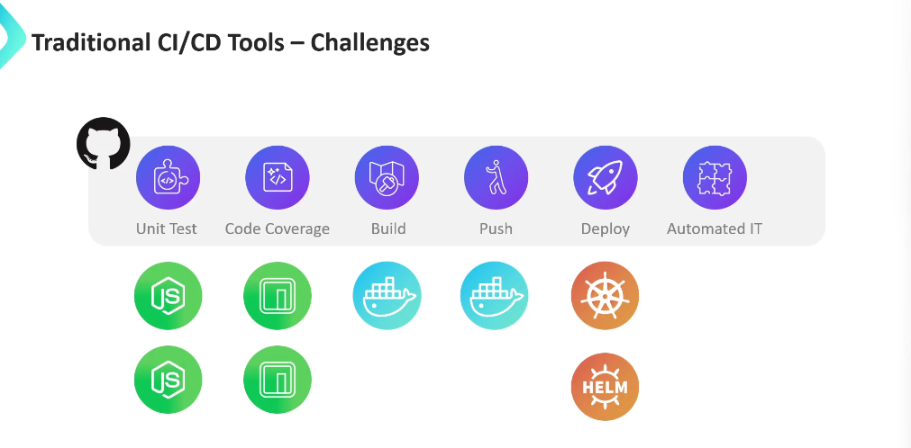
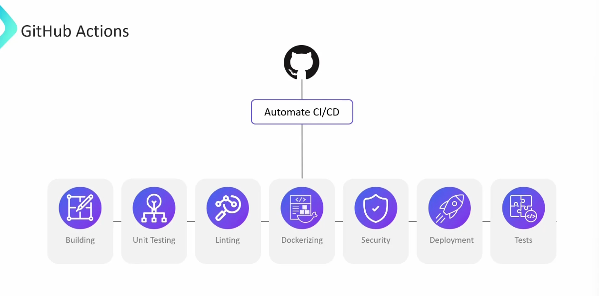
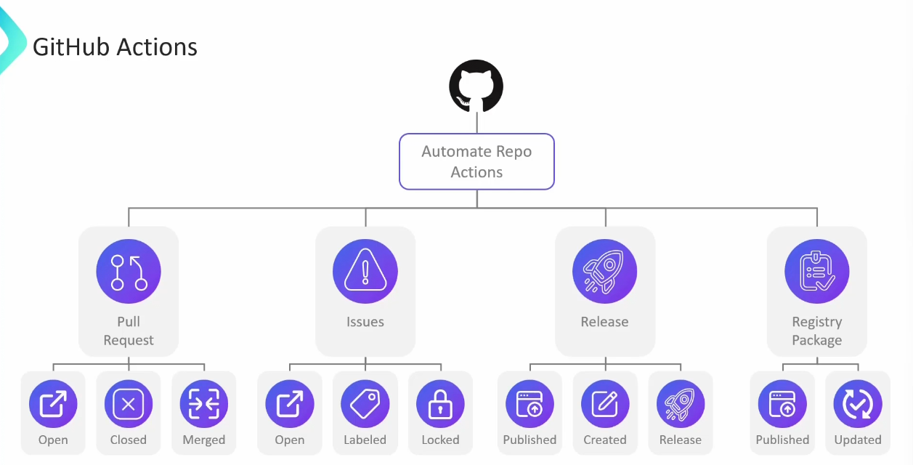
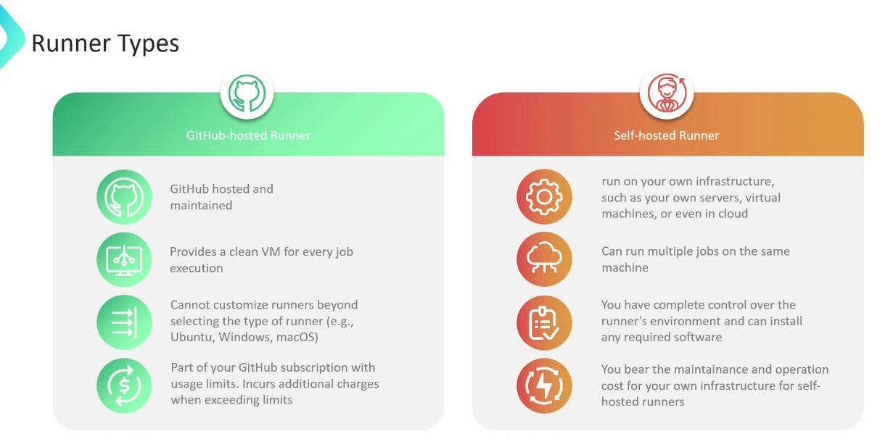
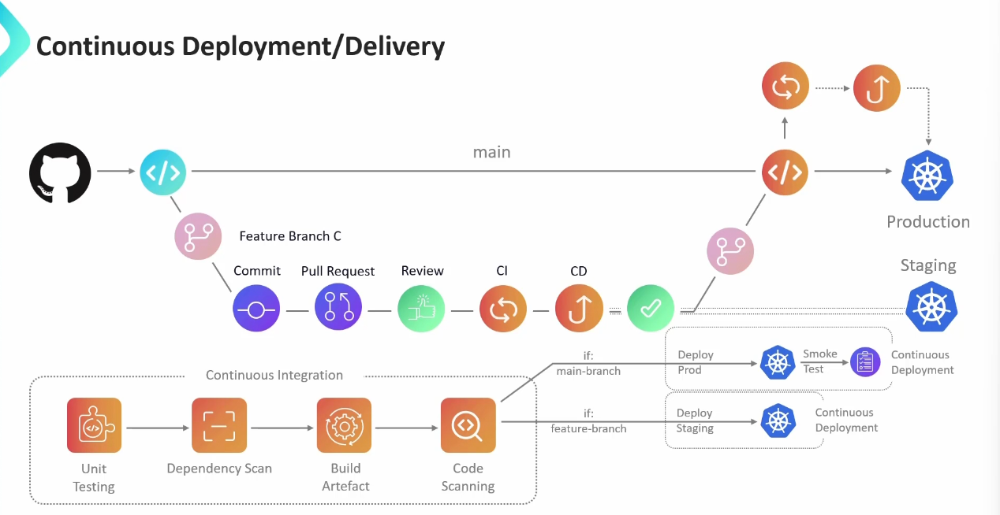

# 🚀 **GitHub Actions Overview**

GitHub Actions is **GitHub’s built-in automation platform** that allows you to build, test, and deploy your code directly from your repository.
Think of it as a **native CI/CD system** deeply integrated with everything GitHub already offers — commits, pull requests, issues, releases, and more.

---

## ⚖️ **Why GitHub Actions (and Not Jenkins)?**

<div align="center" style="background-color: #141a19ff;color: #a8a5a5ff; border-radius: 10px; border: 2px solid">

| Feature         | GitHub Actions                                        | Jenkins                               |
| --------------- | ----------------------------------------------------- | ------------------------------------- |
| **Setup**       | Zero installation (cloud-native, built into GitHub)   | Requires server setup and maintenance |
| **Integration** | Deep integration with GitHub events                   | Requires plugins and GitHub webhooks  |
| **Scalability** | Scales automatically using GitHub-hosted runners      | Requires custom nodes or cloud agents |
| **UI/UX**       | YAML-based workflows inside repo                      | Web dashboard managed separately      |
| **Cost**        | Free for public repos, generous free tier for private | Free but needs infrastructure         |
| **Speed**       | Parallel, matrix builds out-of-the-box                | Needs manual configuration            |

</div>

---

<div align="center" style="background-color:#fff; border-radius: 10px; border: 2px solid">
   
</div>

---

✅ **In short:**  
GitHub Actions is cloud-native, tightly integrated with your GitHub repo, and ideal for both CI/CD and event-driven automation.

---

## 🧩 **GitHub Actions Features**

### 🏗️ **1. Built-in CI/CD Capabilities**

GitHub Actions lets you **automate your build, test, and deployment pipelines** with simple YAML files stored in `.github/workflows/`.

Example use cases:

- Build and test every pull request
- Deploy to AWS, Azure, or GCP
- Run security scans and linting automatically

---

<div align="center" style="background-color:#fff; border-radius: 10px; border: 2px solid">
   
</div>

---

### 🔁 **2. Integration with GitHub Events**

Workflows can be triggered by **GitHub events** like:

- `push`, `pull_request`, `release`, `issue_comment`, `schedule`, etc.

This allows powerful automation chains like:

> “When a pull request is opened, run tests and auto-assign reviewers.”

<div align="center" style="background-color:#fff; border-radius: 10px; border: 2px solid">
   
</div>

---

### 🧠 **3. Automate Repository Management**

You can automate:

- Adding reviewers or assignees
- Applying labels automatically
- Commenting on issues or PRs
- Enforcing branch naming rules

It’s like having a **smart GitHub assistant** for your project!

<div align="center" style="background-color:#fff; border-radius: 10px; border: 2px solid">
   
</div>

---

## ⚙️ **Workflow Architecture**

Each GitHub Actions workflow is defined in a `.yml` file inside:

```ini
.github/workflows/
```

### 🧬 **Workflow Structure**

A workflow is made of:

- **Event trigger** → e.g., `on: push`
- **Jobs** → e.g., `build`, `test`, `deploy`
- **Steps** → individual commands or actions within a job
- **Runners** → environments that execute the jobs

```yaml
name: CI Pipeline
on: [push, pull_request]
jobs:
  build:
    runs-on: ubuntu-latest
    steps:
      - uses: actions/checkout@v4
      - name: Run tests
        run: npm test
```

---

<div align="center" style="background-color:#fff; border-radius: 10px; border: 2px solid">
   
</div>

---

<div align="center" style="background-color:#fff; border-radius: 10px; border: 2px solid">
   
</div>

---

## 🏃 **Runners in GitHub Actions**

<div align="center" style="background-color: #141a19ff;color: #a8a5a5ff; border-radius: 10px; border: 2px solid">

| Type                     | Description                     | Examples                                          |
| ------------------------ | ------------------------------- | ------------------------------------------------- |
| **GitHub-Hosted Runner** | Managed by GitHub, ready to use | `ubuntu-latest`, `windows-latest`, `macos-latest` |
| **Self-Hosted Runner**   | You host your own VM/server     | Custom OS, hardware, or on-premises CI needs      |

</div>

---

> Self-hosted runners are ideal when you need **custom dependencies**, GPU builds, or private network access.

<div align="center" style="background-color:#fff; border-radius: 10px; border: 2px solid">
   
</div>

---

## ♾️ **Basics of CI/CD Workflows**

GitHub Actions simplifies DevOps automation by combining:

1. **Continuous Integration (CI)** → Build & Test every commit.
2. **Continuous Deployment (CD)** → Deploy automatically when tests pass.

---

<div align="center" style="background-color:#fff; border-radius: 10px; border: 2px solid">
   
</div>

---

<div align="center" style="background-color:#fff; border-radius: 10px; border: 2px solid">
   
</div>

---

<div align="center" style="background-color:#fff; border-radius: 10px; border: 2px solid">
   
</div>

---

## 🧠 **Summary**

<div align="center" style="background-color: #141a19ff;color: #a8a5a5ff; border-radius: 10px; border: 2px solid">

| Concept      | Description                                        |
| ------------ | -------------------------------------------------- |
| **Workflow** | YAML file describing automation process            |
| **Job**      | Group of steps run on the same runner              |
| **Step**     | Single command or prebuilt action                  |
| **Runner**   | Machine executing the job                          |
| **Action**   | Reusable automation component (official or custom) |

</div>

💡 **Pro tip:**  
Think of GitHub Actions as **Lego blocks for automation** — each workflow combines modular actions to build your dream CI/CD system, natively inside GitHub.
