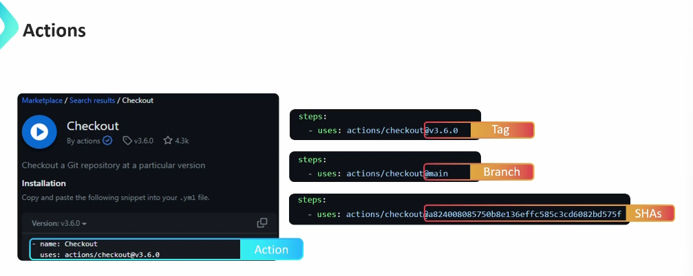
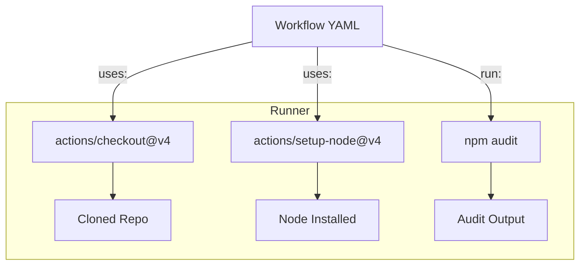

# ⚙️ **What is an “Action”?**

Think of a GitHub workflow (`.github/workflows/*.yml`) as a **recipe** 🍳.

Each **step** in that recipe can either:

1. Run a shell command you write yourself
   👉 `run: npm install`
2. **Use** an existing **Action**, which is a reusable unit of logic
   👉 `uses: actions/checkout@v4`

Formally:

> 🔹 **An action** is a reusable unit of code that performs a specific task inside a GitHub Actions workflow.
> It can be **created by GitHub**, **the community**, or **you**.

---

<div align="center" style="background-color:#fff; border-radius: 10px; border: 2px solid">
   
</div>

---

## 🔴 **What Happens Without Actions?**

Without `uses:`, you’d have to manually:

- Clone the repo (`git clone` with tokens)
- Set up your programming language (Node, Python, .NET)
- Authenticate to cloud or package registries
- Upload artifacts manually with `curl`
- And a hundred other chores 😩

Example — workflow **without** any prebuilt actions:

```yaml
steps:
  - run: git clone https://github.com/${{ github.repository }} .
  - run: sudo apt install nodejs npm
  - run: npm install
  - run: npm test
```

That’s painful, brittle, and repetitive.

Using **Actions**, you simply do:

```yaml
steps:
  - uses: actions/checkout@v4
  - uses: actions/setup-node@v4
    with:
      node-version: 20
  - run: npm ci
  - run: npm test
```

🧠 **Why?**  
Because `actions/checkout` handles cloning, auth, shallow depth, submodules, etc.  
`actions/setup-node` installs Node versions, configures cache, and so on.  
These are **building blocks** you can mix and match.

---

## 🫀 **Anatomy of an “Action”**

Every action has:

```ini
name: <friendly name>
description: <short summary>
inputs: { optional, for configuration }
outputs: { optional, for exposing results }
runs:
  using: [composite|node20|docker]
  main|steps|image|args|...
```

Example (simplified `checkout`):

```yaml
name: "Checkout"
description: "Checks out your repository under $GITHUB_WORKSPACE"
inputs:
  fetch-depth:
    description: "Number of commits to fetch"
    default: 1
runs:
  using: "node20"
  main: "dist/index.js"
```

---

## ⚙️ **How “uses:” Works**

When you write:

```yaml
- uses: actions/checkout@v4
```

GitHub does the following behind the scenes:

1. Looks for the `actions/checkout` repo on GitHub.
2. Pulls version **`v4`** (which maps to a tag or commit SHA).
3. Reads its `action.yml` file.
4. Executes it inside the workflow’s runner environment.

If the action type is:

- **Node** → runs Node.js script defined in `main:`
- **Docker** → builds or pulls the specified Docker image and runs it
- **Composite** → executes multiple steps directly in your workflow context

---

## ⚔️ **Difference Between `run:` and `uses:`**

<div align="center" style="background-color: #141a19ff;color: #a8a5a5ff; border-radius: 10px; border: 2px solid">

| Keyword | Purpose                         | Example                     | Scope                        |
| ------- | ------------------------------- | --------------------------- | ---------------------------- |
| `run:`  | Execute inline shell commands   | `run: npm test`             | Your current shell           |
| `uses:` | Run an external reusable Action | `uses: actions/checkout@v4` | Executes another repo’s code |

</div>

---

**Analogy:**  
`run:` → “I’ll cook this dish myself.”  
`uses:` → “Order from a pre-made recipe on Uber Eats.” 🍔

---

## 🧰 **Commonly Used Official Actions (must-know list)**

<div align="center" style="background-color:#fff; border-radius: 10px; border: 2px solid">
   
</div>

---

### 🧾 Repository Management

<div align="center" style="background-color: #141a19ff;color: #a8a5a5ff; border-radius: 10px; border: 2px solid">

| Action                                                    | Description                                                                         |
| --------------------------------------------------------- | ----------------------------------------------------------------------------------- |
| **`actions/checkout@v4`**                                 | Clone your repo into the runner. Supports submodules, sparse checkout, fetch depth. |
| **`actions/upload-artifact@v4` / `download-artifact@v4`** | Save and restore build outputs between jobs.                                        |
| **`actions/cache@v4`**                                    | Cache dependencies (npm, pip, etc.) for faster builds.                              |
| **`actions/github-script@v7`**                            | Run short JavaScript using GitHub API with context access.                          |

</div>

### 💻 Environment Setup

<div align="center" style="background-color: #141a19ff;color: #a8a5a5ff; border-radius: 10px; border: 2px solid">

| Action                        | Description                                     |
| ----------------------------- | ----------------------------------------------- |
| **`actions/setup-node@v4`**   | Install Node.js & npm/yarn; auto cache support. |
| **`actions/setup-python@v5`** | Install Python & manage versions.               |
| **`actions/setup-dotnet@v3`** | Setup .NET SDKs.                                |
| **`actions/setup-java@v4`**   | Setup JDKs with caching (Gradle/Maven).         |
| **`actions/setup-go@v5`**     | Install Go versions.                            |

</div>

### ☁️ Cloud & Deployment

<div align="center" style="background-color: #141a19ff;color: #a8a5a5ff; border-radius: 10px; border: 2px solid">

| Action                                     | Description                      |
| ------------------------------------------ | -------------------------------- |
| `aws-actions/configure-aws-credentials@v4` | OIDC or key-based AWS auth.      |
| `azure/login@v2`                           | Azure CLI login (supports OIDC). |
| `google-github-actions/auth@v2`            | Google Cloud authentication.     |
| `docker/login-action@v3`                   | Log into Docker registry.        |
| `docker/build-push-action@v5`              | Build & push Docker images.      |

</div>

### 🔄 Utilities

<div align="center" style="background-color: #141a19ff;color: #a8a5a5ff; border-radius: 10px; border: 2px solid">

| Action                               | Description                            |
| ------------------------------------ | -------------------------------------- |
| `actions/setup-node@v4`              | Node setup.                            |
| `peter-evans/create-pull-request@v6` | Automate PR creation.                  |
| `softprops/action-gh-release@v2`     | Create GitHub releases.                |
| `actions/stale@v9`                   | Close stale issues/PRs automatically.  |
| `actions/labeler@v4`                 | Auto-label PRs based on changed paths. |

</div>

---

## 📝 **Example: Using Actions Together**

```yaml
name: Node CI
on: [push]

jobs:
  test:
    runs-on: ubuntu-latest
    steps:
      - uses: actions/checkout@v4
      - uses: actions/setup-node@v4
        with:
          node-version: 20
          cache: npm
      - run: npm ci
      - run: npm audit --audit-level=high || true # Your own shell command
```

In this case:

- **`actions/checkout@v4`**
  Clones your repo → now your files exist on the runner.

- **`actions/setup-node@v4`**
  Prepares Node.js environment.

- **`run: npm audit --audit-level=high || true`**
  Runs a shell command that audits dependencies; `|| true` ensures workflow doesn’t fail even if vulnerabilities exist.

If you omit checkout, the runner starts empty (no code).  
Your `npm audit` would fail because `package.json` doesn’t exist. ❌

---

## 🔨 **Creating Your Own Custom Actions**

There are **3 types** of custom actions you can create:

<div align="center" style="background-color: #141a19ff;color: #a8a5a5ff; border-radius: 10px; border: 2px solid">

| Type          | Runs Using         | Example Use                           | File                                      |
| ------------- | ------------------ | ------------------------------------- | ----------------------------------------- |
| **Composite** | YAML + shell steps | Combine multiple existing actions     | `.github/actions/my-composite/action.yml` |
| **Node.js**   | Node 20 runtime    | Write JS logic, call APIs, parse data | `action.yml` + `index.js`                 |
| **Docker**    | Custom container   | Specialized tools or binaries         | `action.yml` + `Dockerfile`               |

</div>

---

### 🔹 1. Composite Action (Easiest & Recommended)

📁 `.github/actions/lint-and-test/action.yml`

```yaml
name: "Lint and Test"
description: "Run consistent lint + test sequence"
inputs:
  node:
    default: 20
runs:
  using: "composite"
  steps:
    - uses: actions/setup-node@v4
      with:
        node-version: ${{ inputs.node }}
    - run: npm ci
      shell: bash
    - run: npm run lint
      shell: bash
    - run: npm test
      shell: bash
```

Use it in a workflow:

```yaml
- uses: ./.github/actions/lint-and-test
  with:
    node: 20
```

---

### 🔹 2. JavaScript (Node) Action

📁 structure:

```ini
.github/actions/hello-world/
├─ action.yml
└─ index.js
```

**action.yml:**

```yaml
name: "Hello JS Action"
description: "Greets the world"
inputs:
  who-to-greet:
    description: "Who to greet"
    required: true
runs:
  using: "node20"
  main: "index.js"
```

**index.js:**

```js
const core = require("@actions/core");
try {
  const name = core.getInput("who-to-greet");
  console.log(`👋 Hello ${name}!`);
  const time = new Date().toTimeString();
  core.setOutput("time", time);
} catch (error) {
  core.setFailed(error.message);
}
```

**Usage:**

```yaml
- uses: ./.github/actions/hello-world
  with:
    who-to-greet: "GitHub"
```

---

### 🔹 3. Docker Action

📁 structure:

```ini
.github/actions/hello-docker/
├─ action.yml
└─ Dockerfile
```

**action.yml:**

```yaml
name: "Hello Docker Action"
description: "Say hello from a container"
inputs:
  who-to-greet:
    required: true
runs:
  using: "docker"
  image: "Dockerfile"
  args:
    - ${{ inputs.who-to-greet }}
```

**Dockerfile:**

```dockerfile
FROM alpine:latest
RUN apk add --no-cache bash
COPY entrypoint.sh /entrypoint.sh
ENTRYPOINT ["/entrypoint.sh"]
```

**entrypoint.sh:**

```bash
#!/bin/sh
echo "👋 Hello $1 from Docker!"
```

---

## 🚀 **Publishing an Action to Marketplace**

1. Create a **public** repo (recommended).
2. Place your `action.yml` in the root.
3. Tag it:

   ```bash
   git tag -a v1 -m "first release"
   git push origin v1
   ```

4. Users can now `uses: yourusername/your-action@v1`.

You can also submit it to the [GitHub Marketplace](https://github.com/marketplace?type=actions).

---

## ✅ **Best Practices (Action Mastery)**

- ✅ **Pin versions** (`@v4`, or better, commit SHA).
- ✅ Keep composite actions lightweight (don’t re-checkout code).
- ✅ Reuse your own composite actions for CI patterns.
- ✅ Avoid `sudo` inside actions — they already run as privileged users.
- ✅ For security, prefer **OIDC** authentication over secrets.
- ✅ Use **`core.setOutput()`** to pass results.
- ✅ Use **composite actions** over Node actions when possible (faster, simpler).

---

## 🖼️ **Visual Map**

<div align="center" style="background-color: #141a19ff;color: #a8a5a5ff; border-radius: 10px; border: 2px solid">



</div>

---

## 🏁 **Summary**

<div align="center" style="background-color: #141a19ff;color: #a8a5a5ff; border-radius: 10px; border: 2px solid">

| Concept              | Key Idea                         | Example                     |
| -------------------- | -------------------------------- | --------------------------- |
| `run:`               | Inline shell commands            | `run: npm test`             |
| `uses:`              | External or local reusable logic | `uses: actions/checkout@v4` |
| **Composite Action** | Mini workflow of steps           | `runs.using: composite`     |
| **Node Action**      | JS logic using `@actions/core`   | `runs.using: node20`        |
| **Docker Action**    | Runs in container                | `runs.using: docker`        |

</div>
