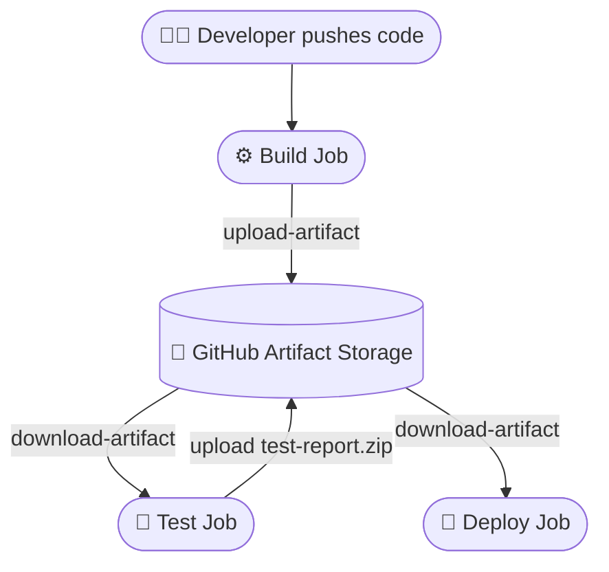
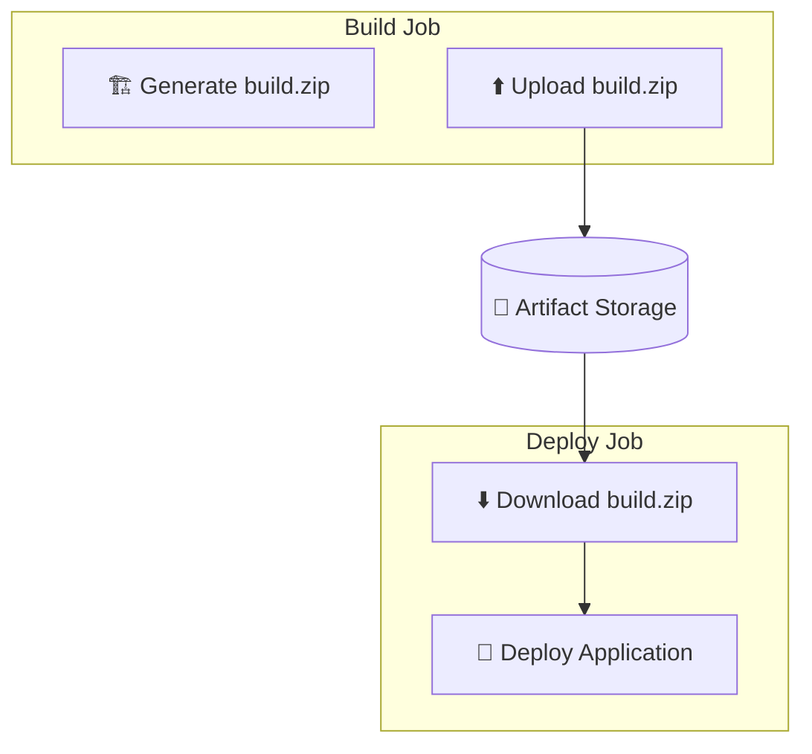

# 📦 **GitHub Actions Artifacts**

When you run workflows in **GitHub Actions**, each job executes in a temporary virtual machine called a **runner**.
And the moment your job finishes — _poof!_ — that runner is gone, along with every file inside it.

That’s a problem when you need to share build results, logs, or reports across jobs.
So GitHub gives you a magic vault called **Artifacts** — a secure storage layer to **persist files** beyond a single job’s lifetime.

---

## 📖 **Official Definition**

> **Artifacts** are files created by a workflow run that can be shared between jobs or downloaded after a workflow completes.
> They are uploaded to GitHub’s artifact storage and retained for a configurable period.

In simpler terms:

> Artifacts = “I built this file — please don’t delete it yet.”

They are the bridge between **ephemeral runners** and your **persistent workflow data**.

---

## ⚙️ **Why Artifacts Matter**

<div align="center" style="background-color: #141a19ff;color: #a8a5a5ff; border-radius: 10px; border: 2px solid">

| Without Artifacts                              | With Artifacts                             |
| ---------------------------------------------- | ------------------------------------------ |
| Each job starts fresh with an empty filesystem | Files can survive between jobs             |
| Builds, logs, or reports are lost              | You can save and reuse files               |
| Runners can’t share outputs                    | Teams can share data across stages         |
| Debugging is harder                            | You can download and inspect results later |

</div>

---

<div align="center" style="background:#343739ff; border-radius:20px">



</div>

**Flow Summary:**
Your build job uploads artifacts → tests download them → deploy retrieves them → everyone’s happy.

---

## 🧰 **Uploading Artifacts**

Uploading an artifact is like saying, “GitHub, keep this safe for me.”

```yaml
- name: Upload build output
  uses: actions/upload-artifact@v4
  with:
    name: build-output
    path: ./dist/
```

**Parameters Explained:**

<div align="center" style="background-color: #141a19ff;color: #a8a5a5ff; border-radius: 10px; border: 2px solid">

| Key                 | Description                                          | Example           |
| ------------------- | ---------------------------------------------------- | ----------------- |
| `name`              | Logical name (appears in workflow UI)                | `frontend-bundle` |
| `path`              | File or folder path to upload                        | `dist/`           |
| `if-no-files-found` | Action if no files exist (`warn`, `error`, `ignore`) | `error`           |
| `retention-days`    | Override default retention duration                  | `14`              |

</div>

---

💡 **Pro Tip:** Always zip large directories before upload — it speeds up transfer and saves quota:

```bash
zip -r dist.zip dist/
```

---

## 📥 **Downloading Artifacts**

When another job needs that file, it simply downloads it:

```yaml
- name: Download build output
  uses: actions/download-artifact@v4
  with:
    name: build-output
    path: ./dist/
```

**Behavior:**

- If `name` is omitted → all artifacts are downloaded.
- You can specify a custom directory (`path:`) for restoration.

---

## 🔄 **Example: Build → Test → Deploy**

```yaml
jobs:
  build:
    runs-on: ubuntu-latest
    steps:
      - uses: actions/checkout@v4
      - run: npm run build
      - uses: actions/upload-artifact@v4
        with:
          name: webapp
          path: build/

  deploy:
    needs: build
    runs-on: ubuntu-latest
    steps:
      - uses: actions/download-artifact@v4
        with:
          name: webapp
          path: ./deploy
      - run: echo "Deploying from ./deploy"
```

**Workflow Logic:**

1. Build job creates and uploads the artifact.
2. Deploy job depends on build (`needs: build`) and downloads that artifact for deployment.

This avoids redundant rebuilding across jobs.

---

## 🗃️ **Multiple Artifacts Example**

You can upload multiple artifacts if your workflow produces multiple assets.

```yaml
- uses: actions/upload-artifact@v4
  with:
    name: backend
    path: api/bin/
- uses: actions/upload-artifact@v4
  with:
    name: frontend
    path: dist/
```

And download them later:

```yaml
- uses: actions/download-artifact@v4
  with:
    name: backend
- uses: actions/download-artifact@v4
  with:
    name: frontend
```

If you omit the name:

```yaml
- uses: actions/download-artifact@v4
  with:
    path: ./artifacts/
```

→ All artifacts are downloaded to that folder.

---

## ⏳ **Retention Policy**

GitHub doesn’t store artifacts forever. Each has a **retention period**, after which it’s automatically deleted.

<div align="center" style="background-color: #141a19ff;color: #a8a5a5ff; border-radius: 10px; border: 2px solid">

| Plan              | Default      | Min | Max |
| ----------------- | ------------ | --- | --- |
| Free / Pro / Team | 90 days      | 1   | 90  |
| Enterprise        | Configurable | 1   | 400 |

</div>

---

You can customize this per artifact:

```yaml
- uses: actions/upload-artifact@v4
  with:
    name: report
    path: ./reports
    retention-days: 7
```

You can also change your repository’s default in
**Settings → Actions → Artifact and log retention**

---

## 📏 **Size and Storage Limits**

<div align="center" style="background-color: #141a19ff;color: #a8a5a5ff; border-radius: 10px; border: 2px solid">

| Limit Type             | Maximum                        |
| ---------------------- | ------------------------------ |
| Per artifact           | 10 GB                          |
| Total per workflow run | 90 GB                          |
| Concurrent uploads     | 30                             |
| File count             | Unlimited (within size limits) |

</div>

---

💡 Compressing artifacts (`tar`, `zip`) improves performance and saves bandwidth.

---

## 🧠 **Common Pitfalls and Fixes**

<div align="center" style="background-color: #141a19ff;color: #a8a5a5ff; border-radius: 10px; border: 2px solid">

| Problem                   | Cause                       | Solution                       |
| ------------------------- | --------------------------- | ------------------------------ |
| Artifact upload skipped   | No matching path            | Add `if-no-files-found: error` |
| Downloaded artifact empty | Wrong artifact name         | Check exact casing             |
| Storage full              | Too many retained artifacts | Lower `retention-days`         |
| Upload slow               | Many small files            | Zip before upload              |

</div>

---

Example safe upload:

```yaml
- uses: actions/upload-artifact@v4
  with:
    name: test-report
    path: ./reports
    if-no-files-found: error
```

---

## 🔐 **Security and Access**

Artifacts are **private** by default:

- Only users who can **view workflow runs** can access them.
- Even on **public repos**, artifacts require authentication.
- Encrypted **in transit** and **at rest**.
- No permanent public download URLs (must use GitHub UI or API).

---

## 🧩 **Cross-Workflow Artifacts**

Artifacts normally live within a single workflow run,
but you can reuse them in other workflows using the `workflow_run` trigger.

```yaml
# build.yml
name: Build
on: [push]
jobs:
  build:
    runs-on: ubuntu-latest
    steps:
      - run: echo "Hello world" > hello.txt
      - uses: actions/upload-artifact@v4
        with:
          name: hello
          path: hello.txt
```

```yaml
# deploy.yml
name: Deploy
on:
  workflow_run:
    workflows: ["Build"]
    types: [completed]
jobs:
  deploy:
    runs-on: ubuntu-latest
    steps:
      - uses: actions/download-artifact@v4
        with:
          name: hello
          run-id: ${{ github.event.workflow_run.id }}
      - run: cat hello.txt
```

This allows you to **build once and deploy later**, across different workflow runs.

---

## 🧹 **Cleaning Up Artifacts**

Artifacts count toward your repository’s storage quota.
To prevent bloat, automate cleanup using the community action:

```yaml
- uses: geekyeggo/delete-artifact@v2
  with:
    name: build-*
    failOnError: false
```

Or run weekly:

```yaml
on:
  schedule:
    - cron: "0 3 * * 0" # Every Sunday
```

You can also change the default retention globally in your repository settings.

---

## 🧾 **Combining Artifacts with Outputs**

Artifacts are for **files**, outputs are for **text values**.
You can combine both for dynamic deployments.

```yaml
jobs:
  build:
    runs-on: ubuntu-latest
    outputs:
      artifact_name: ${{ steps.zip.outputs.name }}
    steps:
      - id: zip
        run: |
          zip -r app.zip build/
          echo "name=app-${{ github.run_number }}" >> "$GITHUB_OUTPUT"
      - uses: actions/upload-artifact@v4
        with:
          name: app-${{ github.run_number }}
          path: app.zip

  deploy:
    needs: build
    runs-on: ubuntu-latest
    steps:
      - uses: actions/download-artifact@v4
        with:
          name: ${{ needs.build.outputs.artifact_name }}
      - run: echo "Deploying ${{ needs.build.outputs.artifact_name }}"
```

---

## 🧩 **Debugging Artifacts**

To inspect files after downloading:

```yaml
- run: ls -R ./artifacts
```

To view upload metadata:

```yaml
- run: echo '${{ toJSON(steps.upload.outputs) }}'
```

To enable debug logging globally:

1. Go to **Settings → Secrets and Variables → Actions → Variables**
2. Add variable `ACTIONS_STEP_DEBUG=true`

---

## 📘 **Summary**

<div align="center" style="background-color: #141a19ff;color: #a8a5a5ff; border-radius: 10px; border: 2px solid">

| Concept           | Description                                         |
| ----------------- | --------------------------------------------------- |
| **Purpose**       | Persist files between jobs or workflows             |
| **Upload**        | `actions/upload-artifact@v4`                        |
| **Download**      | `actions/download-artifact@v4`                      |
| **Retention**     | Auto-deletion after N days                          |
| **Size Limit**    | 10 GB per artifact                                  |
| **Security**      | Encrypted and private                               |
| **Scope**         | Single workflow run (extendable via `workflow_run`) |
| **Cleanup**       | Automate using `delete-artifact`                    |
| **Best Practice** | Zip large files and use `retention-days` wisely     |

</div>

---

<div align="center" style="background:#343739ff; border-radius:20px">



</div>

---

### 🧠 Key Takeaways

- Artifacts are the **file persistence layer** of GitHub Actions.
- Use them for **build outputs, logs, and reports**, not dependency caches.
- Combine them with **job outputs** and **workflow_run triggers** for advanced pipelines.
- Regularly manage retention and cleanup to optimize storage.
- They’re **secure, compressed, and time-limited**, making them safe to use in CI/CD.
