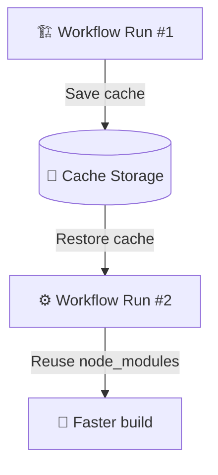
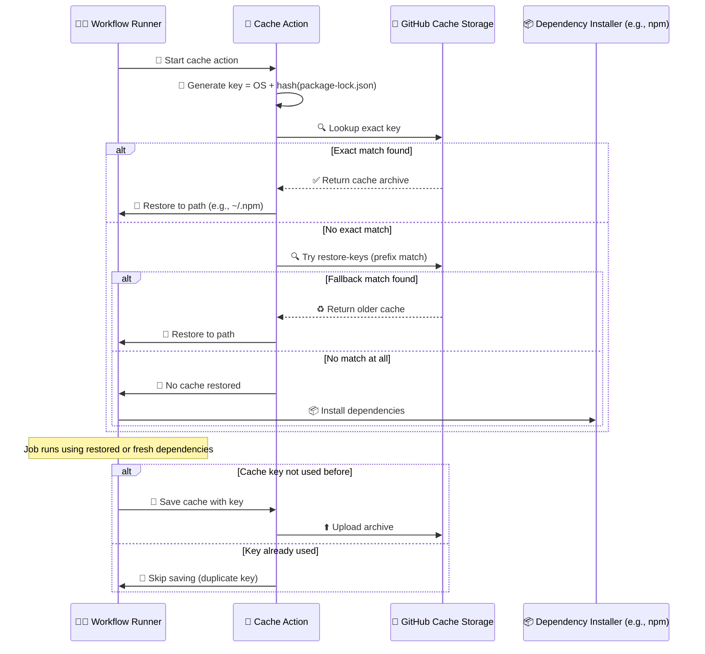
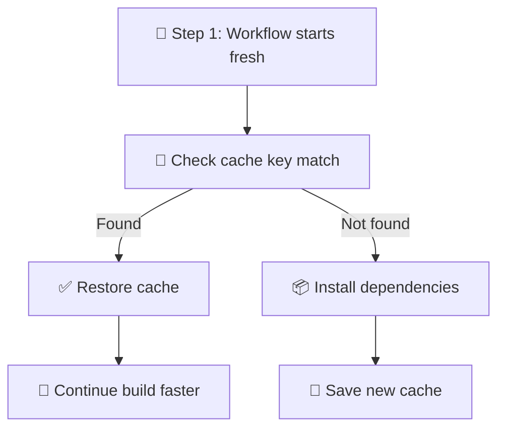

# ⚡ **GitHub Actions Cache** — The Hidden Performance Engine

Every time your workflow runs, the runner starts on a **fresh VM** with no previous files, packages, or dependencies.
That’s great for isolation… but painfully slow for builds that must reinstall packages every time.

Enter **`actions/cache`** — a built-in GitHub Action that lets you **save and reuse dependencies** or other files between workflow runs, cutting your build time dramatically.

> **Official Definition:**
> GitHub’s caching action enables you to persist files and directories between workflow runs to speed up subsequent jobs that depend on the same data.

Think of it like a “shortcut” for your workflows:

> Why redownload 200 MB of npm packages when you could just reuse yesterday’s node_modules folder?

---

## 🎯 **The Core Concept**

The cache action saves files to **GitHub’s cache storage** (separate from artifacts) using a **unique key**.
When a future workflow runs with the same key, the cache is **restored instantly**, skipping slow installations.

<div align="center" style="background:#343739ff; border-radius:20px">



</div>

---

## 🧱 **Cache vs Artifact (Quick Comparison)**

<div align="center" style="background-color: #141a19ff;color: #a8a5a5ff; border-radius: 10px; border: 2px solid">

| Feature                | **Cache**                               | **Artifact**                       |
| ---------------------- | --------------------------------------- | ---------------------------------- |
| **Purpose**            | Speed up jobs by reusing dependencies   | Persist build outputs between jobs |
| **Scope**              | Across workflow runs                    | Within a single workflow run       |
| **Automatic Expiry**   | 7 days (if not accessed)                | Retention policy (default 90 days) |
| **Key Required**       | Yes (for matching)                      | No                                 |
| **Best for**           | npm, pip, Maven, Gradle, Docker layers  | Build files, test reports, logs    |
| **Storage**            | Cache backend                           | Artifact backend                   |
| **Overwrite behavior** | Overwrites existing cache with same key | New upload each time               |

</div>

---

So:

- Use **cache** for _dependencies and tools_.
- Use **artifacts** for _build outputs and results_.

---

## ⚙️ **Basic Syntax**

Here’s how you cache dependencies in a Node.js project:

```yaml
- name: Cache npm dependencies
  uses: actions/cache@v4
  with:
    path: ~/.npm
    key: ${{ runner.os }}-npm-${{ hashFiles('**/package-lock.json') }}
    restore-keys: |
      ${{ runner.os }}-npm-
```

### Explanation

- `path:` — The directory to cache (e.g., npm, pip, Gradle).
- `key:` — A unique identifier for the cache (must change when dependencies change).
- `restore-keys:` — Optional fallback keys (used when exact key doesn’t exist).

---

## 🧠 Deep Dive: How `actions/cache@v4` Works

### 🔹 1. **Key Generation**

- The `key` is a **unique string** that identifies a cache entry. In your example:

  ```yaml
  key: ${{ runner.os }}-npm-${{ hashFiles('**/package-lock.json') }}
  ```

- This resolves to something like:

  ```ini
  Linux-npm-abc123def456
  ```

- `runner.os` → OS-specific (e.g., `Linux`, `Windows`)
- `hashFiles(...)` → SHA-256 hash of the contents of `package-lock.json`
- This ensures the cache is **tied to the exact dependency state**

---

### 🔹 2. **Cache Lookup**

- GitHub checks for a cache entry with an **exact match** to the `key`.

- If not found, it tries **fallback keys** from `restore-keys`, like:

  ```yaml
  restore-keys: |
    Linux-npm-
  ```

- This matches any cache key that starts with `Linux-npm-`, such as:

  ```ini
  Linux-npm-xyz987
  ```

> ✅ This allows partial reuse of older caches even if the lockfile changed.

---

### 🔹 3. **Cache Restore**

If a match is found (exact or partial):

- The cache archive is downloaded from GitHub’s cache storage
- It is extracted into the specified `path` (e.g., `~/.npm`)
- The runner proceeds with the job using the restored files

---

### 🔹 4. **Cache Miss**

If no match is found:

- The job proceeds normally (e.g., runs `npm install`)
- At the end of the job, the cache is **saved** using the original `key`

> ⚠️ Only one cache can be saved per job, and only if the key was not already used.

---

### 🔹 5. **Cache Save**

- The specified `path` is zipped and uploaded to GitHub’s cache storage
- It is stored under the exact `key` used in the job
- Future jobs with the same key will restore this cache

---

### 🔄 Cache Invalidation

If `package-lock.json` changes:

- The hash changes → the `key` changes → cache miss
- But fallback keys may still match and restore a **stale cache**
- This is why it’s important to **pin the key to the lockfile hash**

---

## 🧬 Detailed Mermaid Diagram

<div align="center" style="background-color: #141a19ff;color: #a8a5a5ff; border-radius: 10px; border: 2px solid">



</div>

---

## 🧰 **Common Examples by Language**

### Node.js

```yaml
- uses: actions/cache@v4
  with:
    path: ~/.npm
    key: ${{ runner.os }}-npm-${{ hashFiles('**/package-lock.json') }}
    restore-keys: |
      ${{ runner.os }}-npm-
```

### Python

```yaml
- uses: actions/cache@v4
  with:
    path: ~/.cache/pip
    key: ${{ runner.os }}-pip-${{ hashFiles('**/requirements.txt') }}
    restore-keys: |
      ${{ runner.os }}-pip-
```

### Java / Maven

```yaml
- uses: actions/cache@v4
  with:
    path: ~/.m2/repository
    key: ${{ runner.os }}-maven-${{ hashFiles('**/pom.xml') }}
    restore-keys: |
      ${{ runner.os }}-maven-
```

### Gradle

```yaml
- uses: actions/cache@v4
  with:
    path: |
      ~/.gradle/caches
      ~/.gradle/wrapper
    key: ${{ runner.os }}-gradle-${{ hashFiles('**/*.gradle*', '**/gradle-wrapper.properties') }}
```

### .NET

```yaml
- uses: actions/cache@v4
  with:
    path: ~/.nuget/packages
    key: ${{ runner.os }}-nuget-${{ hashFiles('**/packages.lock.json') }}
    restore-keys: |
      ${{ runner.os }}-nuget-
```

---

## 🧩 **Fallbacks Using Restore Keys**

Restore keys are like **backup patterns** in case the exact key isn’t found.

Example:

```yaml
restore-keys: |
  ubuntu-npm-
```

If your cache key is `ubuntu-npm-abcdef`, but it doesn’t exist,
GitHub will look for any cache starting with `ubuntu-npm-`.

This ensures partial reuse even when lockfiles change slightly.

---

## 📊 **Caching Strategy Example (Multi-Stage Workflow)**

```yaml
jobs:
  build:
    runs-on: ubuntu-latest
    steps:
      - uses: actions/checkout@v4
      - name: Cache dependencies
        uses: actions/cache@v4
        with:
          path: ~/.npm
          key: ${{ runner.os }}-npm-${{ hashFiles('**/package-lock.json') }}
      - run: npm ci
      - run: npm run build
```

**How it helps:**

- First run installs packages normally and saves cache.
- Subsequent runs restore from cache — skipping `npm install`.

Average speed improvement: **50–70% faster builds**.

---

## 🧠 **Best Practices**

<div align="center" style="background-color: #141a19ff;color: #a8a5a5ff; border-radius: 10px; border: 2px solid">

| Tip                            | Explanation                                                   |
| ------------------------------ | ------------------------------------------------------------- |
| Always use lock files          | Ensures deterministic cache keys                              |
| Use OS in key                  | Avoids cross-platform cache conflicts                         |
| Avoid caching build outputs    | That’s for artifacts, not caches                              |
| Don’t overwrite cache keys     | Each key is immutable; use prefixes for new ones              |
| Compress large caches manually | Especially for multi-gigabyte dependencies                    |
| Verify with logging            | Use `actions/cache@v4` output messages to confirm hits/misses |

</div>

---

## 🚨 **Limitations**

<div align="center" style="background-color: #141a19ff;color: #a8a5a5ff; border-radius: 10px; border: 2px solid">

| Type                  | Limit                                                        |
| --------------------- | ------------------------------------------------------------ |
| Max cache size        | 10 GB per cache entry                                        |
| Total caches per repo | 10 GB × number of keys (shared quota)                        |
| Expiration            | Automatically deleted after 7 days if unused                 |
| Immutability          | Existing cache cannot be updated, only replaced with new key |

</div>

---

If your cache exceeds 10 GB, it will fail silently — zip big directories manually if needed.

---

## 🧹 **Clearing Cache**

You can manually delete caches from:

> **Repository → Actions → Caches → Delete**

Or programmatically via the **GitHub REST API**:

```bash
curl -X DELETE \
  -H "Authorization: token <PAT>" \
  https://api.github.com/repos/<owner>/<repo>/actions/caches/<cache_id>
```

---

## 🧩 **Cache + Artifact Hybrid Example**

When both are used together:

```yaml
- name: Cache Dependencies
  uses: actions/cache@v4
  with:
    path: ~/.npm
    key: ${{ runner.os }}-npm-${{ hashFiles('**/package-lock.json') }}

- name: Upload Build Output
  uses: actions/upload-artifact@v4
  with:
    name: webapp
    path: dist/
```

**Logic:**

- Cache speeds up dependency installs.
- Artifact persists the _resulting_ build files.

**Rule of Thumb:**

> Cache = “Don’t redo work”
> Artifact = “Keep results of work”

---

## 🧩 **Debugging Caches**

To see what’s happening under the hood:

```yaml
- name: Debug cache status
  run: echo "Cache key: ${{ steps.cache.outputs.cache-hit }}"
```

If it prints `true`, your cache was restored successfully.

---

<div align="center" style="background:#343739ff; border-radius:20px">



</div>

---

## 📘 **Summary Table**

<div align="center" style="background-color: #141a19ff;color: #a8a5a5ff; border-radius: 10px; border: 2px solid">

| Concept            | Description                              |
| ------------------ | ---------------------------------------- |
| **Purpose**        | Reuse dependencies between workflow runs |
| **Action**         | `actions/cache@v4`                       |
| **Best Use Cases** | npm, pip, Maven, Gradle, NuGet           |
| **Key Mechanism**  | Unique key + fallback restore keys       |
| **Expiration**     | 7 days after last use                    |
| **Storage**        | GitHub cache backend                     |
| **Limit**          | 10 GB per cache entry                    |
| **Do Not Use For** | Build outputs or runtime artifacts       |

</div>

---

## 🧠 **Final Thoughts**

Caching is one of the easiest ways to cut your workflow runtime by half — but it’s not a silver bullet.
It shines when:

- Dependencies don’t change often.
- You hash deterministic lockfiles.
- You separate cache (speed) from artifacts (storage).

Once you grasp this, your CI/CD pipelines go from _“coffee break slow”_ to _“blink-and-it’s-deployed”_ fast.

---

Would you like me to continue next with **“Advanced Cache Key Strategies & Conditional Cache Updates”** — where I’ll show smart ways to handle cache invalidation, multi-language caching, and combining caches across matrices (e.g., Node + Python + OS)?
